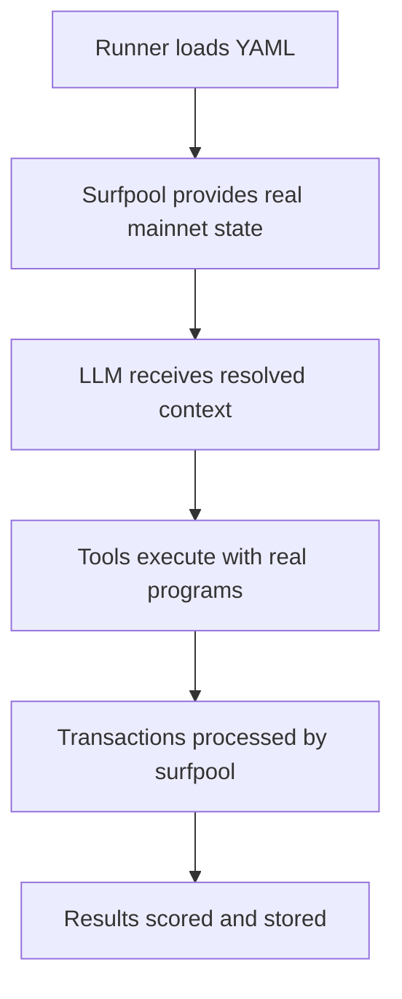

# ARCHITECTURE.md

## Core Flow
```
tui/api → runner → agent → tools → protocols → jupiter → surfpool → score
```

## Services & Ports
- **reev-tui**: Interactive terminal UI (port: none)
- **reev-api**: REST API server (port: 3001)
- **reev-runner**: CLI orchestrator (port: none)
- **reev-agent**: LLM service (port: 9090)
- **surfpool**: Forked mainnet (port: 8899)

## Component Layers

### Entry Points
- `reev-tui`: Terminal UI for benchmark execution
- `reev-api`: REST API for web interface
- `reev-runner`: CLI tool for direct execution

### Core Runner (`reev-runner`)
- Orchestrates benchmark execution
- Manages dependencies (agent + surfpool)
- Handles flow orchestration (multi-step)
- Session logging to database

### Agent Service (`reev-agent`)
- Routes to LLM models (OpenAI/GLM/Local/ZAI)
- Provides tools to AI agents
- OpenTelemetry integration for flow tracking
- HTTP API for runner communication

### Protocol Stack
```
reev-tools → reev-protocols → jupiter-sdk → surfpool
```
- `reev-tools`: Tool wrappers for AI agents
- `reev-protocols`: Protocol implementations
- `jupiter-sdk`: Jupiter DeFi operations
- `surfpool`: High-performance mainnet fork with real program execution

### Execution & Scoring
```
surfpool → SolanaEnv → scoring → database
```
- `surfpool`: High-performance mainnet fork with real program execution
- `SolanaEnv`: Transaction execution environment
- `surfpool`: Mock RPC with mainnet state
- `scoring`: Two-tier system (75% instruction + 25% execution)
- `database`: Session and result persistence

## Key Data Structures

### Agent Request Flow
1. Runner loads benchmark YAML
2. Runner starts agent service (port 9090)
3. Runner sends prompt + account context to agent
4. Agent routes to appropriate LLM model
5. LLM generates response with tool calls
6. Tools execute via Jupiter SDK
7. Transactions sent to surfpool (port 8899)
8. Results scored and stored

## Ground Truth Data Separation Rules

### 🚨 Critical Architecture Principle
**Ground truth data MUST be separated from real-time context resolution** to prevent information leakage and ensure valid multi-step flow evaluation.

### ✅ Valid Ground Truth Usage
1. **Test Mode**: Use `ground_truth` for fast validation without surfpool
2. **Scoring System**: Use `ground_truth` for final result validation
3. **Deterministic Mode**: Use `ground_truth` for reproducible test behavior

### ❌ Invalid Ground Truth Usage  
1. **LLM Mode**: Ground truth injected into context leaks future information
2. **Context Resolution**: Real blockchain state gets corrupted by expected outcomes
3. **Multi-Step Logic**: Steps become predetermined instead of reactive

### 🛡️ Implementation Rules

#### In Test Files (benchmarks/*.yml)
- `ground_truth`: Final expected state for validation and scoring
- `initial_state`: Starting blockchain state for test setup

#### In FlowAgent (production mode)
```rust
// ❌ WRONG - Leaks future information
context_resolver.resolve_initial_context(
    &initial_state,
    &serde_json::to_value(&benchmark.ground_truth).unwrap_or_default(), // GROUND TRUTH LEAK!
    None,
).await

// ✅ CORRECT - Real-time state only
let ground_truth_for_context = if is_deterministic_mode() {
    Some(&benchmark.ground_truth)
} else {
    None // LLM gets real blockchain state
};

context_resolver.resolve_initial_context(
    &initial_state,
    ground_truth_for_context, // No leakage in LLM mode
    None,
).await
```

#### Mode Detection
```rust
fn is_deterministic_mode() -> bool {
    // Check agent type, environment variable, or benchmark tag
    matches!(agent_name, "deterministic") || 
    std::env::var("REEV_DETERMINISTIC").is_ok() ||
    benchmark.tags.contains(&"deterministic".to_string())
}
```

#### Validation Rules
```rust
// Prevent ground truth usage in LLM mode
if !is_deterministic_mode() && !benchmark.ground_truth.is_null() {
    return Err(anyhow!("Ground truth not allowed in LLM mode"));
}
```

### Tool Categories
- **Native**: SOL transfers (program_id: 111111111...)
- **SPL**: Token operations (TokenkegQfeZyiNwAJbNbGKPFXCWuBvf9Ss623VQ5DA)
- **Jupiter**: Swap/lend/earn (JUP6LkbZbjS1jKKwapdHNy74zcZ3tLUZoi5QNyVTaV4)

### Response Formats
- **Jupiter**: `{"transactions": [{"instructions": [...], "completed": true}]}`
- **Simple**: `{"transactions": [{"program_id": "...", "accounts": [...], "data": "..."}]}`

## 🤖 LLM Context Understanding

### 🎯 What LLM Needs to Know

#### Initial Context Access
- **Complete Account State**: All account balances and data from `initial_state`
- **Resolved Addresses**: Real addresses instead of placeholders
- **Available Tools**: Tool catalog with capabilities and descriptions
- **Execution Constraints**: Real Solana programs via surfpool with actual state

#### Execution Capabilities  
- **SOL Transfers**: Move native SOL between accounts
- **SPL Token Operations**: Transfer and manage any SPL tokens
- **Jupiter DEX**: Aggregate swaps across multiple DEXs
- **Jupiter Lending**: Deposit, withdraw, earn yield with real protocols
- **Flow Orchestration**: Multi-step workflows with state management

#### ⚠️ Operational Constraints
- **Real Mainnet State**: All operations affect real account balances via surfpool
- **Gas Requirements**: Each transaction consumes SOL for fees
- **Slippage Impact**: Market operations may have price impact
- **Account Dependencies**: Some operations require specific account types

#### 🚫 Prohibited Directives
- **No Raw Instructions**: Cannot generate raw Solana instructions directly
- **No System Program Access**: Limited to exposed tool interfaces
- **No Future State Access**: Ground truth separated to prevent leakage
- **No Program Execution**: Limited to available tools and protocols

### ✅ Available Operations
Based on surfpool's mainnet fork capabilities, LLM can perform:

#### Native Operations
```rust
// SOL transfer - works with real mainnet accounts
SolTransferInstruction {
    from: user_wallet,
    to: recipient_wallet,
    lamports: 1000000, // 0.001 SOL
}
```

#### SPL Token Operations
```rust
// USDC transfer - uses real USDC mint and accounts
SplTransferInstruction {
    mint: usdc_mint,        // Real mainnet USDC mint
    from_account: user_token_account,
    to_account: recipient_token_account,
    authority: user_wallet,
    amount: 1000000,          // 1 USDC (6 decimals)
}
```

#### Jupiter DeFi Operations
```rust
// Jupiter swap - interacts with real DEXs and liquidity
JupiterSwapInstruction {
    input_mint: sol_mint,     // Real SOL mint
    output_mint: usdc_mint,   // Real USDC mint  
    input_amount: 1000000000,  // 1 SOL
    slippage_bps: 100,      // 1% slippage
}
```

#### Flow Operations
```rust
// Multi-step workflows with real state transitions
let flow_steps = vec![
    FlowStep {
        step_id: 1,
        depends_on: None,        // First step has no dependencies
        // ... other fields
    },
    FlowStep {
        step_id: 2,
        depends_on: Some(vec![1]), // Step 2 depends on step 1 completion
        // ... other fields
    }
];
```

### 🌊 Surfpool: Mainnet Fork Reality

#### Real Program Execution
- **Complete Solana Programs**: Jupiter, SPL Token, native programs
- **Actual Account States**: Real balances from live mainnet fork
- **Dynamic State Fetching**: Account data fetched on-demand from mainnet
- **Transaction Validation**: Real transaction processing with actual fees

#### State Manipulation Capabilities
For advanced testing scenarios, surfpool provides cheat codes for direct blockchain state manipulation:

```bash
# Fund account with SOL
curl -X POST http://127.0.0.1:8899 -d '{
  "jsonrpc": "2.0",
  "id": 1,
  "method": "surfnet_setAccount",
  "params": [
    "USER_WALLET_PUBKEY",
    {
      "lamports": 1000000000
    }
  ]
}'

# Fund account with USDC (ATA creation + balance)
curl -X POST http://127.0.0.1:8899 -d '{
  "jsonrpc": "2.0",
  "id": 1,
  "method": "surfnet_setTokenAccount",
  "params": [
    "USER_WALLET_PUBKEY",
    "EPjFWdd5AufqSSqeM2qN1xzybapC8G4wEGGkZwyTDt1v", // USDC mint
    {
      "amount": 100000000 // 100 USDC (6 decimals)
    },
    "TokenkegQfeZyiNwAJbNbGKPFXCWuBvf9Ss623VQ5DA" // USDC token program
  ]
}'
```

#### Time Control
```bash
# Jump to specific slot for testing time-sensitive logic
curl -X POST http://127.0.0.1:8899 -d '{
  "jsonrpc": "2.0",
  "id": 1,
  "method": "surfnet_timeTravel",
  "params": [
    150000000  // Jump to slot 150M
  ]
}'
```

### 🎯 LLM Best Practices

#### State-Aware Decision Making
1. **Query Balance First**: Always check current state before operations
2. **Use Appropriate Tools**: Match tool to operation (transfer/swap/lend)
3. **Handle Slippage**: Set reasonable limits for market operations
4. **Account for Fees**: Ensure sufficient SOL for transaction costs
5. **Multi-Step Planning**: Consider dependencies between operations

#### Error Recovery
1. **Transaction Failures**: Handle insufficient funds, failed swaps
2. **Network Issues**: Retry with exponential backoff
3. **Invalid Instructions**: Validate tool inputs before execution
4. **Partial Success**: Handle operations with multiple steps

### 🚫 What LLM CANNOT Do

```rust
// ❌ CANNOT generate raw Solana instructions directly
let raw_instruction = Instruction::new_with_bytes(
    program_id,
    accounts,
    data
); // This is not allowed!

// ✅ MUST use tool-based approach
let transfer_result = sol_transfer_tool.execute(transfer_args)?;
let swap_result = jupiter_swap_tool.execute(swap_args)?;
```

### 🔍 Debugging LLM Context

#### Enable Detailed Logging
```rust
RUST_LOG=debug cargo test -p reev-runner benchmarks_test -- --nocapture
```

#### Check Context Structure
```rust
println!("Initial state: {:?}", initial_state);
println!("Resolved addresses: {:?}", context.key_map);
println!("Available tools: {:?}", tool_registry.get_all_tools());
```

#### Validate Tool Access
```rust
// Ensure placeholder resolution worked
assert!(context.key_map.contains_key("USER_WALLET_PUBKEY"));

// Check account states are populated
assert!(!context.account_states.is_empty());
```

### 🎮 Integration with Reev Architecture



## Critical Integration Points

### Agent Selection Logic
```rust
match agent_name {
    "deterministic" => hardcoded_responses,
    "local" => localhost:1234/v1 (LM Studio),
    "glm-4.6" | "glm-4.6-coding" => ZAI API,
    _ => OpenAI API,
}
```

### Dependency Management
- Runner auto-starts/stops agent (9090) and surfpool (8899)
- Health checks before benchmark execution
- Graceful shutdown on completion

### Scoring System
- Instruction Score (75%): Compare generated vs expected instructions
- On-Chain Score (25%): Transaction execution success/failure
- API benchmarks: `skip_instruction_validation: true` = full score if tools succeed

## YAML Ground Truth Testing Strategy

### 🧪 Two-Tier Validation Approach

#### 1. Context Validation Tests (`benchmark_context_validation.rs`)
**Purpose**: Test LLM input format without external dependencies
- **Scope**: Context preparation and YAML format validation
- **Dependencies**: None (completely self-contained)
- **Ground Truth**: Extracted but intentionally ignored (`_ground_truth`)
- **Use Case**: Ensure LLM receives correct context format
- **Command**: `cargo test -p reev-context --test benchmark_context_validation -- --nocapture`

#### 2. YAML Ground Truth Tests (`benchmark_yaml_validation.rs`)
**Purpose**: End-to-end YAML validation without surfpool
- **Scope**: Complete benchmark structure validation
- **Dependencies**: None (ground truth only, no external services)
- **Ground Truth**: Actively applied and validated
- **Use Case**: Verify benchmark YAMLs are well-formed and self-contained
- **Command**: `cargo test -p reev-context --test benchmark_yaml_validation -- --nocapture`

#### 3. Ground Truth Separation Tests (`ground_truth_separation_test.rs`)
**Purpose**: Validate architectural principle of no information leakage
- **Scope**: Mode detection and ground truth access control
- **Dependencies**: Agent service only
- **Coverage**: 6 comprehensive test cases
- **Use Case**: Ensure deterministic vs LLM mode separation works correctly
- **Command**: `cargo test -p reev-agent --test ground_truth_separation_test -- --nocapture`

#### 4. Integration Tests (`benchmarks_test.rs`) 
**Purpose**: End-to-end validation of ALL benchmarks against surfpool
- **Scope**: Complete system integration with real Solana programs
- **Dependencies**: surfpool (mainnet fork) + agent service
- **Coverage**: All `benchmarks/*.yml` files with configurable agents
- **Use Case**: Production readiness validation with real blockchain state
- **Command**: `cargo test -p reev-runner benchmarks_test -- --nocapture`

### 🎯 Test Execution Strategy

#### Before Production Changes:
```bash
# 1. Validate YAML structure and ground truth
cargo test -p reev-context --test benchmark_yaml_validation -- --nocapture

# 2. Validate context preparation for LLM
cargo test -p reev-context --test benchmark_context_validation -- --nocapture

# 3. Validate ground truth separation architecture
cargo test -p reev-agent --test ground_truth_separation_test -- --nocapture

# 4. Validate complete integration with surfpool
cargo test -p reev-runner benchmarks_test -- --nocapture
```

#### Continuous Integration:
- **Fast feedback**: YAML validation tests (no external deps)
- **Full validation**: All three test suites
- **Security check**: Ground truth separation tests must pass

### 📋 Testing Checklist for YAML Changes

When modifying benchmark YAML files:
1. ✅ **Structure Validation**: `benchmark_yaml_validation.rs` passes
2. ✅ **Context Generation**: `benchmark_context_validation.rs` passes  
3. ✅ **No Information Leakage**: `ground_truth_separation_test.rs` passes
4. ✅ **Integration Testing**: `benchmarks_test.rs` passes with surfpool
5. ✅ **Clippy Compliance**: `cargo clippy --fix --allow-dirty` clean
6. ✅ **Compilation**: `cargo check` succeeds

## File Locations
- Benchmarks: `benchmarks/*.yml`
- Tools: `crates/reev-tools/src/tools/`
- Protocols: `crates/reev-protocols/src/`
- Jupiter SDK: `protocols/jupiter/jup-sdk/`
- Agent: `crates/reev-agent/src/`
- Runner: `crates/reev-runner/src/`
- Context Tests: `crates/reev-context/tests/`
- Ground Truth Tests: `crates/reev-agent/tests/`
- Integration Tests: `crates/reev-runner/tests/`

## Environment Variables
- `ZAI_API_KEY`: GLM API access
- `LOCAL_MODEL_NAME`: Custom local model name
- `REEV_SESSION_LOG_PATH`: Session log directory
- `DATABASE_PATH`: SQLite database location

## Common Failure Patterns
1. **Port conflicts**: Services not cleaned up properly
2. **Agent routing**: Wrong model selection for environment
3. **Response parsing**: Jupiter vs simple format mismatch
4. **Tool execution**: Missing API keys or network issues
5. **Scoring**: Instruction validation failures
6. **Ground Truth Leakage**: Incorrect mode detection causing information leak
7. **YAML Structure**: Invalid benchmark format failing validation
8. **Context Resolution**: Placeholder resolution failures in test environment
9. **Integration Failures**: surfpool unavailability or agent startup issues
10. **Benchmark Execution**: Transaction failures in real mainnet fork environment

## Ground Truth Testing Troubleshooting

### Environment Variable Conflicts
```bash
# Clean environment before running tests
unset REEV_DETERMINISTIC
cargo test -p reev-agent --test ground_truth_separation_test -- --nocapture
```

### Test Isolation Issues
- Tests use `serial_test` crate to prevent interference
- Environment variables set/cleaned per test
- Run individually for debugging: `cargo test test_name`

### YAML Validation Failures
- Check `initial_state` structure (required fields: pubkey, owner, lamports)
- Verify `ground_truth` contains proper `final_state_assertions`
- Ensure JSON/YML syntax is valid

### Context Resolution Errors
- Placeholder names must be consistent across YAML sections
- Mock address generation handles unknown placeholders
- Key mapping verified between initial state and ground truth assertions

### Integration Test Failures
```bash
# Check surfpool availability
curl -X POST http://127.0.0.1:8899 -d '{"jsonrpc":"2.0","id":1,"method":"getHealth"}'

# Check agent availability  
curl http://127.0.0.1:9090/health

# Run integration tests with specific agent
cargo test -p reev-runner benchmarks_test -- --nocapture --agent gpt-4
```

### Agent Configuration Issues
```bash
# Available agents for integration tests:
cargo run -p reev-runner -- --agent deterministic benchmarks/    # Perfect responses
cargo run -p reev-runner -- --agent gpt-4 benchmarks/          # OpenAI
cargo run -p reev-runner -- --agent glm-4.6 benchmarks/        # GLM via ZAI
cargo run -p reev-runner -- --agent local benchmarks/            # Local LM Studio
```