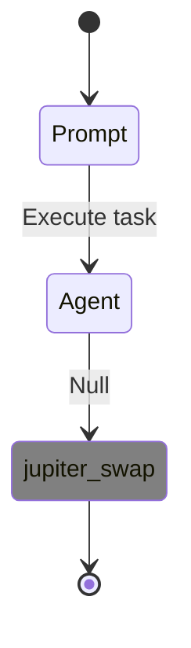

# Development & Testing Guide: API Flow Visualization

## 🎯 **Purpose**
This guide provides curl commands for testing and developing the API flow visualization functionality, focusing on GLM-4.6 agent dynamic flows.

## 🚀 **Quick Start**

### **1. Start API Server**
```bash
cd reev
pkill -f reev-api  # Clean restart
RUST_LOG=info cargo run --bin reev-api --quiet > api_server_test.log 2>&1 &
sleep 3  # Wait for startup
```

### **2. Verify Server Health**
```bash
curl -s http://localhost:3001/api/v1/benchmarks | jq length
# Should return: 18+
```

## 🧪 **Flow Testing Scenarios**

### **Scenario 1: Simple SOL → USDC Swap**
```bash
# Execute flow
curl -s -X POST http://localhost:3001/api/v1/benchmarks/execute-direct \
  -H "Content-Type: application/json" \
  -d '{
    "prompt": "swap 1 SOL for USDC",
    "wallet": "test_swap_wallet",
    "agent": "GLM-4.6",
    "shared_surfpool": false
  }' | jq -r '.result.flow_id'

# Get flow ID
FLOW_ID=$(curl -s -X POST http://localhost:3001/api/v1/benchmarks/execute-direct \
  -H "Content-Type: application/json" \
  -d '{
    "prompt": "swap 1 SOL for USDC",
    "wallet": "test_swap_wallet", 
    "agent": "GLM-4.6",
    "shared_surfpool": false
  }' | jq -r '.result.flow_id')

# Visualize flow
curl -s "http://localhost:3001/api/v1/flows/$FLOW_ID" | jq .
```

### **Scenario 2: Complex Multi-Step Flow (Current Issue)**
```bash
# Execute multiplication strategy
FLOW_ID=$(curl -s -X POST http://localhost:3001/api/v1/benchmarks/execute-direct \
  -H "Content-Type: application/json" \
  -d '{
    "prompt": "use my 50% sol to multiply usdc 1.5x on jup",
    "wallet": "complex_flow_wallet",
    "agent": "GLM-4.6", 
    "shared_surfpool": false
  }' | jq -r '.result.flow_id')

# Check flow visualization (ISSUE: Shows minimal info)
curl -s "http://localhost:3001/api/v1/flows/$FLOW_ID" | jq '.metadata | {tool_count, state_count, session_id}'

# Check diagram (ISSUE: Generic template)
curl -s "http://localhost:3001/api/v1/flows/$FLOW_ID" | jq -r '.diagram'
```

### **Scenario 3: Bridge Mode with YML Generation**
```bash
# Execute bridge mode
FLOW_ID=$(curl -s -X POST http://localhost:3001/api/v1/benchmarks/execute-bridge \
  -H "Content-Type: application/json" \
  -d '{
    "prompt": "use 75% of my SOL to get maximum USDC yield on Jupiter",
    "wallet": "bridge_test_wallet",
    "agent": "GLM-4.6",
    "shared_surfpool": true
  }' | jq -r '.result.flow_id')

# Check if YML file was created
curl -s "http://localhost:3001/api/v1/flows/$FLOW_ID" | jq '.result | keys'
```

### **Scenario 4: Recovery Mode Testing**
```bash
# Execute with recovery configuration
curl -s -X POST http://localhost:3001/api/v1/benchmarks/execute-recovery \
  -H "Content-Type: application/json" \
  -d '{
    "prompt": "swap all my SOL to USDC with maximum yield",
    "wallet": "recovery_test_wallet",
    "agent": "GLM-4.6",
    "recovery_config": {
      "base_retry_delay_ms": 1000,
      "max_retry_delay_ms": 10000,
      "backoff_multiplier": 2.0,
      "max_recovery_time_ms": 30000,
      "enable_alternative_flows": true,
      "enable_user_fulfillment": false
    }
  }' | jq '.result.execution_mode'
```

## 🔍 **Debugging & Validation**

### **Check Server Logs**
```bash
# Real-time log monitoring
tail -f api_server_test.log | grep -E "(flow|session|tool)"

# Check for errors
grep -i error api_server_test.log | tail -10
```

### **Validate Flow Components**
```bash
# Check tool calls in detail
FLOW_ID="dynamic-1762252083-26f0eb3b"  # Replace with actual ID
curl -s "http://localhost:3001/api/v1/flows/$FLOW_ID" | jq '.tool_calls[0]'

# Check metadata
curl -s "http://localhost:3001/api/v1/flows/$FLOW_ID" | jq '.metadata'

# Check sessions (should show execution data)
curl -s "http://localhost:3001/api/v1/flows/$FLOW_ID" | jq '.sessions'
```

### **Database Inspection**
```bash
# Check if session logs are stored
sqlite3 db/reev_results.db "SELECT session_id, length(log_content) FROM session_logs ORDER BY created_at DESC LIMIT 5;"

# Check session log content
SESSION_ID="dynamic-1762252083-26f0eb3b"
sqlite3 db/reev_results.db "SELECT log_content FROM session_logs WHERE session_id = '$SESSION_ID';" | jq .
```

## 📊 **Expected vs Actual Results**

### **❌ Current Issue: Information-Poor Visualization**
```bash
# Current flow shows:
curl -s "http://localhost:3001/api/v1/flows/$FLOW_ID" | jq -r '.diagram'
```
**Output:**


**Problems:**
- `: Null` transitions - no useful information
- No transaction amounts
- No wallet addresses  
- No execution results
- No timing details

### **✅ Desired: Information-Rich Visualization**
**What Users Need:**
```mermaid
stateDiagram
    [*] --> Swap_0.5_SOL
    Swap_0.5_SOL --> Check_USDC_Balance
    Check_USDC_Balance --> Lend_75_USDC
    Lend_75_USDC --> [*]

note right of Swap_0.5_SOL: 0.5 SOL → 75.23 USDC<br/>Slippage: 2.1%<br/>Signature: 5xK7m...
note right of Lend_75_USDC: Deposit: 75.23 USDC<br/>APY: 5.8%<br/>Position: jUSDC-7f9a
```

## 🛠️ **Development Tasks**

### **Phase 1: Fix Current Mock Data (Immediate)**
```bash
# Test current mock generation
curl -s -X POST http://localhost:3001/api/v1/benchmarks/execute-direct \
  -H "Content-Type: application/json" \
  -d '{"prompt": "swap 0.5 SOL", "wallet": "debug_wallet", "agent": "GLM-4.6", "shared_surfpool": false}' | \
  jq '.tool_calls | length'

# Expected: 1 tool call
# Check: curl -s "http://localhost:3001/api/v1/flows/$FLOW_ID" | jq '.tool_calls[0]'
```

### **Phase 2: Real Execution Integration (Major)**
**Target:** Replace mock data with actual GLM-4.6 agent execution results.

**Current Location:** `crates/reev-api/src/handlers/dynamic_flows/mod.rs`
**Function:** `create_mock_tool_calls_from_flow_plan()`

**Required Changes:**
1. Execute actual GLM-4.6 agent with generated flow plan
2. Capture real tool calls, parameters, results
3. Store transaction signatures, amounts, addresses
4. Update SessionParser to handle rich tool data

### **Phase 3: Enhanced Visualization (Polish)**
**Target:** Rich flow diagrams with meaningful information.

## 🧪 **Test Script for Validation**

```bash
#!/bin/bash
# test_flow_validation.sh

echo "🧪 Testing API Flow Visualization..."

# Test 1: Basic functionality
echo "📋 Test 1: Basic flow execution"
RESPONSE=$(curl -s -X POST http://localhost:3001/api/v1/benchmarks/execute-direct \
  -H "Content-Type: application/json" \
  -d '{"prompt": "swap 0.5 SOL", "wallet": "auto_test", "agent": "GLM-4.6", "shared_surfpool": false}')

FLOW_ID=$(echo $RESPONSE | jq -r '.result.flow_id')
TOOL_COUNT=$(echo $RESPONSE | jq '.tool_calls | length')

echo "✅ Flow ID: $FLOW_ID"
echo "✅ Tool Count: $TOOL_COUNT"

# Test 2: Flow visualization
echo "📋 Test 2: Flow visualization"
FLOW_RESPONSE=$(curl -s "http://localhost:3001/api/v1/flows/$FLOW_ID")
VISUAL_TOOL_COUNT=$(echo $FLOW_RESPONSE | jq '.metadata.tool_count')
DIAGRAM_STATES=$(echo $FLOW_RESPONSE | jq '.metadata.state_count')

echo "✅ Visualization Tool Count: $VISUAL_TOOL_COUNT"
echo "✅ Diagram States: $DIAGRAM_STATES"

# Test 3: Information quality
echo "📋 Test 3: Information quality check"
TOOL_DETAILS=$(echo $FLOW_RESPONSE | jq '.tool_calls[0]')
HAS_AMOUNT=$(echo $TOOL_DETAILS | jq 'has("input_amount")')
HAS_SIGNATURE=$(echo $TOOL_DETAILS | jq 'has("tx_signature")')

if [ "$HAS_AMOUNT" = "true" ] && [ "$HAS_SIGNATURE" = "true" ]; then
    echo "✅ Tool calls contain real execution data"
else
    echo "❌ Tool calls are mock/synthetic - ISSUE CONFIRMED"
fi

echo "🎉 Test completed!"
```

## 📝 **Development Notes**

### **Key Files to Modify:**
- `crates/reev-api/src/handlers/dynamic_flows/mod.rs` - Flow execution logic
- `crates/reev-api/src/handlers/flow_diagram/session_parser.rs` - Data parsing
- `crates/reev-api/src/handlers/flow_diagram/state_diagram_generator.rs` - Visualization
- `crates/reev-orchestrator/src/gateway.rs` - Connect to real execution

### **Current Data Flow:**
1. User sends prompt → API
2. Orchestrator creates flow plan
3. **⚠️ ISSUE**: Mock tool calls generated
4. Session log stored with synthetic data
5. Flow visualization shows generic template

### **Target Data Flow:**
1. User sends prompt → API
2. Orchestrator creates flow plan
3. **✅ GOAL**: Execute GLM-4.6 agent with plan
4. **✅ GOAL**: Capture real tool execution data
5. **✅ GOAL**: Store real transaction information
6. **✅ GOAL**: Visualize meaningful execution flow

## 🔗 **Related Issues**
- **Issue #12**: API Flow Visualization Returns Empty Tool Calls (Partially Fixed)
- **Issue #13**: Dynamic Flow Visualization Shows No Useful User Information (Current)
- **Issue #10**: API Flow Visualization OTEL Format Compatibility

---

**Last Updated:** 2025-11-04  
**Focus:** GLM-4.6 agent API flow visualization
**Status:** Mock data working, real execution integration needed