# Dynamic Flow Benchmark Design (300-Series)

## 🎯 Purpose

Dynamic benchmarks test LLM-driven orchestration for multi-step DeFi strategies using real Jupiter integration.

## 📋 Benchmark 300: Foundation Implementation

### Current Status: PARTIALLY WORKING ⚠️

**✅ Working**: LLM routing, basic tool execution, scoring  
**❌ Missing**: Complete 4-step flow visualization

### Scenario
- **Prompt**: "use my 50% sol to multiply usdc 1.5x on jup"
- **Initial State**: 4 SOL wallet + 20 USDC position
- **Target**: Multiply USDC position to ~30 USDC using swap + lend

### Expected Tool Call Sequence
1. `get_account_balance` → Check wallet state
2. `jupiter_swap` → Convert 50% SOL → USDC  
3. `jupiter_lend_earn_deposit` → Deposit for yield
4. `get_account_balance` → Validate final positions

## 🔧 Architecture Status

### ✅ Implemented
- `flow_type: "dynamic"` field support
- LLM agent routing (glm-4.6-coding)
- 4-step flow generation in gateway.rs (lines 352-363)
- Basic Mermaid diagram generation
- OpenTelemetry tool tracking
- Agent tool validation (all Jupiter tools enabled)

### ❌ Critical Issues

**1. Incomplete Flow Visualization**
- **Problem**: Only single tool calls shown in Mermaid diagrams
- **Root Cause**: Tool call tracking captures final step, misses intermediate steps
- **Expected**: Complete 4-step strategy visualization with parameter context

**2. Production Mock Behavior**
- **Problem**: Mock/deterministic behaviors not feature-flagged for removal
- **Root Cause**: Hardcoded test behaviors leak into production
- **Expected**: Clean production deployment with only LLM orchestration

## 📊 Enhanced Mermaid Specification

### Current (Broken) Output:

```mermaid
stateDiagram
    [*] --> Prompt
    Prompt --> Agent : |
    Agent --> jupiter_swap : 2.000 SOL → USDC
    jupiter_swap --> [*]
```


### Target (Fixed) Output:
```mermaid
stateDiagram
    [*] --> AccountDiscovery
    AccountDiscovery --> ContextAnalysis : "Extract 50% SOL requirement"
    ContextAnalysis --> BalanceCheck : "Current: 4 SOL, 20 USDC"
    BalanceCheck --> JupiterSwap : "Swap 2 SOL → ~300 USDC"
    JupiterSwap --> JupiterLend : "Deposit USDC for yield"  
    JupiterLend --> PositionValidation : "Verify 1.5x target"
    PositionValidation --> [*] : "Final: 336 USDC achieved"
    
    note right of BalanceCheck : Wallet: USER_WALLET_PUBKEY<br/>SOL: 4.0 → 2.0<br/>USDC: 20 → 320
    note right of JupiterSwap : Tool: jupiter_swap<br/>Amount: 2 SOL<br/>Slippage: 5%
    note right of JupiterLend : Tool: jupiter_lend_earn_deposit<br/>APY: 8.5%<br/>Yield target: 1.3x
    note right of PositionValidation : Target: 30 USDC (1.5x)<br/>Achieved: 336 USDC<br/>Score: 1.0
    
    classDef discovery fill:#e3f2fd
    classDef tools fill:#c8e6c9  
    classDef validation fill:#fff3e0
    class AccountDiscovery,ContextAnalysis discovery
    class BalanceCheck,JupiterSwap,JupiterLend tools
    class PositionValidation validation
```

## 🏗️ Architecture Overview

### Mode-Based Execution
- **Dynamic flows**: Route to LLM agents (intelligent orchestration)
- **Static flows**: Route to deterministic agents (predefined instructions)
- **Same core runner**: Execution logic identical across modes

### Execution Flow
1. **Intent Analysis**: Parse prompt complexity (swap/lend/complex)
2. **Flow Generation**: Create 4-step plan for complex strategies
3. **Tool Execution**: Sequential ping-pong with validation
4. **Scoring**: Evaluate against ground truth assertions

## 📈 Future Extensions (301-305)

### Next Benchmarks
- **301**: Yield optimization strategies
- **302**: Portfolio rebalancing
- **303**: Risk-adjusted growth
- **304**: Emergency exit strategies  
- **305**: Multi-pool yield farming

### Progressive Complexity
Each benchmark introduces new tool combinations and strategy requirements.

## 🧪 Testing Strategy

### API Testing Workflow
```bash
# Execute 300 benchmark
curl -X POST "/api/v1/benchmarks/300-jup-swap-then-lend-deposit-dyn/run" \
  -d '{"agent":"glm-4.6-coding","mode":"dynamic"}'

# Get flow diagram  
curl "/api/v1/flows/{execution_id}?format=json" | jq '.diagram'
```

### Success Criteria
- **Min Score**: 0.7 (target: 1.0)
- **Tool Calls**: All 4 steps tracked
- **Flow Diagram**: Complete strategy visualization
- **Performance**: <15 seconds execution time

## 🔄 Continuous Improvement

### Next Development Steps
1. **Fix tool call tracking** to capture all 4 steps
2. **Enhance Mermaid generation** with parameters and notes
3. **Add context validation** for intermediate states
4. **Implement recovery mechanisms** for failed steps

### Quality Gates
- All tool calls visible in flow diagrams
- Parameter context displayed for each step
- Success metrics clearly shown
- Error handling and recovery demonstrated

## 🚀 Production Configuration

### Feature Flags
```toml
[features]
default = ["production"]
production = []                    # Clean LLM orchestration, no mocks
development = ["mock_behaviors"]     # Mock/deterministic for testing
```

### Production Mode (`production` feature)
- ✅ **LLM Only**: Pure LLM orchestration with real tool execution
- ✅ **No Mocks**: All mock/deterministic behaviors disabled
- ✅ **Real Tools**: Jupiter swap/lend with actual Solana execution
- ✅ **Clean Scoring**: Based on real transaction results

### Development Mode (`mock_behaviors` feature)  
- ⚠️ **Testing**: Mock responses and deterministic fallbacks
- ⚠️ **Rule-Based**: Hardcoded tool selection for consistent testing
- ⚠️ **Simulation**: Predictable behavior for test reproducibility

### Build Commands
```bash
# Production deployment
cargo build --release --features production

# Development testing  
cargo build --features mock_behaviors
```

### Runtime Detection
```rust
#[cfg(feature = "production")]
fn is_production_mode() -> bool { true }

#[cfg(feature = "mock_behaviors")] 
fn is_production_mode() -> bool { false }
```

---
**Status**: LLM integration functional, flow visualization needs enhancement  
**Priority**: Fix 4-step tool call tracking and Mermaid generation