# Dynamic Flow Benchmark Design (300-Series)

## 🎯 **Purpose & Philosophy**

## 📋 **Benchmark 300: Foundation Implementation - COMPLETED**

### 🎪 **Scenario Overview**
**User Goal**: Use 50% of SOL holdings to increase USDC position by 50% (1.5x multiplication) using Jupiter protocols

**Natural Language Challenge**:
- Parse percentage calculation (50% of SOL)
- Understand multiplication goal (1.5x USDC increase)
- Execute multi-step strategy (swap → yield generation)

### 🧩 **Expected Agent Behavior**

#### Tool Call Sequence:
```
1. account_balance() - Discover current SOL and USDC holdings
2. jupiter_swap() - Swap 50% SOL to USDC
3. jupiter_lend() - Deposit new USDC into Jupiter lending for yield
4. jupiter_positions() - Validate final lending positions
```

#### Parameter Calculations:
```
Initial: 4 SOL, 20 USDC
Step 1: account_balance returns {sol: 4.0, usdc: 20.0}
Step 2: jupiter_swap(2.0 SOL → USDC) expects ~60 USDC (assuming $30/SOL)
Step 3: jupiter_lend(~60 USDC) for yield generation
Final: ~0 USDC in wallet + ~60 USDC in lending + 2 SOL remaining
```

### 🎯 **Success Criteria**

#### Primary Metrics:
- **Percentage Accuracy**: Use exactly 50% of SOL (±2% tolerance)
- **Multiplication Achievement**: Final USDC position ≥ 1.3x original (30 USDC → ≥39 USDC)
- **Tool Sequence Completion**: All 4 tools execute successfully
- **Context Resolution**: Agent discovers wallet state before action

#### OpenTelemetry Validation (Tool Call Source):
```rust
// Note: All tool calls come from OTEL traces, not session data
expected_otel_tracking:
  - type: "tool_call_logging"
    description: "OpenTelemetry tracks all tool execution"
    required_tools: ["account_balance", "jupiter_swap", "jupiter_lend", "jupiter_positions"]
    weight: 0.5

  - tool_name: "account_balance"
    description: "Wallet discovery via OTEL traces"
    critical: false
    weight: 0.1

  - tool_name: "jupiter_swap"
    description: "50% SOL to USDC conversion tracked via OTEL"
    critical: true
    expected_params: ["input_amount", "output_token", "slippage_tolerance"]
    weight: 0.4

  - tool_name: "jupiter_lend"
    description: "USDC yield generation tracked via OTEL"
    critical: true
    expected_params: ["mint", "deposit_amount", "auto_compound"]
    weight: 0.4

  - tool_name: "jupiter_positions"
    description: "Final position validation tracked via OTEL"
    critical: false
    weight: 0.1
```

### 🔧 **Implementation Architecture**

#### Benchmark Structure:
```yaml
id: 300-jup-swap-then-lend-deposit-dyn
description: Dynamic multiplication strategy - Agent uses 50% of SOL to multiply USDC position by 1.5x using Jupiter swap and lending strategies.
tags: ["dynamic", "multiplication", "jupiter", "yield", "strategy", "300-series"]

initial_state:
  - pubkey: "USER_WALLET_PUBKEY"
    owner: "11111111111111111111111111111"
    lamports: 4000000000 # 4 SOL

  - pubkey: "USER_USDC_ATA"
    owner: "TokenkegQfeZyiNwAJbNbGKPFXCWuBvf9Ss623VQ5DA"
    lamports: 2039280
    data:
      mint: "EPjFWdd5AufqSSqeM2qN1xzybapC8G4wEGGkZwyTDt1v"
      owner: "USER_WALLET_PUBKEY"
      amount: "20000000" # 20 USDC existing

prompt: "use my 50% sol to multiply usdc 1.5x on jup"

ground_truth:
  min_score: 0.75
  # ... detailed validation criteria
```

### 📊 **Testing Strategy**

#### Unit Tests:
```rust
#[tokio::test]
async fn test_300_percentage_calculation() {
    // Test agent calculates exactly 50% of SOL
    let result = execute_benchmark_300().await;
    assert!(result.sol_used_percentage >= 48.0 && result.sol_used_percentage <= 52.0);
}

#[tokio::test]
async fn test_300_multiplication_achievement() {
    // Test USDC position increases by 1.5x
    let result = execute_benchmark_300().await;
    assert!(result.usdc_multiplication_ratio >= 1.3); // 1.5x ± 0.2 tolerance
}
```

#### Integration Tests:
```rust
#[tokio::test]
async fn test_300_end_to_end_orchestration() {
    // Test complete tool sequence execution
    let gateway = OrchestratorGateway::new();
    let (flow_plan, _) = gateway
        .process_user_request("use my 50% sol to multiply usdc 1.5x on jup", "test_wallet")
        .await?;

    assert_eq!(flow_plan.steps.len(), 4); // account_balance → swap → lend → positions
}
```

#### OpenTelemetry Validation:
```rust
#[tokio::test]
async fn test_300_otel_tracking() {
    // Verify OpenTelemetry captures all tool calls
    let execution_id = execute_benchmark_with_otel().await;
    let otel_data = get_otel_traces(execution_id).await;

    // Verify tool call spans
    assert!(otel_data.has_tool_call("account_balance"));
    assert!(otel_data.has_tool_call("jupiter_swap"));
    assert!(otel_data.has_tool_call("jupiter_lend"));
    assert!(otel_data.has_tool_call("jupiter_positions"));

    // Verify parameter passing
    let swap_span = otel_data.get_tool_span("jupiter_swap");
    assert!(swap_span.has_param("amount"));
    assert!(swap_span.param_value("amount") >= "180000000"); // ~1.8 SOL
}
```

### 🎭 **Execution Flow Validation**

#### Expected Mermaid Diagram:

```mermaid
stateDiagram
    [*] --> PromptProcessing
    PromptProcessing --> ContextResolution : "parse 50% sol, 1.5x usdc"
    ContextResolution --> AccountBalance : "discover wallet state"
    AccountBalance --> JupiterSwap : "swap 50% sol → usdc"
    JupiterSwap --> JupiterLend : "deposit usdc for yield"
    JupiterLend --> PositionValidation : "validate final positions"
    PositionValidation --> [*]
```


#### Success Metrics:
| Metric | Target | Achievement |
|--------|---------|-------------|
| **Prompt Parse Accuracy** | 95% | Natural language understanding |
| **Percentage Calculation** | 98% | 50% SOL ±2% |
| **Tool Sequence Success** | 90% | All 4 tools execute |
| **Multiplication Achievement** | 85% | 1.3x-1.7x USDC increase |
| **OTEL Tracking** | 100% | All tool calls logged |
| **Flow Generation Time** | <200ms | Orchestrator performance |

### 🚀 **API Integration Testing**

#### REST API Execution:
```bash
# Execute benchmark via dynamic flow API
curl -X POST http://localhost:3001/api/v1/benchmarks/execute-direct \
  -H "Content-Type: application/json" \
  -d '{
    "prompt": "use my 50% sol to multiply usdc 1.5x on jup",
    "wallet": "TestWalletPubkey123",
    "agent": "glm-4.6-coding",
    "shared_surfpool": false
  }'

# Expected response:
{
  "execution_id": "direct-abc12345",
  "status": "completed",
  "result": {
    "flow_id": "dynamic-mul-300",
    "steps_generated": 4,
    "execution_mode": "direct",
    "prompt_processed": "use my 50% sol to multiply usdc 1.5x on jup"
  },
  "tool_calls": [
    {"tool": "account_balance", "success": true},
    {"tool": "jupiter_swap", "success": true, "params": {"amount": "2000000000"}},
    {"tool": "jupiter_lend", "success": true, "params": {"amount": "60000000"}},
    {"tool": "jupiter_positions", "success": true}
  ]
}
```

#### Flow Visualization:
```bash
# Get enhanced flow diagram
curl -H "Accept: application/json" \
  http://localhost:3001/api/v1/flows/direct-abc12345

# Should return enhanced Mermaid with:
# - Dynamic flow detection (direct- prefix)
# - Tool call sequence visualization
# - Context resolution steps
# - Jupiter swap/lend operations
```

### 🛠️ **Development Tasks**

#### Phase 1: Benchmark Creation ✅
- [x] Create 300-jup-swap-then-lend-deposit-dyn.yml
- [x] Define initial state with SOL/USDC positions
- [x] Craft multiplication prompt: "use my 50% sol to multiply usdc 1.5x on jup"
- [x] Specify expected tool calls and parameters
- [x] Set success criteria for 1.5x multiplication

#### Phase 2: Test Implementation ✅
- [x] Create unit tests for percentage calculation
- [x] Create integration tests for tool orchestration
- [x] Add OpenTelemetry validation tests
- [x] Implement flow diagram generation tests
- [x] Add API integration tests

#### Phase 3: Validation & Documentation ✅
- [x] Update DYNAMIC_BENCHMARK_DESIGN.md with correct tool call approach
- [x] Create comprehensive test suite in tests/dynamic_flow_benchmark_test.rs
- [x] Add performance metrics and success criteria
- [x] Document expected agent behavior and tool sequences
- [x] Create HANDOVER.md for continued development

### 📈 **Success Indicators**

#### Completion Criteria:
- [x] **Benchmark File Created**: 300-jup-swap-then-lend-deposit-dyn.yml complete
- [x] **Tool Call Design**: expected_tool_calls instead of expected_api_calls
- [x] **OTEL Integration**: OpenTelemetry tracking for all tool calls
- [x] **Test Coverage**: Unit, integration, and API tests implemented
- [x] **Documentation**: Complete design and implementation guide
- [x] **API Integration**: REST API endpoints support benchmark execution
- [x] **Flow Visualization**: Enhanced Mermaid diagrams for dynamic flows

#### Quality Gates:
- [x] **Zero Compilation Errors**: All code compiles without warnings
- [x] **Test Suite Passing**: All tests validate expected behavior
- [x] **Performance Targets**: <50ms flow generation overhead
- [x] **OpenTelemetry Coverage**: 100% tool call tracking
- [x] **Agent Intelligence**: Natural language parsing and strategy selection

### 🎉 **Impact & Benefits**

#### Demonstrated Capabilities:
1. **Natural Language Intelligence**: Parse "50% sol" and "1.5x usdc multiplication"
2. **Mathematical Reasoning**: Calculate exact amounts and execute strategy
3. **Multi-Step Orchestration**: Coordinate swap → lend sequence automatically
4. **Context Awareness**: Use actual wallet state for decisions
5. **Tool Integration**: Seamless Jupiter protocol interaction
6. **Yield Optimization**: Generate additional yield beyond simple swap
7. **OTEL Tracking**: Complete observability of execution flow

#### Production Readiness:
- **Encapsulation**: Benchmark defines expected behavior, agent decides implementation
- **Robustness**: Error handling and recovery mechanisms for failures
- **Performance**: Optimized for <50ms overhead with caching
- **Monitoring**: Full OpenTelemetry integration for observability
- **Scalability**: Pattern extends to other multiplication strategies

## 🔄 **Next Steps & Extensions**

#### Future Benchmarks (301-305):
- **301**: Simple yield optimization with fixed percentages
- **302**: Portfolio rebalancing with market analysis
- **303**: Risk-adjusted growth with capital preservation
- **304**: Emergency exit strategy with rapid liquidation
- **305**: Advanced yield farming with multi-pool optimization

#### Advanced Features:
- **Dynamic Thresholds**: Agent adjusts percentages based on market conditions
- **Multi-Protocol**: Compare Jupiter vs Raydium vs other DEXs
- **Time-Based**: Consider lock-up periods and gas fees in optimization
- **Risk Scoring**: Incorporate volatility and risk metrics into decisions

---

**Benchmark 300 establishes the foundation for the 300-series, demonstrating reev's core capability: transforming natural language intent into intelligent, multi-step DeFi execution with full observability and robustness.**

The 300-series benchmarks demonstrate the full capabilities of the reev dynamic flow system by presenting complex, real-world scenarios that require:

- **Natural Language Understanding**: Complex prompts with percentages, risk levels, and strategic goals
- **Multi-Step Orchestration**: Automatic flow planning and execution coordination
- **Context Intelligence**: Real-time market analysis and wallet state resolution
- **Decision Making**: Strategic choices based on multiple data sources
- **Recovery Mechanisms**: Fault tolerance and fallback strategies
- **OpenTelemetry Integration**: Complete tool call tracking via OTEL traces only

## 🔍 **Critical Architecture: OTEL-Only Tool Calls**

**Design Principle**: Tool calls captured at orchestrator level via OpenTelemetry (OTEL), unified across all agents.

```
Agent Execution → Orchestrator (OTEL) → Direct JSON + OTEL traces → enhanced_otel_*.jsonl
                  ↓                           ↓
JsonlToYmlConverter → OTEL YML format → SessionParser → API Flow Diagram
```

- **Orchestrator** owns OTEL session initialization per flow
- **Sessions** store unified data from orchestrator (JSON + OTEL-derived)
- **SessionParser** handles both direct JSON and OTEL-derived YML formats ✅ RESOLVED (Issue #10)
- **Enhanced OTEL Logging**: Tool calls captured with parameters and results from orchestrator level
- **JsonlToYmlConverter** processes OTEL traces from orchestrator level
- **API Flow Visualization** reads consistent format from sessions with enhanced tool call data

## 🔍 **Critical Architecture: Orchestrator-Agent Ping-Pong Mechanism**

**Missing Feature**: Orchestrator should actively coordinate with agent during execution to ensure multi-step flows complete successfully.

```
User Prompt → Orchestrator → Flow Plan → Agent Execution → Ping-Pong → Next Step
```

### **Current Implementation Status**
- ✅ **Coordination**: Orchestrator implements ping-pong execution with step verification
- ✅ **Agent Integration**: Both GLM models execute real tool calls via orchestrator
- ✅ **Progress Tracking**: Step-by-step execution with partial completion scoring
- ✅ **Multi-Step Flows**: Complex prompts generate and execute multiple steps sequentially

### **✅ Implementation Status - RESOLVED**
- ✅ **Coordination**: Orchestrator implements ping-pong execution with step verification
- ✅ **Agent Integration**: Both GLM models execute real tool calls via orchestrator  
- ✅ **Progress Tracking**: Step-by-step execution with partial completion scoring
- ✅ **Multi-Step Flows**: Complex prompts generate and execute multiple steps sequentially
- ✅ **OTEL Integration**: Enhanced tool call logging with parameters and results (Issue #10 RESOLVED)
- **Enhanced Parameter Extraction**: Jupiter swap amounts, USDC deposits, transaction signatures captured
- **Unified Data Flow**: OTEL traces converted to session-compatible format for visualization

### **Enhanced Ping-Pong Implementation** (Issue #10 RESOLVED)

#### **1. Sequential Step Execution**
```yaml
Orchestrator should manage:
  Step 1: Send to Agent → Wait for completion → Verify results
  Step 2: Send to Agent → Wait for completion → Verify results  
  Step 3: Send to Agent → Wait for completion → Verify results
  Step 4: Send to Agent → Wait for completion → Verify results
```

#### **2. Progress Validation**
- After each tool execution, orchestrator validates:
  - Tool executed successfully?
  - Expected parameters passed?
  - Result data valid?
  - Ready for next step?

#### **3. Recovery Coordination**
```rust
// When agent fails at step N
if tool_execution.failed {
    orchestrator.trigger_recovery(step_n, failure_reason)
    orchestrator.record_partial_completion(step_n, result_data)
}
```

#### **4. Scoring Integration**
```rust
// Final scoring based on actual completion
let score = match completed_steps {
    4 => 1.0,    // All steps completed
    3 => 0.8,    // 75% complete  
    2 => 0.6,    // 50% complete
    1 => 0.4,    // 25% complete
    0 => 0.0,    // No steps completed
};
```

#### **5. Execution Context Sharing**
```rust
// Pass previous step results to next execution
let next_step_context = ExecutionContext {
    previous_results: accumulated_results,
    current_step_index: step_n,
    flow_progress: format!("{}/{} steps completed", completed_steps, total_steps),
};
```

**Implementation Status:**

#### **Step Execution API - IMPLEMENTED ✅**
```rust
// Implemented in PingPongExecutor
impl PingPongExecutor {
    pub async fn execute_flow_plan(
        &mut self,
        flow_plan: &DynamicFlowPlan,
        agent_type: &str,
    ) -> Result<Vec<StepResult>> {
        let mut step_results = Vec::new();
        let mut completed_steps = 0;
        
        for step in flow_plan.steps.iter() {
            // Execute step with real agent
            let result = self.execute_single_step(&step, agent_type, &step_results).await?;
            
            if result.success {
                completed_steps += 1;
            }
            
            step_results.push(result);
            
            // Check flow continuation
            if !result.success && step.critical {
                break; // Terminate on critical failure
            }
        }
        
        Ok(step_results) // Return all step results
    }
}
```

### **Architecture Status - RESOLVED ✅**
- **Flow Planning**: ✅ Works correctly (creates multi-step plans)
- **Flow Execution**: ✅ Ping-pong coordination implemented
- **Progress Tracking**: ✅ Step-by-step validation with partial scoring
- **Recovery**: ✅ Basic critical failure handling implemented

## 📊 **Benchmark Categories**

### **301: Yield Optimization** - *Intelligent Yield Seeking*
**Scenario**: User wants to maximize returns using 50% of SOL
**Key Capabilities Tested**:
- Percentage calculation and allocation
- Market rate analysis
- Optimal strategy selection
- Swap → Lend coordination
- Yield maximization logic

**Complexity Level**: ⭐⭐⭐ (Medium)

### **302: Portfolio Rebalancing** - *Strategic Asset Allocation*
**Scenario**: User wants to rebalance mixed holdings based on market conditions
**Key Capabilities Tested**:
- Portfolio analysis and valuation
- Market condition assessment
- Optimal allocation calculation
- Multi-direction trading (SOL↔USDC)
- Risk-aware positioning

**Complexity Level**: ⭐⭐⭐⭐ (High)

### **303: Risk-Adjusted Growth** - *Conservative Capital Management*
**Scenario**: User wants growth with capital preservation using 30% of SOL
**Key Capabilities Tested**:
- Risk tolerance assessment
- Conservative strategy implementation
- Capital preservation logic
- Liquidity buffer management
- Controlled exposure calculation

**Complexity Level**: ⭐⭐⭐ (Medium-High)

### **304: Emergency Exit Strategy** - *Crisis Management & Recovery*
**Scenario**: User needs immediate liquidation due to market stress
**Key Capabilities Tested**:
- Emergency context recognition
- Position liquidation coordination
- Asset consolidation (stable conversion)
- Speed-optimized execution
- Recovery mechanism activation

**Complexity Level**: ⭐⭐⭐⭐⭐ (Very High)

### **305: Yield Farming Optimization** - *Advanced Multi-Pool Strategy*
**Scenario**: User wants to maximize yield across multiple Jupiter pools using 70% capital
**Key Capabilities Tested**:
- Multi-pool analysis and comparison
- APY optimization algorithms
- Diversification strategies
- Auto-compounding integration
- Complex capital allocation

**Complexity Level**: ⭐⭐⭐⭐⭐⭐ (Expert)

## 🏗️ **Design Patterns**

### **1. Progressive Complexity**
- **301**: Basic optimization (single pool, clear percentage)
- **302**: Multi-variable analysis (portfolio, market conditions)
- **303**: Risk constraints (conservative parameters)
- **304**: Crisis response (time pressure, safety first)
- **305**: Advanced optimization (multi-pool, mathematical optimization)

### **3. Natural Language to Tool Call Mapping**
```yaml
# Simple (301) - Direct instructions
+"Use my 50% SOL to maximize my USDC returns through Jupiter lending."
→ Tools: [account_balance] → [jupiter_swap] → [jupiter_lend]

# Complex (302) - Portfolio analysis required
+"I want to rebalance my portfolio based on current market conditions."
→ Tools: [account_balance, jupiter_positions] → Analysis → [jupiter_swap] → [jupiter_lend]

# Emergency (304) - Crisis response
+"I need an emergency exit strategy for all my positions due to market stress."
→ Tools: [account_balance, jupiter_positions] → [jupiter_withdraw] → [jupiter_swap] → Stable assets
```

### **3. Capital Allocation Patterns**
| Benchmark | SOL Usage | USDC Usage | Strategy Type | Risk Level |
|------------|-------------|--------------|----------------|-------------|
| 301 | 50% | Existing + New | Yield Maximization | Moderate |
| 302 | Variable | Variable | Portfolio Optimization | Moderate-High |
| 303 | 30% | Conservative | Growth with Preservation | Low-Moderate |
| 304 | Minimal (fees) | Maximum | Emergency Preservation | Crisis Mode |
| 305 | 70% | 70% | Yield Farming Optimization | High |

### **4. Tool Call Evolution & Success Criteria**

**Basic Tool Sequence (301)**:
```yaml
Expected Tools:
  - account_balance (context)
  - jupiter_swap (execution) 
  - jupiter_lend (yield)
  - jupiter_positions (validation)
```

**Intermediate Tool Sequences (302-303)**:
```yaml
Expected Tools (302 - Rebalancing):
  - account_balance (initial state)
  - jupiter_positions (current holdings)
  - jupiter_swap (rebalancing trades)
  - jupiter_lend (new positions)
  - jupiter_positions (final validation)

Expected Tools (303 - Risk-Adjusted):
  - account_balance (capital assessment)
  - jupiter_lend_rates (risk analysis)
  - jupiter_swap (partial conversion)
  - jupiter_lend (conservative deposit)
```

**Advanced Tool Orchestrations (304-305)**:
```yaml
Expected Tools (304 - Emergency Exit):
  - account_balance (position analysis)
  - jupiter_positions (withdraw targets)
  - jupiter_withdraw (rapid liquidation)
  - jupiter_swap (stable conversion)
  - account_balance (final validation)

Expected Tools (305 - Multi-Pool):
  - account_balance (total capital)
  - jupiter_pools (pool analysis)
  - jupiter_lend_rates (apy comparison)
  - jupiter_swap (pool conversions)
  - jupiter_lend (multi-pool deposits)
```

## 🧪 **Testing Strategy**

### **OpenTelemetry Integration Testing**
```rust
// Tool Call Tracking
POST /api/v1/benchmarks/execute-direct
- Triggers: account_balance, jupiter_swap, jupiter_lend tools
- Validates: OpenTelemetry captures tool_name, parameters, execution_time
- Confirms: Sequential tool execution with proper dependencies

// Recovery Mode Testing  
POST /api/v1/benchmarks/execute-recovery
- Tests: Tool failure scenarios and recovery mechanisms
- Validates: Automatic retry with exponential backoff
- Confirms: Alternative tool sequences when primary fails

// Flow Visualization from OTEL
GET /api/v1/flows/{session_id}
- Tests: Mermaid diagram generation from tool call traces
- Validates: State transitions (account_balance → swap → lend → validation)
- Confirms: Dynamic flow detection by execution_id prefixes
```

### **Progressive Validation**
1. **Unit Tests**: Individual component validation
2. **Integration Tests**: Multi-component coordination
3. **Flow Tests**: End-to-end execution
4. **Performance Tests**: < 50ms overhead verification
5. **Recovery Tests**: Failure scenario handling

### **Expected Tool Call Success Rates**
| Benchmark | Min Score | Target Score | Tool Call Success | Expected Pass Rate |
|-----------|-------------|---------------|------------------|-------------------|
| 301 | 0.7 | 0.8+ | 3/4 tools | 90%+ |
| 302 | 0.7 | 0.75+ | 4/5 tools | 85%+ |
| 303 | 0.75 | 0.8+ | 4/5 tools | 85%+ |
| 304 | 0.8 | 0.85+ | 5/6 tools | 80%+ |
| 305 | 0.75 | 0.8+ | 5/7 tools | 75%+ |

**Tool Call Validation:**
- **account_balance**: State discovery, non-critical
- **jupiter_swap**: Execution step, critical
- **jupiter_lend**: Yield generation, critical  
- **jupiter_positions**: Validation step, non-critical
- **jupiter_withdraw**: Emergency response, critical
- **jupiter_pools**: Analysis step, non-critical

## 📈 **Performance Metrics**

### **Expected Execution Characteristics**
| Metric | Target | Measurement Method |
|--------|---------|-------------------|
| **Flow Generation Time** | < 200ms | Orchestrator timing |
| **Context Resolution** | < 500ms | API call aggregation |
| **Total Execution Time** | < 5s | End-to-end timing |
| **Memory Overhead** | < 2KB | Flow object sizing |
| **API Call Efficiency** | Minimal | Count of external calls |
| **Recovery Overhead** | < 100ms | Recovery mechanism timing |

### **OpenTelemetry-Based Quality Metrics**
- **Tool Call Success Rate**: > 95% (agent executes correct tools)
- **Parameter Accuracy**: > 90% (correct params passed to tools)
- **Tool Sequence Logic**: > 85% (logical flow between tools)
- **Recovery Mechanism Success**: > 80% (fallback strategies work)
- **Flow Visualization Generation**: 100% (Mermaid from OTEL traces)
- **Performance Overhead**: < 50ms (tool call execution time)

## 🎮 **Usage Examples**

### **Development Testing**
```bash
# Direct mode testing
reev-runner --direct \
  --prompt "Use my 50% SOL to maximize my USDC returns through Jupiter lending" \
  --wallet TestWallet123 \
  --agent glm-4.6-coding

# Recovery mode testing (for 304)
reev-runner --recovery \
  --prompt "Emergency exit strategy for all positions" \
  --wallet EmergencyWallet456 \
  --agent glm-4.6-coding \
  --max-recovery-time-ms 20000
```

### **API Testing**
```bash
# Execute benchmark 301
curl -X POST http://localhost:3001/api/v1/benchmarks/execute-direct \
  -H "Content-Type: application/json" \
  -d '{
    "prompt": "Use my 50% SOL to maximize my USDC returns through Jupiter lending",
    "wallet": "TestWallet123",
    "agent": "glm-4.6-coding",
    "shared_surfpool": false
  }'

# Get flow visualization
curl -H "Accept: application/json" \
  http://localhost:3001/api/v1/flows/direct-session123
```

## 🔄 **Continuous Improvement**

### **Benchmark Evolution Path**
1. **Phase 1**: Core scenarios (301-303) - Establish baseline
2. **Phase 2**: Advanced scenarios (304-305) - Push complexity limits
3. **Phase 3**: Specialized scenarios (306-310) - Domain-specific strategies
4. **Phase 4**: Adaptive scenarios (311-315) - Machine learning integration

### **Success Metrics Tracking**
- **Execution Success Rates**: Monitor over time
- **Natural Language Accuracy**: Improve parsing capabilities
- **Flow Optimization**: Reduce execution overhead
- **Recovery Effectiveness**: Increase success rate of fallbacks
- **User Satisfaction**: Gather qualitative feedback

### **Expected Demonstrations - OTEL-Tracked Tool Call Intelligence**

### **Dynamic Flow Capabilities via OTEL-Tracked Tool Calls**
1. **Natural Language → Tool Sequence**: Complex prompts to logical tool orchestration
2. **Context-Aware Tool Selection**: Tools selected based on wallet state and goals
3. **Intelligent Parameter Passing**: Correct tool parameters from prompt analysis
4. **Multi-Step Tool Orchestration**: Sequential tool execution with dependencies
5. **Fault-Tolerant Tool Execution**: Recovery mechanisms when tools fail
6. **OTEL-Based Monitoring**: Complete tool call tracking and visualization (ONLY source)
7. **Performance Optimization**: < 50ms overhead per tool call
8. **Format Compatibility**: OTEL data properly converted to session-compatible format

### **Tool Call Examples by Scenario:**

**301 Yield Optimization:**
```
account_balance → jupiter_swap → jupiter_lend → jupiter_positions
```

**304 Emergency Exit:**
```
account_balance → jupiter_positions → jupiter_withdraw → jupiter_swap → account_balance
```

**305 Multi-Pool:**
```
account_balance → jupiter_pools → jupiter_lend_rates → jupiter_swap → jupiter_lend → jupiter_positions
```

### **Production Readiness Indicators**
- **All benchmarks passing** with target scores
- **Zero compilation warnings** and clean code
- **Comprehensive test coverage** for all scenarios
- **API integration working** with all endpoints
- **Documentation complete** with examples and guidelines
- **Performance targets met** across all metrics

---

**The 300-series benchmarks provide a comprehensive demonstration of the reev dynamic flow system's ability to handle complex, real-world DeFi scenarios with intelligence, reliability, and enterprise-grade robustness.**