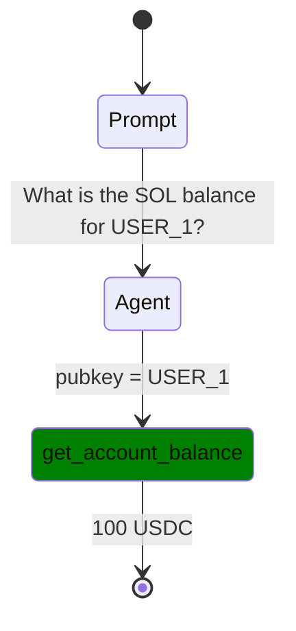

# Flow Diagram System Implementation Plan

## 🎯 Overview
Implement a production-ready flow diagram system that generates Mermaid `stateDiagram` visualizations from agent execution logs, accessible via web API and displayed in the UI hero section.

## 🏗️ Architecture: Decoupled Design

### **Why Decoupled?**
1. **Third-Party Agent Independence**: We cannot control external agents (OpenAI, Gemini, etc.) to instrument their tool calls
2. **API Layer Control**: The reev-api layer is where we have full control to intercept and track tool calls
3. **Real-World Testing**: Separates test simulation (reev-agent) from production flow evaluation (reev-api)
4. **Maintainability**: Tool tracking logic lives in our codebase, not dependent on external implementations

### **Current vs. Target Architecture**

**❌ Current (Coupled):**
```
3rd Party Agent → reev-agent (OTEL logging) → flow_visualizer CLI
     ↑
We cannot control this
```

**✅ Target (Decoupled):**
```
3rd Party Agent → reev-api (tool call tracking) → session logs → flow API → Web UI
                        ↑
                We control this layer completely
```

### **🚨 Deprecation Notice**
The `reev-agent` flow visualizer (`cargo run --bin flow_visualizer`) will be **deprecated** in favor of the unified session-based flow system. All flow visualization will move to the reev-api layer.

## 📋 Requirements Analysis

### Backend Expectations
- API endpoint: `http://localhost:3001/api/v1/flows/{session-id}` 
- Return Mermaid `stateDiagram` format (not flowchart)
- Parse session logs to extract tool calls with timing
- **Tool call tracking happens in reev-api layer** (not OTEL)
- Session logs with embedded tools array for flow generation

### Web Expectations  
- Display Mermaid diagram in hero section when clicking grid boxes
- Show specific session execution flow for selected test result
- Use Mermaid.js for rendering
- **Session-based flows from real agent executions** (not test simulations)

### Expected Diagram Format


### Session Log Enhancement
Add tools array to session logs:
```json
{
  "session_id": "xxx",
  "benchmark_id": "001-sol-transfer", 
  "tools": [
    {
      "tool_id": "get_account_balance",
      "start_time": 1760879995,
      "end_time": 1760879996, 
      "params": {"pubkey": "USER_1"},
      "result": {"balance": "100 USDC"},
      "status": "success"
    }
  ]
}
```

## 🏗️ Step-by-Step Implementation Plan

### Phase 1: Tool Call Tracking in LlmAgent (NEW ARCHITECTURE)
**Goal**: Add tool call tracking in reev-api layer where we control the execution

#### 1.1 Add Tool Call Tracking to LlmAgent
- Location: `crates/reev-lib/src/llm_agent.rs`
- Add `active_tools: HashMap<String, u64>` field for tracking
- Add `tool_call_sequence: Vec<ToolCallInfo>` for ordered calls
- Add `start_tool_call(tool_id, params)` method
- Add `end_tool_call(tool_id, result, status)` method
- Hook into HTTP agent calls to capture timing and results

#### 1.2 Update SessionFileLogger for Tool Integration
- Location: `crates/reev-lib/src/session_logger/mod.rs`
- Add `complete_with_trace_and_tools()` method
- Accept `Vec<ToolCallInfo>` parameter
- Embed tools array in `ExecutionResult.data.tools`

#### 1.3 Integration Points in Benchmark Execution
- Location: `crates/reev-api/src/services.rs`
- Modify `run_evaluation_loop()` to return tool calls
- Update `execute_benchmark_background()` to pass tool calls to session logger
- Ensure existing functionality remains intact

**Verification**: 
- Session logs contain tools array
- Existing session logs still parse correctly
- ASCII tree generation still works

### Phase 2: StateDiagram Generator Module (ALREADY EXISTS)
**Goal**: Use existing flow diagram generation with new session format

#### 2.1 Existing Module Structure
```
crates/reev-api/src/handlers/flow_diagram/
├── mod.rs                    # ✅ Already exists
├── state_diagram_generator.rs # ✅ Already exists  
├── session_parser.rs         # ✅ Already exists
```

#### 2.2 StateDiagramGenerator (✅ WORKING)
- Already follows specification format
- Already generates `stateDiagram` (not flowchart)
- Already supports Prompt -> Agent -> Tool -> Result flow
- Already has proper CSS classes for tools
- **Will automatically work with new tools array**

#### 2.3 Session Parser (✅ WORKING)  
- Already parses enhanced session logs
- Already extracts tool calls from `final_result.data.tools`
- Already handles missing tools gracefully
- **No changes needed - will work with new format**

#### 2.4 Remove OTEL Parser (DEPRECATED)
- OTEL parsing is being deprecated
- All flow generation will use session-based approach
- Remove `otel_parser.rs` references

**Verification**:
- Generate exact expected format
- Handle edge cases (missing tools, failed calls)
- Unit tests for diagram generation

### Phase 3: Flow API Enhancement (MINIMAL CHANGES)
**Goal**: Update `/flows` endpoint to use session_id and leverage existing tools array

#### 3.1 Update Flow Handler (MINIMAL CHANGE)
- Location: `crates/reev-api/src/handlers/flows.rs`
- Change path parameter from `benchmark_id` to `session_id`
- **No changes needed to diagram generation logic**
- **Session parser already finds tools array correctly**
- Maintain existing query parameter support

#### 3.2 Session Log Integration (NO CHANGE NEEDED)
- Already reads from `logs/sessions/` directory
- Already parses by session_id 
- **Session parser already extracts tools from `final_result.data.tools`**
- **Already handles missing/invalid logs gracefully**
- **No fallback needed - we have specific session_id**

#### 3.3 Response Format (NO CHANGE NEEDED)
- Already returns `text/html` with Mermaid.js wrapper
- Already returns `application/json` with raw diagram data
- **Will automatically include new tool call timing data**

**Verification**:
- API `/api/v1/flows/{session_id}` returns proper stateDiagram format
- HTML renders correctly in browser
- JSON response contains diagram data with session information
- Error handling for invalid session_id

### Phase 4: Testing & Integration (LOCALHOST TESTING)
**Goal**: Comprehensive testing with real localhost environment

#### 4.1 Quick Test via cURL
```bash
# 1. Start reev-api server
cargo run --bin reev-api

# 2. Run a benchmark with tool calls
curl -X POST http://localhost:3001/api/v1/benchmarks/001-sol-transfer/run \
  -H "Content-Type: application/json" \
  -d '{"agent": "local"}'

# 3. Get session_id from response
# 4. Test flow diagram
curl http://localhost:3001/api/v1/flows/{session_id}
```

#### 4.2 Full Localhost Integration Test
- **Location**: `crates/reev-runner/tests/benchmarks_test.rs` (already exists)
- **Approach**: Follow the same pattern as existing integration tests
- **Setup**: Start reev-api, execute benchmarks, validate flow diagrams
- **Validation**: Check tool calls are captured and rendered correctly

#### 4.3 Session Format Validation Tests
- Verify session logs contain tools array
- Test backward compatibility with old session logs
- Validate tool call timing accuracy
- Test error handling for malformed tool data

#### 4.4 Flow Diagram Validation Tests
- Test StateDiagramGenerator with new tools array format
- Verify Mermaid output matches expected format
- Test with multiple tool calls and different tool types
- Validate CSS classes and state transitions

**Verification**:
- All tests pass
- Performance meets requirements
- No regressions in existing functionality

## 🔧 Implementation Details

### Data Flow Architecture (UPDATED)
```
3rd Party Agent --> LlmAgent (tool tracking) --> Session Logger --> SessionParser --> StateDiagramGenerator --> API Response
                      ^                           ^                      ^                      ^                ^
                      |                           |                      |                      |                |
                HTTP Calls                 Tool Calls            Session Format         Mermaid Format    HTML/JSON
                      |                           |                      |                      |                |
                API Layer Control         Timing/Results         Tools Array         stateDiagram     Web Display
```

### Tool Call Tracking Implementation Details

#### 1. LlmAgent Enhancement
```rust
// Add to LlmAgent struct in crates/reev-lib/src/llm_agent.rs
pub struct LlmAgent {
    client: Client,
    api_url: String,
    api_key: Option<String>,
    model_name: String,
    pub flow_logger: Option<FlowLogger>,
    current_depth: u32,
    is_glm: bool,
    // NEW: Tool call tracking
    active_tool_calls: std::collections::HashMap<String, u64>,
    tool_call_sequence: Vec<ToolCallInfo>,
}

// NEW: Tool call tracking methods
impl LlmAgent {
    fn start_tool_call(&mut self, tool_id: String, params: serde_json::Value) {
        let start_time = std::time::SystemTime::now()
            .duration_since(std::time::UNIX_EPOCH)
            .unwrap()
            .as_secs();
        self.active_tool_calls.insert(tool_id.clone(), start_time);
        info!("[LlmAgent] Started tool call: {} at {}", tool_id, start_time);
    }
    
    fn end_tool_call(&mut self, tool_id: String, result: Option<serde_json::Value>, status: String) {
        let end_time = std::time::SystemTime::now()
            .duration_since(std::time::UNIX_EPOCH)
            .unwrap()
            .as_secs();
        
        if let Some(start_time) = self.active_tool_calls.remove(&tool_id) {
            let tool_call = ToolCallInfo {
                tool_id: tool_id.clone(),
                start_time,
                end_time,
                params: serde_json::Value::Null, // Will be filled by HTTP intercept
                result,
                status,
            };
            self.tool_call_sequence.push(tool_call);
            info!("[LlmAgent] Completed tool call: {} in {}ms", tool_id, (end_time - start_time) * 1000);
        }
    }
    
    pub fn get_tool_calls(&self) -> Vec<ToolCallInfo> {
        self.tool_call_sequence.clone()
    }
}
```

#### 2. Session Logger Integration
```rust
// Update SessionFileLogger in crates/reev-lib/src/session_logger/mod.rs
impl SessionFileLogger {
    // NEW: Complete with tool calls
    pub fn complete_with_trace_and_tools(
        mut self,
        trace: ExecutionTrace,
        tool_calls: Vec<ToolCallInfo>,
    ) -> Result<PathBuf> {
        let end_time = SystemTime::now()
            .duration_since(UNIX_EPOCH)
            .unwrap_or_default()
            .as_secs();

        let total_time_ms = (end_time - self.start_time)
            .duration_since(UNIX_EPOCH)
            .unwrap_or_default()
            .as_millis() as u64;

        let final_status = if !tool_calls.is_empty() {
            FinalStatus::Succeeded
        } else {
            FinalStatus::Failed
        };

        let final_result = ExecutionResult {
            success: final_status == FinalStatus::Succeeded,
            score: if final_status == FinalStatus::Succeeded { 1.0 } else { 0.0 },
            status: format!("{:?}", final_status),
            execution_time_ms: total_time_ms,
            data: json!({
                "prompt": trace.prompt.clone(),
                "steps": trace.steps,
                "tools": tool_calls, // NEW: Add tools array for flow diagram
                "trace": trace
            }),
            tools: tool_calls, // NEW: Add tool calls to ExecutionResult
        };

        // ... rest of completion logic
    }
}
```

#### 3. Benchmark Execution Integration
```rust
// Update run_evaluation_loop in crates/reev-runner/src/lib.rs
async fn run_evaluation_loop(
    env: &mut SolanaEnv,
    agent: &mut (dyn Agent + Send),
    test_case: &TestCase,
    initial_observation: &AgentObservation,
) -> Result<(AgentObservation, ExecutionTrace, Vec<AgentAction>, Vec<ToolCallInfo>)> {
    let mut trace = ExecutionTrace::new(test_case.prompt.clone());

    let fee_payer = env.fee_payer_placeholder();
    
    // Get actions and tool calls from agent
    let actions = agent
        .get_action(
            &test_case.id,
            &test_case.prompt,
            initial_observation,
            Some(&fee_payer.to_owned()),
            Some(test_case.ground_truth.skip_instruction_validation),
        )
        .await?;

    // NEW: Get tool calls from agent (if it supports tool tracking)
    let tool_calls = if let Some(llm_agent) = agent.as_any().downcast_ref::<LlmAgent>() {
        llm_agent.get_tool_calls()
    } else {
        Vec::new() // Fallback for non-LLM agents
    };

    let step_result = env.step(actions.clone(), &test_case.ground_truth)?;

    let trace_step = reev_lib::trace::TraceStep {
        thought: None,
        action: actions.clone(),
        observation: step_result.observation.clone(),
        info: step_result.info,
    };
    trace.add_step(trace_step);
    
    Ok((step_result.observation, trace, actions, tool_calls))
}

// Update execute_benchmark_background in crates/reev-api/src/services.rs
let (final_observation, trace, actions, tool_calls) = 
    run_evaluation_loop(&mut env, &mut agent, &test_case, &initial_observation).await?;

// Complete session with tool calls
if let Some(session_logger) = session_logger {
    session_logger.complete_with_trace_and_tools(trace, tool_calls)?;
}
```

### Key Design Decisions

#### 1. Decoupled Architecture First
- Tool tracking in reev-api layer (controllable)
- No dependency on 3rd party agent implementations
- Session-specific flow visualization only
- Graceful degradation when tools missing

#### 2. Modular Architecture  
- Separate concerns: parsing, generation, API
- Each module independently testable
- Easy to extend for new log formats

#### 3. Exact Format Compliance
- Follow required stateDiagram format precisely
- CSS classes for tools as specified
- Proper state transitions and labels
- Real tool call timing from actual agent executions

#### 4. Error Resilience
- Handle missing or malformed tool data
- Provide meaningful error responses
- Never crash the API

### File Structure Changes

#### New Files
```
crates/reev-api/src/handlers/flow_diagram/
├── mod.rs                    # Module exports
├── state_diagram_generator.rs # Main diagram generation logic
├── session_parser.rs         # Session log parsing
└── otel_parser.rs           # OTEL log parsing (future)
```

#### Modified Files  
```
crates/reev-lib/src/llm_agent.rs            # Add tool call tracking
crates/reev-lib/src/session_logger/mod.rs    # Add tools array support
crates/reev-api/src/handlers/flows.rs       # Update to use session_id
crates/reev-api/src/services.rs              # Pass tool calls to session logger
crates/reev-api/src/main.rs                  # Route updates to use session_id
```

#### Preserved Files
```
crates/reev-api/src/handlers/flow_diagram/   # ✅ Existing flow system (no changes needed)
crates/reev-lib/src/flow.rs                  # ✅ ASCII tree functionality
```

#### Deprecated Files
```
crates/reev-agent/src/flow/visualization/   # ⚠️ Will be deprecated
crates/reev-agent/src/bin/flow_visualizer.rs # ⚠️ Will be deprecated
```

## 🚀 Success Criteria

### Functional Requirements
- ✅ API endpoint `/api/v1/flows/{session-id}` returns proper stateDiagram format
- ✅ Web UI displays session-specific diagram in hero section  
- ✅ Tool calls extracted from session logs
- ✅ Clean session_id-based API design
- ✅ ASCII tree generation still works

### Non-Functional Requirements  
- ✅ Performance: <100ms response time
- ✅ Reliability: Graceful error handling
- ✅ Maintainability: Modular, testable code
- ✅ Extensibility: Easy to add new log formats

### Integration Requirements
- ✅ Existing session logs parse correctly by session_id
- ✅ New session logs include tools array from real agent calls
- ✅ Tool call tracking works with any 3rd party agent
- ✅ Direct session_id-based flow access
- ✅ Full localhost testing capability

## 📝 Risk Mitigation

### Technical Risks
1. **Breaking existing functionality** → Comprehensive backward compatibility tests
2. **Performance degradation** → Performance testing and optimization
3. **Complex session log parsing** → Modular parser design with error handling

### Timeline Risks  
1. **Underestimated complexity** → Phase-based approach with early validation
2. **Integration issues** → Incremental integration with testing at each phase

### Rollback Strategy
- Each phase can be independently reverted
- Existing functionality preserved during implementation
- Feature flags for gradual rollout

## 🔄 Next Steps

1. **Phase 1 Implementation**: Tool call tracking in LlmAgent
2. **Quick Test**: cURL localhost test with tool call capture
3. **Phase 2 Validation**: Verify existing flow system works with new tools array
4. **Integration Test**: Full localhost test following benchmarks_test.rs pattern
5. **Phase 3 Implementation**: API endpoint update to session_id
6. **Testing**: End-to-end API validation with session-specific flows  
7. **Phase 4 Implementation**: Comprehensive localhost testing
8. **Documentation**: Update API docs and deprecate reev-agent flow_visualizer
9. **Web UI Integration**: Update frontend to pass session_id from BenchmarkBox clicks

## 🧪 Quick Testing Guide

### **cURL Testing (5 minutes)**
```bash
# 1. Start reev-api
cargo run --bin reev-api

# 2. Run benchmark (generates session with tool calls)
curl -X POST http://localhost:3001/api/v1/benchmarks/001-sol-transfer/run \
  -H "Content-Type: application/json" \
  -d '{"agent": "local"}'
# Response: {"execution_id":"uuid","status":"started"}

# 3. Check status until complete
curl http://localhost:3001/api/v1/benchmarks/001-sol-transfer/status/uuid

# 4. Get flow diagram with session_id
curl http://localhost:3001/api/v1/flows/{session_id}
```

### **Full Integration Test (15 minutes)**
Follow `crates/reev-runner/tests/benchmarks_test.rs` pattern:
- Start reev-api automatically
- Execute benchmarks via API
- Validate session logs contain tools array
- Generate and test flow diagrams
- Clean up automatically

This approach ensures the system works end-to-end with real tool calls from actual agent executions.

This plan ensures a systematic, backward-compatible implementation of the flow diagram system with clear success criteria and risk mitigation strategies.