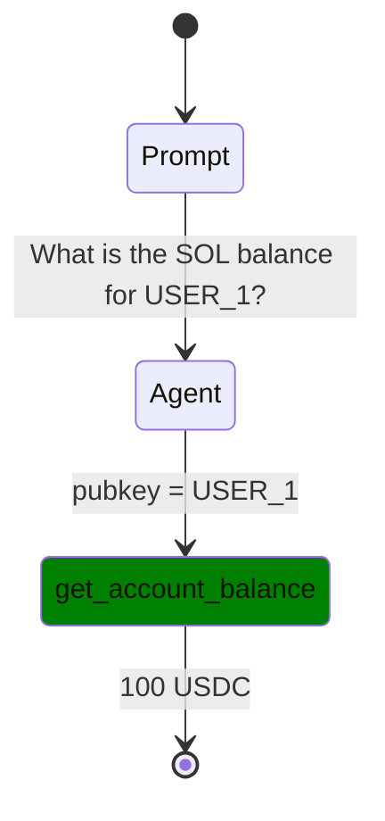

# Flow Diagram System Implementation Plan

## 🎯 Overview
Implement a production-ready flow diagram system that generates Mermaid `stateDiagram` visualizations from agent execution logs, accessible via web API and displayed in the UI hero section.

## 📋 Requirements Analysis

### Backend Expectations
- API endpoint: `http://localhost:3001/api/v1/flows/{benchmark-id}` 
- Return Mermaid `stateDiagram` format (not flowchart)
- Parse session logs to extract tool calls with timing
- Support both session logs and OTEL logs

### Web Expectations  
- Display Mermaid diagram in hero section when clicking grid boxes
- Default to first test result with focus simulation
- Use Mermaid.js for rendering

### Expected Diagram Format


### Session Log Enhancement
Add tools array to session logs:
```json
{
  "session_id": "xxx",
  "benchmark_id": "001-sol-transfer", 
  "tools": [
    {
      "tool_id": "get_account_balance",
      "start_time": 1760879995,
      "end_time": 1760879996, 
      "params": {"pubkey": "USER_1"},
      "result": {"balance": "100 USDC"},
      "status": "success"
    }
  ]
}
```

## 🏗️ Step-by-Step Implementation Plan

### Phase 1: Session Logger Enhancement (BACKWARD COMPATIBLE)
**Goal**: Add tool tracking to existing session logs without breaking current functionality

#### 1.1 Add ToolCallInfo Structure
- Location: `crates/reev-lib/src/session_logger/mod.rs`
- Add `ToolCallInfo` struct with required fields
- Add `tools` field to `ExecutionResult` struct
- Ensure backward compatibility with existing logs

#### 1.2 Enhance SessionFileLogger
- Add `active_tools: HashMap<String, u64>` field for tracking
- Add `start_tool_call(tool_id, params)` method
- Add `end_tool_call(tool_id, result, status)` method  
- Add `extract_tools_from_events()` helper method
- Modify `complete()` and `complete_with_trace()` to populate tools

#### 1.3 Integration Points
- Identify where tools are called in agent execution
- Add tool start/end tracking calls
- Ensure existing ASCII tree functionality remains intact

**Verification**: 
- Session logs contain tools array
- Existing session logs still parse correctly
- ASCII tree generation still works

### Phase 2: StateDiagram Generator Module (NEW)
**Goal**: Create dedicated module for Mermaid stateDiagram generation

#### 2.1 Create New Module Structure
```
crates/reev-api/src/handlers/flow_diagram/
├── mod.rs
├── state_diagram_generator.rs
├── session_parser.rs  
└── otel_parser.rs
```

#### 2.2 StateDiagramGenerator Implementation
- Follow exact specification format
- Generate `stateDiagram` (not flowchart)
- Support Prompt -> Agent -> Tool -> Result flow
- Add proper CSS classes for tools
- Handle multiple tool calls sequentially

#### 2.3 Session Parser
- Parse enhanced session logs
- Extract tool calls with timing
- Handle missing tools gracefully (backward compatibility)
- Generate state transitions

#### 2.4 OTEL Parser (Future)
- Parse OTEL log format for tool calls
- Merge with session parser results
- Handle OTEL-specific event patterns

**Verification**:
- Generate exact expected format
- Handle edge cases (missing tools, failed calls)
- Unit tests for diagram generation

### Phase 3: Flow API Enhancement (REPLACE)
**Goal**: Update `/flows` endpoint to use new stateDiagram generator

#### 3.1 Update Flow Handler
- Location: `crates/reev-api/src/handlers/flows.rs`
- Replace current Mermaid flowchart generation
- Use new StateDiagramGenerator
- Maintain existing query parameter support

#### 3.2 Session Log Integration
- Read session logs from `logs/sessions/` directory
- Parse latest session for benchmark
- Extract tool calls and generate diagram
- Handle missing/invalid logs gracefully

#### 3.3 Response Format
- Return `text/html` with Mermaid.js wrapper
- Return `application/json` with raw diagram data
- Maintain backward compatibility

**Verification**:
- API returns proper stateDiagram format
- HTML renders correctly in browser
- JSON response contains diagram data

### Phase 4: Testing & Integration (VALIDATE)
**Goal**: Comprehensive testing and integration validation

#### 4.1 Unit Tests
- Test StateDiagramGenerator with various inputs
- Test session parsing with different log formats
- Test error handling for malformed logs

#### 4.2 Integration Tests  
- Test full API endpoint flow
- Test with real session data
- Test with OTEL log data (if available)

#### 4.3 Backward Compatibility Tests
- Verify existing ASCII tree still works
- Verify existing session logs parse
- Verify existing API responses unchanged

#### 4.4 Performance Tests
- Test with large session logs
- Test concurrent API requests
- Memory usage validation

**Verification**:
- All tests pass
- Performance meets requirements
- No regressions in existing functionality

## 🔧 Implementation Details

### Data Flow Architecture
```
Session Log --> SessionParser --> StateDiagramGenerator --> API Response
     ^                    ^                      ^                ^
     |                    |                      |                |
Existing Format    Enhanced Format      Mermaid Format    HTML/JSON
     |                    |                      |                |
ASCII Tree        Tools Array         stateDiagram     Web Display
```

### Key Design Decisions

#### 1. Backward Compatibility First
- Never break existing session log parsing
- Optional tools array in ExecutionResult
- Graceful degradation when tools missing

#### 2. Modular Architecture  
- Separate concerns: parsing, generation, API
- Each module independently testable
- Easy to extend for new log formats

#### 3. Exact Format Compliance
- Follow required stateDiagram format precisely
- CSS classes for tools as specified
- Proper state transitions and labels

#### 4. Error Resilience
- Handle missing or malformed tool data
- Provide meaningful error responses
- Never crash the API

### File Structure Changes

#### New Files
```
crates/reev-api/src/handlers/flow_diagram/
├── mod.rs                    # Module exports
├── state_diagram_generator.rs # Main diagram generation logic
├── session_parser.rs         # Session log parsing
└── otel_parser.rs           # OTEL log parsing (future)
```

#### Modified Files  
```
crates/reev-lib/src/session_logger/mod.rs    # Add tool tracking
crates/reev-api/src/handlers/flows.rs       # Update to use new generator
crates/reev-api/src/handlers/mod.rs         # Export new module
crates/reev-api/src/main.rs                 # Route updates (if needed)
```

#### Preserved Files
```
crates/reev-agent/src/flow/visualization/   # Existing flow visualizer (POC)
crates/reev-agent/src/bin/flow_visualizer.rs # CLI tool (keep for development)
crates/reev-lib/src/flow.rs                 # ASCII tree functionality
```

## 🚀 Success Criteria

### Functional Requirements
- ✅ API endpoint returns proper stateDiagram format
- ✅ Web UI displays diagram in hero section  
- ✅ Tool calls extracted from session logs
- ✅ Backward compatibility maintained
- ✅ ASCII tree generation still works

### Non-Functional Requirements  
- ✅ Performance: <100ms response time
- ✅ Reliability: Graceful error handling
- ✅ Maintainability: Modular, testable code
- ✅ Extensibility: Easy to add new log formats

### Integration Requirements
- ✅ Existing session logs parse correctly
- ✅ New session logs include tools array
- ✅ OTEL integration ready for future
- ✅ No breaking changes to existing APIs

## 📝 Risk Mitigation

### Technical Risks
1. **Breaking existing functionality** → Comprehensive backward compatibility tests
2. **Performance degradation** → Performance testing and optimization
3. **Complex session log parsing** → Modular parser design with error handling

### Timeline Risks  
1. **Underestimated complexity** → Phase-based approach with early validation
2. **Integration issues** → Incremental integration with testing at each phase

### Rollback Strategy
- Each phase can be independently reverted
- Existing functionality preserved during implementation
- Feature flags for gradual rollout

## 🔄 Next Steps

1. **Phase 1 Implementation**: Session logger enhancement
2. **Testing**: Validate tools array in session logs
3. **Phase 2 Implementation**: StateDiagram generator module
4. **Testing**: Validate diagram generation
5. **Phase 3 Implementation**: API integration
6. **Testing**: End-to-end API validation  
7. **Phase 4 Implementation**: Comprehensive testing
8. **Documentation**: Update API docs and usage examples

This plan ensures a systematic, backward-compatible implementation of the flow diagram system with clear success criteria and risk mitigation strategies.