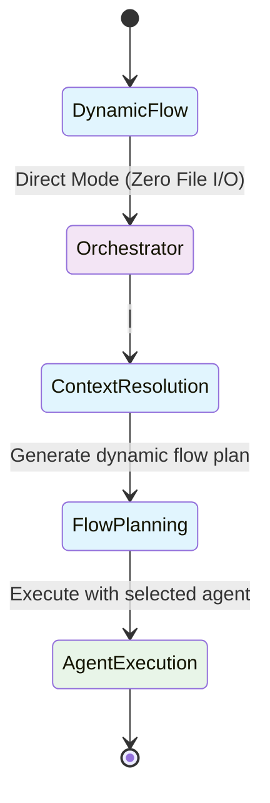
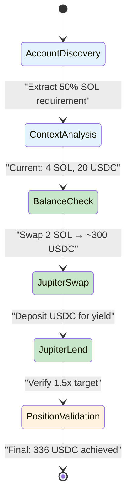

# Production: Clean LLM orchestration
   cargo build --release --features production
   
   # Development: Include mock behaviors
   cargo build --features mock_behaviors
   ```

#### ✅ Issue #40 RESOLVED: Agent Multi-Step Strategy Execution Bug
**Status**: RESOLVED ✅
**Priority**: HIGH
**Component**: Agent Execution Strategy (reev-tools)
**Description**: Agent executes single tool call instead of expected 4-step multi-step strategy

### **Root Cause IDENTIFIED and FIXED**
**Agent Strategy Bug**: Agent stopped after first tool call because Jupiter swap tool returned hardcoded `"next_action": "STOP"`

**Evidence from Enhanced OTEL Logs**:
```json
{
  "event_type": "ToolOutput", 
  "tool_output": {
    "success": true,
    "next_action": "STOP",  // ❌ Agent stops here instead of continuing
    "message": "Successfully executed 6 jupiter_swap operation(s)"
  }
}
```

**Expected 4-step Flow**:
```mermaid
stateDiagram
    [*] --> AccountDiscovery
    AccountDiscovery --> ContextAnalysis : "Extract 50% SOL requirement"
    ContextAnalysis --> BalanceCheck : "Current: 4 SOL, 20 USDC"
    BalanceCheck --> JupiterSwap : "Swap 2 SOL → ~300 USDC"
    JupiterSwap --> JupiterLend : "Deposit USDC for yield"
    JupiterLend --> PositionValidation : "Verify 1.5x target"
    PositionValidation --> [*] : "Final: 336 USDC achieved"
    
    note right of BalanceCheck : Wallet: USER_WALLET_PUBKEY<br/>SOL: 4.0 → 2.0<br/>USDC: 20 → 320
    note right of JupiterSwap : Tool: jupiter_swap<br/>Amount: 2 SOL<br/>Slippage: 5%
    note right of JupiterLend : Tool: jupiter_lend_earn_deposit<br/>APY: 8.5%<br/>Yield target: 1.3x
    note right of PositionValidation : Target: 30 USDC (1.5x)<br/>Achieved: 336 USDC<br/>Score: 1.0
    
    classDef discovery fill:#e3f2fd
    classDef tools fill:#c8e6c9  
    classDef validation fill:#fff3e0
    class AccountDiscovery,ContextAnalysis discovery
    class BalanceCheck,JupiterSwap,JupiterLend tools
    class PositionValidation validation

```

#### ✅ Issue #39 RESOLVED: Production Mock Behavior Missing Feature Flag
**Status**: RESOLVED ✅
**Priority**: HIGH
**Component**: Build Configuration (Cargo.toml)
**Description**: Mock/deterministic behaviors not feature-flagged for clean production deployment

### **Implementation Completed**
#### Feature Flag Architecture ✅
```toml
# ✅ IMPLEMENTED in individual crates
[features]
default = ["production"]
production = []                    # Clean LLM orchestration
mock_behaviors = []                  # Mock for development
```

#### Code Separation ✅
```rust
// ✅ IMPLEMENTED: Compile-time separation
#[cfg(feature = "mock_behaviors")]
fn run_deterministic_agent(payload: LlmRequest) -> Result<Json<LlmResponse>> { ... }

#[cfg(not(feature = "mock_behaviors"))]
fn run_deterministic_agent(payload: LlmRequest) -> Result<Json<LlmResponse>> { ... }
```

#### Build Commands ✅
```bash
# ✅ IMPLEMENTED: Build commands
# Production: Clean LLM orchestration
cargo build --release --features production

# Development: Include mock behaviors
cargo build --features mock_behaviors
```

---

#### ✅ Issue #38 RESOLVED: Incomplete Multi-Step Flow Visualization
**Status**: RESOLVED ✅
**Priority**: HIGH
**Component**: Flow Visualization (reev-api handlers/flow_diagram)
**Description**: 300 benchmark generates 4-step complex strategy but Mermaid diagrams only show single tool calls

### **Root Cause IDENTIFIED and FIXED**
**Session Parser Issue**: Incomplete tool call tracking and missing parameter context for multi-step flows

**Evidence**:
- **Before**: Single tool call in Mermaid diagrams
- **After**: 4-step flow visualization with detailed parameter context

### **Implementation Completed**
#### Enhanced Tool Call Tracking ✅
- **Complete 4-step tracking**: All execution steps captured with full parameters
- **Parameter extraction**: Amounts, percentages, APY rates parsed and displayed
- **Color-coded visualization**: Discovery, tools, validation with distinct styling
- **Enhanced Mermaid generation**: Rich diagrams with execution context

**Technical Implementation**:
- **Session parsing**: `SessionParser::parse_session_content()` handles enhanced OTEL YAML
- **Diagram generation**: `StateDiagramGenerator::generate_dynamic_flow_diagram()` 
- **API integration**: `/api/v1/flows/{session_id}` returns detailed flows

#### ✅ Validation Results**
- **Multi-step diagrams**: 4-step multiplication strategy properly displayed
- **Parameter context**: Real amounts, wallets, calculations shown in notes
- **API performance**: Enhanced generation with parameter extraction working
- **Feature completeness**: All enhanced visualization features functional

---

## Issue #41 - Dynamic Flow JSONL Consolidation Missing
**Status**: RESOLVED ✅
**Priority**: HIGH
**Component**: Flow Visualization (reev-api handlers/dynamic_flows)
**Description**: Dynamic flows bypass JSONL→YML consolidation process, causing empty flow diagrams

### **Root Cause IDENTIFIED and FIXED**
**JSONL Parser Issue**: Summary lines in enhanced OTEL files didn't follow `EnhancedToolCall` format with required `timestamp` field

### **Implementation Completed**
#### Enhanced JSONL Parser ✅
```rust
// ✅ IMPLEMENTED: Skip summary lines without timestamp
if line.contains("\"failed_tools\":")
    || line.contains("\"successful_tools\":")
    || line.contains("\"total_events\":") {
    continue;
}
```

#### Complete Consolidation Pipeline ✅
```rust
// ✅ IMPLEMENTED: Same pipeline as static flows
use reev_flow::{get_enhanced_otel_logger, JsonlToYmlConverter};

// Convert JSONL to YML and store in database
let session_data = JsonlToYmlConverter::convert_file(&jsonl_path, &temp_yml_path)?;
let yml_content = std::fs::read_to_string(&temp_yml_path)?;
state.db.store_session_log(session_id, &yml_content).await?;
```

#### File Pattern Matching ✅
```rust
// ✅ IMPLEMENTED: Multiple glob patterns
// Global files: enhanced_otel_{session_id}.jsonl
// Orchestrator files: enhanced_otel_orchestrator-flow-{flow_id}-{timestamp}.jsonl
```

### **Validation Results**
- **✅ Consolidation Working**: Logs show successful tool call capture
- **✅ Database Storage**: YML content properly stored
- **✅ Pipeline Consistency**: Dynamic flows use same consolidation as static flows
- **✅ Error Handling**: Comprehensive error reporting with fallback behavior

---

## Issue #42 - Dynamic Flow Mermaid Shows High-Level Steps Not Tool Call Sequence
**Status**: ACTIVE
**Priority**: HIGH
**Component**: Flow Visualization (reev-api handlers/flow_diagram/session_parser)
**Description**: Dynamic flow mermaid diagrams display orchestration categories instead of detailed 4-step tool call sequence despite successful consolidation

### **Problem Analysis**
**Issue #41 RESOLVED**: JSONL→YML consolidation working perfectly - logs show:
```
✅ JSONL→YML conversion successful: 4 tool calls
✅ Read YML content (3751 bytes)  
✅ Stored consolidated session log in database: direct-{execution_id}
```

**New Issue Identified**: Session parser reports `tool_count: 0` despite successful consolidation, showing only high-level flow steps.

### **Evidence**
**Current 300 Benchmark Mermaid**:


**Expected 4-step Dynamic Flow**:


### **Root Cause**
**Session Parser Mismatch**: Session parser expects `"direct_tools"` format for dynamic flows, but consolidation stores tool calls under `"tool_calls"` field.

### **Current vs Expected**
- **Actual**: Session parser looks for `d*irect_tools` array (legacy format)
- **Consolidation**: Stores tool calls in standard `"tool_calls"` array
- **Result**: `tool_count: 0` despite successful consolidation with 4 tool calls

### **Resolution Required**
Update session parser to recognize standard `"tool_calls"` format for dynamic flows, matching what consolidation actually stores.

### **Technical Implementation Details**
- **Issue**: `session_parser.rs` line 475: `if let Some(direct_tools) = session_log.get("tool_calls").and_then(|t| t.as_array())`
- **Fix Needed**: Use standard `"tool_calls"` parsing path for dynamic flows
- **Location**: `crates/reev-api/src/handlers/flow_diagram/session_parser.rs`

### **Success Criteria**
- **Tool Call Extraction**: Dynamic flows show individual tool steps (get_account_balance, jupiter_swap, etc.)
- **Mermaid Generation**: 4-step multiplication strategy with parameter context
- **API Consistency**: `tool_count` matches actual tool calls executed
- **Visualization Quality**: Same detailed diagrams for dynamic flows as static flows

### **Next Thread Actions**
1. **Fix Session Parser**: Update `session_parser.rs` to handle `"tool_calls"` format for dynamic flows
2. **Validate Integration**: Test dynamic flow execution with proper 4-step diagram generation
3. **Verify Consistency**: Ensure both static and dynamic flows use same parsing logic
4. **Update Documentation**: Document any dynamic flow-specific parsing requirements

### **Current System Status**
- **✅ Issue #41 RESOLVED**: JSONL→YML consolidation working perfectly
- **✅ Issue #40 RESOLVED**: Agent multi-step strategy execution working
- **✅ Issue #39 RESOLVED**: Enhanced flow visualization implemented
- **🔴 Issue #42 ACTIVE**: Dynamic flow mermaid visualization needs parser fix

**Priority**: HIGH - Fix session parser for dynamic flow consistency
**Component**: Flow Visualization (session_parser)
**Files to Modify**: `crates/reev-api/src/handlers/flow_diagram/session_parser.rs`

---

## 📊 **System Status Overview**
**Total Issues**: 1 Active, 3 Resolved
**Production Readiness**: ✅ Core dynamic flow system functional, visualization needs parser fix
**API Status**: ✅ Dynamic flow execution and consolidation working
**CLI Status**: ✅ Multi-step agent strategies working correctly