# Handover

## Current State Overview

### ✅ **LLM Integration Architecture Working**
- **Dynamic flow execution**: 300 benchmark routes to LLM agents successfully
- **4-step generation**: Complex strategies created in gateway.rs (lines 352-363)
- **Tool execution**: Real Jupiter swap/lend operations working (score: 1.0)
- **Scoring system**: Perfect achievement on complex multiplication strategy
- **API endpoints**: All flow visualization endpoints functional

### ⚠️ **Critical Issue: Incomplete Flow Visualization**
- **Problem**: Only single tool calls visible in Mermaid diagrams
- **Root Cause**: Tool call tracking captures final step, not intermediate steps
- **Impact**: 4-step strategy appears as single operation
- **Files to Fix**: ping_pong_executor.rs, session_parser.rs, state_diagram_generator.rs

## Development Workflow

### 🔍 **Debug Process**

#### Step 1: Reproduce Issue
```bash
# Execute 300 benchmark with LLM agent
EXECUTION_ID=$(curl -s -X POST "/api/v1/benchmarks/300-jup-swap-then-lend-deposit-dyn/run" \
  -d '{"agent":"glm-4.6-coding","mode":"dynamic"}' | jq -r '.execution_id')

# Check execution results
curl "/api/v1/benchmarks/300-jup-swap-then-lend-deposit-dyn/status/$EXECUTION_ID" | jq '{status, score}'

# Analyze flow visualization
curl "/api/v1/flows/$EXECUTION_ID?format=json" | jq '{total_tools: (.tool_calls | length)}'
```

#### Step 2: Identify Root Cause
```bash
# Check server logs for tool call tracking
tail -f /tmp/reev-api.log | grep -E "(tool_call|OTEL|session)"

# Examine execution session data
curl "/api/v1/debug/execution-sessions" | jq '.data[] | select(.execution_id == "$EXECUTION_ID")'

# Validate 4-step generation in gateway
grep -A 20 '"complex"' reev/crates/reev-orchestrator/src/gateway.rs
```

#### Step 3: Fix Implementation
1. **Enhance Tool Call Tracking** - Capture all 4 steps in ping-pong executor
2. **Multi-Step Session Parsing** - Parse complete execution sequence
3. **Parameter Context Display** - Show amounts, wallets, calculations
4. **Step Validation** - Display success/failure for each intermediate step

### 🧪 **Testing Strategy**

#### Unit Testing
```bash
# Test multi-step flow generation
cargo test test_multi_step_flow_generation -p reev-orchestrator

# Test enhanced session parsing
cargo test test_multi_step_session_parsing -p reev-api

# Test mermaid diagram generation
cargo test test_enhanced_mermaid_generation -p reev-api
```

#### Integration Testing
```bash
# Execute complete 4-step strategy
curl -X POST "/api/v1/benchmarks/300-jup-swap-then-lend-deposit-dyn/run" \
  -d '{"agent":"glm-4.6-coding","mode":"dynamic"}'

# Validate 4-step visualization
EXPECTED_TOOLS=4
ACTUAL_TOOLS=$(curl "/api/v1/flows/$EXECUTION_ID" | jq '.tool_calls | length')
if [ "$ACTUAL_TOOLS" -eq "$EXPECTED_TOOLS" ]; then echo "✅ PASSED"; else echo "❌ FAILED"; fi
```

#### Flow Visualization Testing
```bash
# Test complete mermaid diagram generation
curl "/api/v1/flows/$EXECUTION_ID?format=json" | jq -r '.diagram' > test_diagram.mmd

# Validate diagram contains all steps
grep -q "AccountDiscovery" test_diagram.mmd && echo "✅ Discovery step visible"
grep -q "JupiterSwap" test_diagram.mmd && echo "✅ Swap step visible"
grep -q "JupiterLend" test_diagram.mmd && echo "✅ Lend step visible"
grep -q "PositionValidation" test_diagram.mmd && echo "✅ Validation step visible"
```

### 📊 **Expected Output Validation**

#### Target Mermaid Format

```mermaid
stateDiagram
    [*] --> AccountDiscovery
    AccountDiscovery --> ContextAnalysis : "Extract 50% SOL requirement"
    ContextAnalysis --> BalanceCheck : "Current: 4 SOL, 20 USDC"
    BalanceCheck --> JupiterSwap : "Swap 2 SOL → ~300 USDC"
    JupiterSwap --> JupiterLend : "Deposit USDC for yield"
    JupiterLend --> PositionValidation : "Verify 1.5x target"
    PositionValidation --> [*] : "Final: 336 USDC achieved"
```


#### Success Criteria
- **4 Tool Calls**: All execution steps captured and tracked
- **Parameter Notes**: Real amounts, wallets, calculations displayed
- **Step Sequence**: Discovery → Tools → Validation flow visible
- **Color Coding**: Visual distinction between step types
- **API Performance**: <100ms response time for flow endpoint

### 🔧 **Implementation Focus Areas**

#### Primary Files
1. `reev-orchestrator/src/execution/ping_pong_executor.rs` - Step execution tracking
2. `reev-api/src/handlers/flow_diagram/session_parser.rs` - Multi-step parsing
3. `reev-api/src/handlers/flow_diagram/state_diagram_generator.rs` - Enhanced visualization

#### Key Functions to Modify
- `execute_flow_plan()` - Capture all tool calls with step indices
- `parse_multi_step_session()` - Group tools by execution step
- `generate_multi_step_diagram()` - Create comprehensive visualization
- `create_transition_label()` - Display execution parameters

### 📈 **Validation Metrics**

#### Tool Call Coverage
- **Target**: 100% (4/4 steps)
- **Measurement**: Count of parsed tool calls vs expected
- **Pass Threshold**: ≥95%

#### Diagram Completeness
- **Target**: 5 states (discovery, analysis, 3 tools)
- **Measurement**: State count in generated Mermaid
- **Pass Threshold**: All required states present

#### Parameter Accuracy
- **Target**: Real execution values
- **Measurement**: Amount verification against execution logs
- **Pass Threshold**: Values match actual execution

## Production Deployment

### 🚀 **Rollback Plan**
```bash
# Current working version commit
git log --oneline -5

# Rollback if issues occur
git revert HEAD --no-edit
cargo build --release
systemctl restart reev-api
```

### 📋 **Pre-Deployment Checklist**
- [ ] All 4 tool calls captured in flow visualization
- [ ] Parameter context displayed for each step
- [ ] Color-coded step categories implemented
- [ ] API response time <100ms
- [ ] Integration tests passing
- [ ] Documentation updated

### 🔄 **Post-Monitoring**
```bash
# Monitor flow visualization performance
curl "/api/v1/flows/latest" | jq '.total_execution_time_ms'

# Check error rates in flow generation
tail -f /var/log/reev/flow_diagram.log | grep ERROR

# Validate 300 benchmark success rate
curl "/api/v1/benchmarks/300-jup-swap-then-lend-deposit-dyn" | jq '.recent_executions | map(select(.status == "completed")) | length'
```

## Next Thread Focus

### 🎯 **Primary Goals**
1. Complete 4-step flow visualization to demonstrate full LLM orchestration capabilities
2. Implement production feature flags to separate LLM orchestration from mock behaviors

### 📝 **Immediate Tasks**
#### Issue #38: Flow Visualization
1. Fix tool call tracking in ping-pong executor
2. Implement multi-step session parsing
3. Create enhanced Mermaid generation with parameters
4. Validate with real 300 benchmark execution

#### Issue #39: Production Feature Flags
5. Add feature flags to Cargo.toml
6. Update agent routing with compile-time separation
7. Remove mock behaviors from production builds
8. Validate clean production deployment

### 🔍 **Reference Issues**
- **Issue #39**: Production Mock Behavior Missing Feature Flag (ACTIVE)
- **Issue #38**: Incomplete Multi-Step Flow Visualization (ACTIVE)
- **Issue #37**: ToolName Enum Mismatch (RESOLVED ✅)
- **Issue #10**: Orchestrator-Agent Ping-Pong (RESOLVED ✅)
- **Issue #29**: USER_WALLET_PUBKEY Auto-Generation (RESOLVED ✅)

**Current Status**: Foundation solid, visualization enhancement needed for production demo