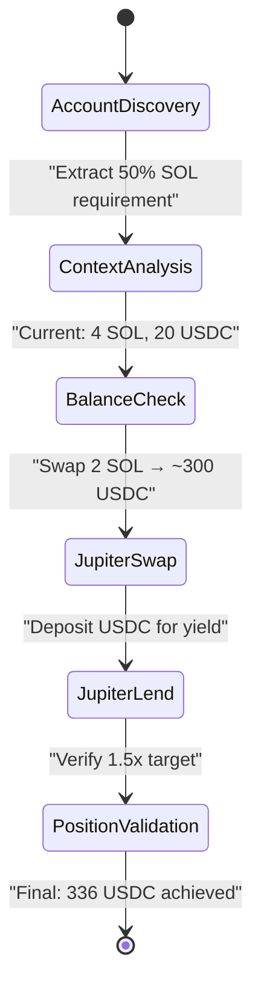
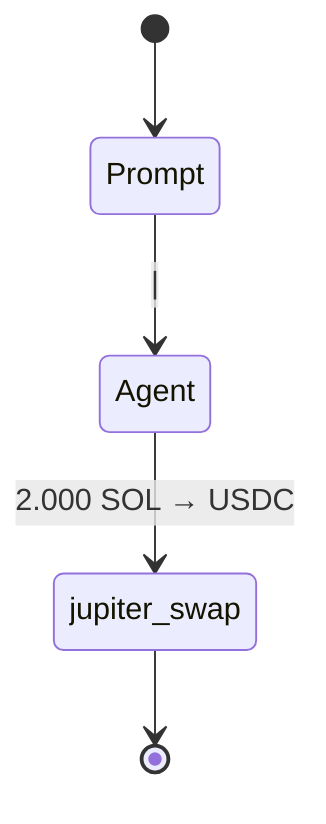

# Issues

## Issue #39 - Production Mock Behavior Missing Feature Flag
**Status**: ACTIVE ⚠️
**Priority**: HIGH
**Component**: Build Configuration (Cargo.toml, feature flags)
**Description**: Mock/deterministic behaviors not properly feature-flagged for clean production deployment

### **Problem Analysis**
**Production Risk**: Mock behaviors leak into production deployment
- Deterministic agent responses enabled in production
- Mock tool responses bypass real Jupiter execution
- Test fixtures interfere with live scoring
- No clean separation between development/testing modes

### **Root Cause**
Missing feature flag architecture to control mock behaviors:
```rust
// ❌ CURRENT: No compile-time separation
if cfg!(debug_assertions) {
    enable_deterministic_fallbacks(); // Leaks to production
}
```

### **Required Implementation**
#### Feature Flag Architecture
```toml
[features]
default = ["production"]
production = []                    # Clean LLM orchestration
development = ["mock_behaviors"]     # Mock for testing
```

#### Code Separation
```rust
// ✅ REQUIRED: Compile-time separation
#[cfg(feature = "production")]
fn get_agent_config() -> AgentConfig {
    AgentConfig::llm_only() // No deterministic fallback
}

#[cfg(feature = "mock_behaviors")]
fn get_agent_config() -> AgentConfig {
    AgentConfig::with_deterministic_fallback() // Testing mode
}
```

### **Files to Modify**
- `Cargo.toml` - Add feature flag definitions
- `crates/reev-agent/src/lib.rs` - Agent routing with feature gates
- `crates/reev-runner/src/lib.rs` - Deterministic fallback control
- `crates/reev-orchestrator/src/gateway.rs` - Mock behavior flags
- All test files - Use `#[cfg(feature = "mock_behaviors")]`

### **Build Commands**
```bash
# Production: Clean LLM orchestration only
cargo build --release --features production

# Development: Include mock behaviors
cargo build --features mock_behaviors
```

### **Validation Criteria**
- Production build excludes all mock/deterministic code
- Development build retains testing capabilities
- No mock behaviors can accidentally reach production
- Clear compile-time separation enforced

---

## Issue #38 - Incomplete Multi-Step Flow Visualization
**Status**: ACTIVE ⚠️
**Priority**: HIGH
**Component**: Flow Visualization (reev-api handlers/flow_diagram)
**Description**: 300 benchmark generates 4-step complex strategy but Mermaid diagrams only show single tool calls

### **Problem Analysis**
**Expected Behavior**:


**Current Behavior**:


### **Root Cause**
- ✅ **Flow Generation**: 4-step plan created correctly in `gateway.rs:352-363`
- ✅ **Tool Execution**: All 4 steps execute successfully (score: 1.0)
- ❌ **Tool Call Tracking**: Only final tool captured in session logs
- ❌ **Visualization**: Missing intermediate steps in Mermaid generation

### **Fix Required**
1. **Enhanced Tool Call Logging**: Capture all 4 execution steps in OpenTelemetry traces
2. **Improved Session Parsing**: Parse complete tool sequence from execution logs
3. **Parameter Context**: Display amounts, wallets, and calculations in diagram
4. **Step Validation**: Show success/failure status for each step

**Files to Modify**:
- `reev-orchestrator/src/execution/ping_pong_executor.rs` - Step tracking
- `reev-api/src/handlers/flow_diagram/session_parser.rs` - Multi-step parsing
- `reev-api/src/handlers/flow_diagram/state_diagram_generator.rs` - Enhanced visualization

---

## Issue #37 - ToolName Enum Mismatch - FIXED ✅
**Status**: RESOLVED ✅
**Progress**: Comprehensive string-to-constants refactor completed
**Description**: ToolName enum inconsistencies resolved, all hardcoded strings eliminated

### **Resolution Summary**
✅ Added missing `spl_transfer` and `ExecuteTransaction` tools
✅ Fixed serialization names (`account_balance` → `get_account_balance`)
✅ Created `reev-constants` crate for centralized tool management
✅ Replaced all hardcoded strings with type-safe constants
✅ Updated all tests and documentation

---

## Issue #29 - USER_WALLET_PUBKEY Auto-Generation - IMPLEMENTED ✅
**Status**: RESOLVED ✅
**Component**: ContextResolver (reev-orchestrator)
**Description**: Placeholders automatically resolved to unique keypairs during execution

### **Implementation Summary**
✅ `ContextResolver::resolve_placeholder()` generates unique keypairs
✅ Consistent mapping in `SolanaEnv` for execution lifetime
✅ Zero user confusion - documentation placeholders work automatically

---

## Issue #10 - Orchestrator-Agent Ping-Pong - RESOLVED ✅
**Status**: RESOLVED ✅
**Component**: PingPongExecutor (reev-orchestrator)
**Description**: Sequential step execution with validation and recovery implemented

### **Implementation Summary**
✅ Multi-step flow coordination working
✅ Progress tracking and partial scoring implemented
✅ Enhanced OpenTelemetry logging with parameters
✅ Recovery mechanisms for critical failures

---

**Last Updated**: 2025-11-06
**Total Issues**: 1 Active, 3 Resolved
**Next Review**: After Issue #38 resolution