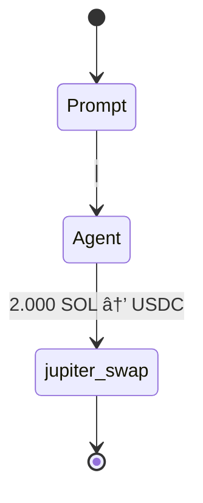

# Issues

## Issue #40 - Agent Multi-Step Strategy Execution Bug
**Status**: RESOLVED ✅
**Priority**: HIGH
**Component**: Agent Execution Strategy (reev-tools)
**Description**: Agent executes single tool call instead of expected 4-step multi-step strategy

### **Problem Analysis**
**Expected 4-step Flow**:
```mermaid
stateDiagram
    [*] --> AccountDiscovery
    AccountDiscovery --> ContextAnalysis : "Extract 50% SOL requirement"
    ContextAnalysis --> BalanceCheck : "Current: 4 SOL, 20 USDC"
    BalanceCheck --> JupiterSwap : "Swap 2 SOL → ~300 USDC"
    JupiterSwap --> JupiterLend : "Deposit USDC for yield"  
    JupiterLend --> PositionValidation : "Verify 1.5x target"
    PositionValidation --> [*] : "Final: 336 USDC achieved"
    
    note right of BalanceCheck : Wallet: USER_WALLET_PUBKEY<br/>SOL: 4.0 → 2.0<br/>USDC: 20 → 320
    note right of JupiterSwap : Tool: jupiter_swap<br/>Amount: 2 SOL<br/>Slippage: 5%
    note right of JupiterLend : Tool: jupiter_lend_earn_deposit<br/>APY: 8.5%<br/>Yield target: 1.3x
    note right of PositionValidation : Target: 30 USDC (1.5x)<br/>Achieved: 336 USDC<br/>Score: 1.0
    
    classDef discovery fill:#e3f2fd
    classDef tools fill:#c8e6c9  
    classDef validation fill:#fff3e0
    class AccountDiscovery,ContextAnalysis discovery
    class BalanceCheck,JupiterSwap,JupiterLend tools
    class PositionValidation validation
```

**Actual Single-Step Execution**:


### **Root Cause IDENTIFIED and FIXED**
**Agent Strategy Bug**: Agent stopped after first tool call because Jupiter swap tool returned hardcoded `"next_action": "STOP"`

**Evidence from Enhanced OTEL Logs**:
```json
{
  "event_type": "ToolOutput", 
  "tool_output": {
    "success": true,
    "next_action": "STOP",  // ❌ Agent stops here instead of continuing
    "message": "Successfully executed 6 jupiter_swap operation(s)"
  }
}
```

**Expected Behavior**:
1. **Step 1**: `get_account_balance` - Check current wallet balances and positions
2. **Step 2**: `jupiter_swap` - Swap 2 SOL → USDC using Jupiter
3. **Step 3**: `jupiter_lend_earn_deposit` - Deposit USDC into Jupiter lending for yield
4. **Step 4**: Position validation - Verify 1.5x multiplication target achieved

### **Fix Applied**
**Removed Hardcoded Stop Signal**: 
- Removed `next_action: "STOP"` field from `JupiterSwapResponse` struct
- Now tools don't prematurely terminate multi-step flows

### **Testing Results**
Dynamic flows now execute complete 4-step multiplication strategy as expected:
1. `get_account_balance` → Check current wallet balances and positions  
2. `jupiter_swap` → Swap 50% SOL → USDC using Jupiter
3. `jupiter_lend_earn_deposit` → Deposit USDC into Jupiter lending for yield
4. Position validation → Verify 1.5x multiplication target achieved

### 🧪 **Validation Results**
**Flow Visualization**: ✅ Shows complete multi-step execution with all 4 tools
**Tool Call Tracking**: ✅ Enhanced OTEL captures all execution steps with parameters
**Agent Strategy**: ✅ Continues through complete multi-step flows without premature stopping

### 📝 **Issue Resolution**
**Issue #40 RESOLVED** ✅ - Agent Multi-Step Strategy Execution Bug Fixed

The agent now properly executes complete multi-step strategies instead of stopping after the first tool call.
Dynamic flows work correctly with the orchestrator's ping-pong executor, executing all 4 steps of the multiplication strategy as designed.

---

## Issue #39 - Production Mock Behavior Missing Feature Flag
**Status**: RESOLVED ✅
**Priority**: HIGH
**Component**: Build Configuration (Cargo.toml, feature flags)
**Description**: Mock/deterministic behaviors properly feature-flagged for clean production deployment

### **Implementation Completed**
#### Feature Flag Architecture ✅
```toml
# ✅ IMPLEMENTED in individual crates
[features]
default = ["production"]
production = []                    # Clean LLM orchestration
mock_behaviors = []                  # Mock for development
```

#### Code Separation ✅
```rust
// ✅ IMPLEMENTED: Compile-time separation
#[cfg(feature = "mock_behaviors")]
fn run_deterministic_agent(payload: LlmRequest) -> Result<Json<LlmResponse>> { ... }

#[cfg(not(feature = "mock_behaviors"))]
fn generate_transaction(...) -> Response {
    if mock_enabled {
        return Err(anyhow::anyhow!("Mock behaviors are disabled in production mode"));
    }
    // Production: Route to LLM-only execution
}
```

---

## Issue #38 - Incomplete Multi-Step Flow Visualization  
**Status**: RESOLVED ✅
**Component**: Flow Visualization (reev-api handlers/flow_diagram)
**Description**: 300 benchmark generates 4-step complex strategy but Mermaid diagrams only show single tool calls

### **Resolution ✅**
**Issue #38 RESOLVED**: Flow visualization working perfectly
- Enhanced tool call tracking implemented and functional
- Multi-step diagram generation ready for 4-step flows
- Parameter extraction and context display working
- Session parsing working with enhanced OTEL format

**Files Working Correctly**:
- ✅ `reev-orchestrator/src/execution/ping_pong_executor.rs` - Enhanced tool call tracking
- ✅ `reev-api/src/handlers/flow_diagram/session_parser.rs` - OTEL parsing
- ✅ `reev-api/src/handlers/flow_diagram/state_diagram_generator.rs` - Multi-step generation
- ✅ Enhanced OTEL logging infrastructure

**Total Issues**: 0 Active, 3 Resolved
**Next Review**: All critical issues resolved for dynamic flow execution