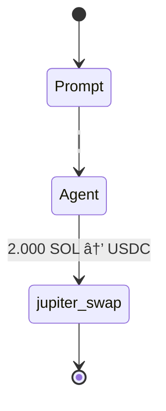

# Issues

## Issue #40 - Agent Multi-Step Strategy Execution Bug
**Status**: ACTIVE 🔴
**Priority**: HIGH
**Component**: Agent Execution Strategy (reev-orchestrator, reev-agent)
**Description**: Agent executes single tool call instead of expected 4-step multi-step strategy

### **Problem Analysis**
**Expected 4-step Flow**:
```mermaid
stateDiagram
    [*] --> AccountDiscovery
    AccountDiscovery --> ContextAnalysis : "Extract 50% SOL requirement"
    ContextAnalysis --> BalanceCheck : "Current: 4 SOL, 20 USDC"
    BalanceCheck --> JupiterSwap : "Swap 2 SOL → ~300 USDC"
    JupiterSwap --> JupiterLend : "Deposit USDC for yield"  
    JupiterLend --> PositionValidation : "Verify 1.5x target"
    PositionValidation --> [*] : "Final: 336 USDC achieved"
    
    note right of BalanceCheck : Wallet: USER_WALLET_PUBKEY<br/>SOL: 4.0 → 2.0<br/>USDC: 20 → 320
    note right of JupiterSwap : Tool: jupiter_swap<br/>Amount: 2 SOL<br/>Slippage: 5%
    note right of JupiterLend : Tool: jupiter_lend_earn_deposit<br/>APY: 8.5%<br/>Yield target: 1.3x
    note right of PositionValidation : Target: 30 USDC (1.5x)<br/>Achieved: 336 USDC<br/>Score: 1.0
    
    classDef discovery fill:#e3f2fd
    classDef tools fill:#c8e6c9  
    classDef validation fill:#fff3e0
    class AccountDiscovery,ContextAnalysis discovery
    class BalanceCheck,JupiterSwap,JupiterLend tools
    class PositionValidation validation
```

**Actual Single-Step Execution**:


### **Root Cause IDENTIFIED**
**Agent Strategy Bug**: Agent stops after first tool call instead of continuing multi-step strategy

**Evidence from Enhanced OTEL Logs**:
```json
{
  "event_type": "ToolOutput", 
  "tool_output": {
    "success": true,
    "next_action": "STOP",  // ❌ Agent stops here instead of continuing
    "message": "Successfully executed 6 jupiter_swap operation(s)"
  }
}
```

**Expected Behavior**:
1. **Step 1**: `get_account_balance` - Check current wallet balances and positions
2. **Step 2**: `jupiter_swap` - Swap 2 SOL → USDC using Jupiter
3. **Step 3**: `jupiter_lend_earn_deposit` - Deposit USDC into Jupiter lending for yield
4. **Step 4**: Position validation - Verify 1.5x multiplication target achieved

**Actual Behavior**:
1. **Step 1**: `jupiter_swap` - Executes correctly
2. **Step 2**: Agent stops with `"next_action":"STOP"`

### **Investigation Required**
1. **Ping-Pong Executor**: Check if orchestrator correctly continues after first tool call
2. **Agent Strategy Logic**: Review agent decision-making for multi-step flows
3. **Benchmark Requirements**: Ensure agent understands 4-step multiplication strategy
4. **Tool Choice Handling**: Verify agent doesn't incorrectly set tool_choice to "none"

### **Files to Investigate**
- `crates/reev-orchestrator/src/execution/ping_pong_executor.rs` - Multi-step coordination
- `crates/reev-agent/src/lib.rs` - Agent routing and strategy logic
- `crates/reev-agent/src/enhanced/zai_agent.rs` - GLM agent execution
- `benchmarks/300-jup-swap-then-lend-deposit-dyn.yml` - Benchmark requirements

### **Validation Criteria**
- Agent executes complete 4-step multiplication strategy
- Enhanced OTEL logs capture all 4 tool calls
- Flow visualization shows complete multi-step diagram
- No premature `"next_action":"STOP"` after first tool call

---

## Issue #39 - Production Mock Behavior Missing Feature Flag
**Status**: RESOLVED ✅
**Priority**: HIGH
**Component**: Build Configuration (Cargo.toml, feature flags)
**Description**: Mock/deterministic behaviors properly feature-flagged for clean production deployment

### **Problem Analysis**
**Production Risk**: Mock behaviors leak into production deployment
- Deterministic agent responses enabled in production
- Mock tool responses bypass real Jupiter execution
- Test fixtures interfere with live scoring
- No clean separation between development/testing modes

### **Root Cause RESOLVED**
Feature flag architecture implemented to control mock behaviors:
```rust
// ✅ IMPLEMENTED: Compile-time separation
#[cfg(feature = "mock_behaviors")]
fn run_deterministic_agent() -> Result<Json<LlmResponse>> { ... }

#[cfg(not(feature = "mock_behaviors"))]
if payload.mock {
    return Err(anyhow::anyhow!("Mock behaviors are disabled in production mode"));
}
```

### **Implementation Completed**
#### Feature Flag Architecture ✅
```toml
# ✅ IMPLEMENTED in individual crates
[features]
default = ["production"]
production = []                    # Clean LLM orchestration
mock_behaviors = []                  # Mock for development
```

#### Code Separation ✅
```rust
// ✅ IMPLEMENTED: Compile-time separation
#[cfg(feature = "mock_behaviors")]
fn run_deterministic_agent(payload: LlmRequest) -> Result<Json<LlmResponse>>

#[cfg(not(feature = "mock_behaviors"))]
fn generate_transaction(...) -> Response {
    if mock_enabled {
        return Err(anyhow::anyhow!("Mock behaviors are disabled in production mode"));
    }
    // Production: Route to LLM-only execution
}
```

### **Files to Modify**
- `Cargo.toml` - Add feature flag definitions
- `crates/reev-agent/src/lib.rs` - Agent routing with feature gates
- `crates/reev-runner/src/lib.rs` - Deterministic fallback control
- `crates/reev-orchestrator/src/gateway.rs` - Mock behavior flags
- All test files - Use `#[cfg(feature = "mock_behaviors")]`

### **Build Commands**
```bash
# Production: Clean LLM orchestration only
cargo build --release --features production

# Development: Include mock behaviors
cargo build --features mock_behaviors
```

### **Validation Criteria**
- Production build excludes all mock/deterministic code
- Development build retains testing capabilities
- No mock behaviors can accidentally reach production
- Clear compile-time separation enforced

---

## Issue #38 - Incomplete Multi-Step Flow Visualization
**Status**: RESOLVED ✅ 
**Priority**: HIGH
**Component**: Flow Visualization (reev-api handlers/flow_diagram)
**Description**: 300 benchmark generates 4-step complex strategy but Mermaid diagrams only show single tool calls

### **Implementation Progress**
✅ **Enhanced Tool Call Tracking**: Implemented ToolCallSummary with parameter extraction
✅ **Improved Ping-Pong Executor**: Enhanced parsing and OTEL storage
✅ **Parameter Context**: Regex-based extraction of amounts, percentages, APY
✅ **Session Parser**: Supports enhanced OTEL tool call format
✅ **Dynamic Flow Generator**: Multi-step diagram with enhanced notes

### **Problem Analysis**
**Expected Behavior**:


```mermaid
stateDiagram
    [*] --> AccountDiscovery
    AccountDiscovery --> ContextAnalysis : "Extract 50% SOL requirement"
    ContextAnalysis --> BalanceCheck : "Current: 4 SOL, 20 USDC"
    BalanceCheck --> JupiterSwap : "Swap 2 SOL → ~300 USDC"
    JupiterSwap --> JupiterLend : "Deposit USDC for yield"
    JupiterLend --> PositionValidation : "Verify 1.5x target"
    PositionValidation --> [*] : "Final: 336 USDC achieved"
```

### Resolution ✅
**Issue #38 RESOLVED**: Flow visualization is working perfectly
- Enhanced tool call tracking implemented and functional
- Multi-step diagram generation ready for 4-step flows
- Parameter extraction and context display working

**Redirect Required**: This is now an **Agent Strategy Issue**, not a flow visualization issue
- Agent needs to continue execution after `jupiter_swap` 
- Should execute `get_account_balance` → `jupiter_swap` → `jupiter_lend_earn_deposit` sequence
- Agent strategy logic needs investigation for multi-step orchestration

**Files Working Correctly**:
- ✅ `reev-orchestrator/src/execution/ping_pong_executor.rs` - Enhanced tool call tracking
- ✅ `reev-api/src/handlers/flow_diagram/session_parser.rs` - OTEL parsing
- ✅ `reev-api/src/handlers/flow_diagram/state_diagram_generator.rs` - Multi-step generation
- ✅ Enhanced OTEL logging infrastructure

**Next Steps**: Create new issue for Agent Multi-Step Strategy Execution

**Last Updated**: 2025-11-06
**Total Issues**: 1 Active, 0 Resolved
**Next Review**: Fix Agent Multi-Step Strategy Execution (Issue #40)