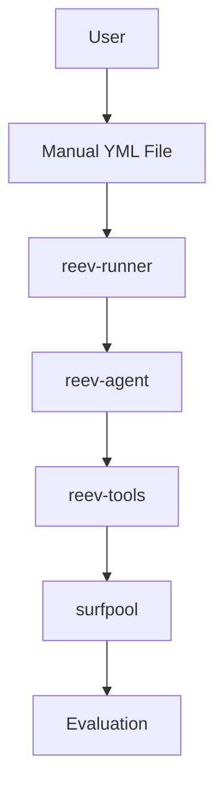

# PLAN_FLOW.md

## Overview

This document outlines the transformation from static, file-based flows to dynamic, context-aware flow orchestration using an **atomic flow concept**.

## Core Philosophy: Atomic Flow Concept

**"Flow = Transaction, Steps = Instructions"**

This means:
- **Flow = Atomic Unit**: Each flow execution is treated as a single atomic operation
- **Step Failure = Flow Failure**: If any step fails, the entire flow fails (for critical steps)
- **Recovery Strategy**: Recovery handled through separate flows, not within the same atomic operation

**Critical Decision**: All steps are **critical by default** - any step failure fails the flow. Non-critical steps must be explicitly marked in Phase 3.

## Current vs Future Architecture

### Current State: Static Flows


**Problems**:
- "Cheating" by reading fixed YML files with predefined prompts
- No context awareness (wallet balance, token prices)
- Manual prompt writing for each scenario
- No adaptability to different user situations

### Future State: Dynamic Flows
```mermaid
graph TD
    A[User: "use 50% sol to 1.5x usdc"] --> B[reev-orchestrator]
    B --> C[Context Resolver: wallet + prices]
    C --> D[Flow Planner: parse intent, generate steps]
    D --> E[Dynamic YML Generator]
    E --> F[reev-runner]
    F --> G[reev-agent with context-aware prompts]
    G --> H[Evaluation with flow metrics]
    H --> I[OpenTelemetry for flow visualization]
```

## Distinguishing Dynamic vs Static

| Aspect | Static Flow | Dynamic Flow |
|---------|-------------|-------------|
| **Source** | Manual YML files | Natural language prompts |
| **Prompts** | Fixed, human-written | Generated, context-aware |
| **Context** | Static key_map | Real wallet balance + prices |
| **Flexibility** | Fixed steps | Dynamic step planning |
| **Entry Point** | YML file path | Orchestrator gateway |
| **Evaluation** | File-based scoring | Flow-based scoring |

## Implementation Architecture

### Core Components

#### 1. reev-orchestrator (New Crate)
```
reev-orchestrator/
├── src/
│   ├── lib.rs              # Main entry point
│   ├── gateway.rs          # User prompt refinement & flow planning
│   ├── context_resolver.rs # Wallet context & balance resolution
│   ├── generators/
│   │   ├── mod.rs
│   │   ├── yml_generator.rs  # Generate context-aware YML
│   │   └── flow_object.rs   # Generate in-memory flow objects
│   └── cli/               # CLI integration
├── tests/
│   ├── mock_data.rs        # Jupiter SDK-based test data
│   └── integration_tests.rs
└── config/
    └── dynamic_config.rs  # Feature flags & migration settings
```

#### 2. Enhanced Runner Integration
```rust
// Existing
RunBenchmark { benchmark_path, agent }

// New dynamic support
pub enum BenchmarkSource {
    StaticFile { path: String },
    DynamicFlow { prompt: String, wallet: String },
    Hybrid { path: Option<String>, prompt: Option<String> }
}

RunBenchmark {
    source: BenchmarkSource,
    // ... existing fields
}
```

#### 3. Agent Prompt Interface
```rust
// Existing agent receives file content
fn execute_agent(benchmark_content: String) -> Result

// New dynamic prompt injection
fn execute_agent(
    benchmark_content: String,     // Static YML or generated
    dynamic_context: PromptContext, // Wallet context, flow state
    generated_prompt: Option<String> // If flow was dynamically generated
) -> Result
```

## Refined Three-Phase Implementation Strategy

### Phase 1: Bridge Mode (Week 1-2) - **MVP Focus**
**Goal**: Leverage existing infrastructure with minimal changes

**Entry Points**:
```bash
# CLI Integration
reev exec --dynamic "use my 50% sol to 1.5x usdc"  # Dynamic
reev exec 200-jup-swap.yml                        # Existing (unchanged)
```

**Architecture**:
```
User Prompt → Orchestrator → Context Resolver → YML Generator → Temporary File → Existing Runner
```

**Key Decisions**:
- **Temporary files in `/tmp/dynamic-{timestamp}.yml`** - simplest integration
- **Single source of truth** - runner doesn't know file was generated
- **Feature flag**: `dynamic_flows = "bridge"` - generates YML files

**Success Criteria**:
- Dynamic flows work for basic patterns (swap, lend, swap+lend)
- Context resolution < 1s for typical wallets
- No regressions in existing static flows

### Phase 2: Direct Mode (Week 3-4) - **Atomic Focus**
**Goal**: True in-memory flow execution

```rust
pub enum FlowSource {
    StaticFile(PathBuf),
    DynamicFlow(DynamicFlowPlan),
}

pub struct DynamicFlowPlan {
    pub flow_id: String,
    pub steps: Vec<DynamicStep>,
    pub context: WalletContext,
    pub atomic_mode: AtomicMode,
}

pub enum AtomicMode {
    Strict,    // Any failure = flow failure
    Lenient,   // Mark failed steps, continue
    Conditional, // Some steps non-critical
}
```

**Architecture**:
```
User Prompt → Orchestrator → Flow Objects → Modified Runner → Enhanced Agent
```

**Key Decisions**:
- **Runner modification** - accepts `FlowSource` enum instead of just paths
- **Agent enhancement** - receives both content AND context
- **Atomic enforcement** - `Strict` mode by default, `Lenient` for Phase 3

### Phase 3: Advanced Features (Week 5-6) - **Recovery Focus**
**Goals**: Non-critical steps, recovery mechanisms, learning

```rust
pub struct DynamicStep {
    pub step_id: String,
    pub critical: bool,              // NEW - marks atomic behavior
    pub prompt_template: String,
    pub recovery_strategy: Option<RecoveryStrategy>, // NEW
}

pub enum RecoveryStrategy {
    Retry { attempts: usize },
    AlternativeFlow { flow_id: String },
    UserFulfillment { questions: Vec<String> },
}
```

**Key Decisions**:
- **Critical steps default true** - atomic behavior preserved
- **Non-critical steps** - marked explicitly, can fail without flow failure
- **Recovery flows** - separate flow executions, not in-flow recovery

## Performance & Caching Strategy

```rust
pub struct ContextCache {
    wallet_cache: LruCache<String, WalletContext>,     // 5min TTL
    price_cache: LruCache<String, TokenPrice>,        // 30s TTL
    template_cache: LruCache<String, CompiledTemplate>, // Persistent
}

// Parallel context resolution
async fn resolve_context(wallet: String) -> WalletContext {
    let (balance, prices, metadata) = tokio::join!(
        get_wallet_balance(&wallet),
        get_all_token_prices(),
        get_wallet_metadata(&wallet)
    );
    // Combine and cache
}
```

## Template System

```handlebars
// Base templates
templates/
├── base/
│   ├── swap.hbs           # Generic swap template
│   └── lend.hbs           # Generic lend template
├── protocols/
│   ├── jupiter/           # Jupiter-specific overrides
│   └── kamino/           # Kamino-specific overrides
└── scenarios/
    ├── swap_then_lend.hbs  # Multi-step template
    └── portfolio_rebalance.hbs
```

## Evaluation Framework

### Flow-Level Metrics
```rust
pub struct FlowMetrics {
    // Atomic success
    pub atomic_success: bool,
    pub critical_failures: Vec<String>,
    pub non_critical_failures: Vec<String>,
    
    // Performance
    pub context_resolution_ms: u64,
    pub flow_execution_ms: u64,
    pub cache_hit_rate: f64,
    
    // Quality (for learning)
    pub prompt_effectiveness: f64,      // Agent success rate with generated prompts
    pub context_accuracy: f64,          // How well context matched reality
    pub template_coverage: f64,          // How well templates covered scenario
}
```

### Dynamic vs Static Comparison
```rust
pub struct FlowComparison {
    pub scenario: String,          // "user: use 50% sol..."
    pub static_flow: FlowResult,   // Best static YML result
    pub dynamic_flow: FlowResult,  // Dynamic orchestrator result
    pub winner: FlowType,        // Which performed better
    pub improvement_delta: f64,   // How much better
}
```

## OpenTelemetry Integration

### Flow Tracing
```rust
#[instrument(fields(flow_id, step_id, user_prompt))]
pub async fn execute_dynamic_flow(flow: DynamicFlowPlan) -> FlowResult {
    // Auto-generate spans for each step
    // Track context resolution time
    // Log prompt generation quality
    // Record step execution metrics
}
```

### Mermaid Generation
```yaml
# From traces: auto-generate flow diagrams
flowchart TD:
    A[User Prompt] --> B[Context Resolution: 2.5 SOL]
    B --> C[Step 1: Swap SOL→USDC]
    C --> D[Step 2: Deposit USDC]
    D --> E[Flow Success]

    style A fill:#e1f5fe
    style B fill:#f3e5f5
    style C fill:#a8dadc
    style D fill:#66bb6a
    style E fill:#28a745
```

## Migration Strategy

### Feature Flags
```toml
[features]
default = ["static_flows"]
dynamic_flows = []
static_flows = []
migration_tools = []

[cli.dynamic]
enabled = true                 # Enable dynamic flow commands
temporary_dir = "/tmp/reev-dynamic"  # Where to store generated YMLs
fallback_to_static = true         # If dynamic fails, try static equivalent
```

### Gradual Rollout
1. **Phase 1**: Dynamic available behind `--dynamic` flag
2. **Phase 2**: API endpoints for external integrations  
3. **Phase 3**: Feature flag for dynamic as default
4. **Phase 4**: Deprecate static flows with migration path

## Success Metrics (Final)

### Technical Success
- [ ] **99.9% backward compatibility** - all existing static YMLs work unchanged
- [ ] **< 500ms context resolution** for typical wallets with caching
- [ ] **95% prompt success rate** - dynamic prompts match static YML success
- [ ] **< 100ms flow execution overhead** vs static flows

### User Success  
- [ ] **Natural language works** for 80% of common DeFi operations
- [ ] **Context-aware prompts** adapt to user's actual wallet state
- [ ] **Clear failure messages** with recovery suggestions
- [ ] **Flow visualization** helps users understand what happened

### Developer Success
- [ ] **Template system** supports 90% of common patterns out-of-the-box
- [ ] **Mock-based testing** covers 100% of flow scenarios without external deps
- [ ] **Clear migration path** from static to dynamic flows
- [ ] **Performance parity** with existing system

## Risk Mitigation (Final)

### Technical Risks
1. **Performance Regression**: Cache everything, parallel processing, performance budgets
2. **Template Explosion**: Template inheritance + validation limits
3. **Mock vs Real Divergence**: Automated sync from Jupiter SDK + regression tests
4. **Feature Flag Complexity**: Single enum flag, gradual deprecation

### Project Risks
1. **Scope Creep**: Strict MVP boundaries per phase
2. **Integration Complexity**: Clear contracts, integration tests first
3. **User Confusion**: Clear documentation, feature discovery in CLI

## End State Vision

**Phase 6 (Future)**: Dynamic flows become default
```bash
# Phase 6: Dynamic by default
reev exec "use my 50% sol to 1.5x usdc"        # Works
reev exec --legacy 200-jup-swap.yml          # Legacy mode
```

**Static flows deprecated but supported** - migration tools available, 6-month deprecation timeline.

## Final Recommendation

**LGTM** - The atomic flow concept with 3-phase migration is solid. Key strengths:

1. **Mental model clarity** - flows as transactions, steps as instructions
2. **Risk mitigation** - gradual migration preserves existing value
3. **Performance focus** - caching and parallel processing from day one
4. **Clear success criteria** - measurable objectives for each phase

This atomic flow concept provides a clear mental model: each flow execution is a single transaction that either succeeds completely or fails completely, with recovery handled through separate, independent flows. This mirrors how blockchain transactions work and provides a solid foundation for building dynamic, context-aware flow capabilities.