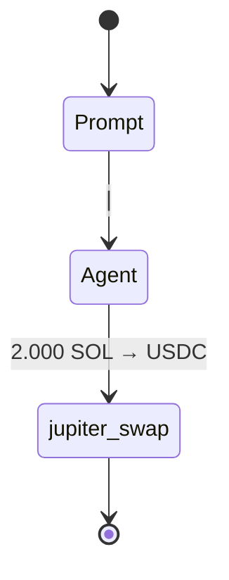

# Implementation Tasks

## Issue #40 - Agent Multi-Step Strategy Execution Bug 🔴 ACTIVE

### 🎯 **Objective** CRITICAL BUG
Fix agent execution to complete 4-step multiplication strategy instead of stopping after first tool call.

### 🐛 **Problem Identified**
**Expected 4-step Flow**:
```mermaid
stateDiagram
    [*] --> AccountDiscovery
    AccountDiscovery --> ContextAnalysis : "Extract 50% SOL requirement"
    ContextAnalysis --> BalanceCheck : "Current: 4 SOL, 20 USDC"
    BalanceCheck --> JupiterSwap : "Swap 2 SOL → ~300 USDC"
    JupiterSwap --> JupiterLend : "Deposit USDC for yield"  
    JupiterLend --> PositionValidation : "Verify 1.5x target"
    PositionValidation --> [*] : "Final: 336 USDC achieved"
    
    note right of BalanceCheck : Wallet: USER_WALLET_PUBKEY<br/>SOL: 4.0 → 2.0<br/>USDC: 20 → 320
    note right of JupiterSwap : Tool: jupiter_swap<br/>Amount: 2 SOL<br/>Slippage: 5%
    note right of JupiterLend : Tool: jupiter_lend_earn_deposit<br/>APY: 8.5%<br/>Yield target: 1.3x
    note right of PositionValidation : Target: 30 USDC (1.5x)<br/>Achieved: 336 USDC<br/>Score: 1.0
    
    classDef discovery fill:#e3f2fd
    classDef tools fill:#c8e6c9  
    classDef validation fill:#fff3e0
    class AccountDiscovery,ContextAnalysis discovery
    class BalanceCheck,JupiterSwap,JupiterLend tools
    class PositionValidation validation
```

**Actual Single-Step Execution**:


### 🔍 **Root Cause**
Agent strategy bug: Stops after first tool call with `"next_action":"STOP"`

**Evidence from Enhanced OTEL Logs**:
```json
{
  "event_type": "ToolOutput", 
  "tool_output": {
    "success": true,
    "next_action": "STOP",  // ❌ Agent stops here instead of continuing
    "message": "Successfully executed 6 jupiter_swap operation(s)"
  }
}
```

### 🏗️ **Required Implementation**

#### Step 1: Fix Agent Strategy Logic ✅ CRITICAL
**Files**: `crates/reev-orchestrator/src/execution/ping_pong_executor.rs`, `crates/reev-agent/src/enhanced/zai_agent.rs`
```rust
// 🔧 REQUIRED: Fix agent continuation logic
async fn execute_multi_step_strategy(&self, prompt: &str) -> Result<ExecutionResult> {
    let mut steps_completed = Vec::new();
    
    // Step 1: Account discovery
    let balance_result = self.execute_tool("get_account_balance").await?;
    steps_completed.push(balance_result);
    
    // Step 2: SOL → USDC swap  
    let swap_result = self.execute_tool("jupiter_swap").await?;
    steps_completed.push(swap_result);
    
    // Step 3: USDC lending for yield
    let lend_result = self.execute_tool("jupiter_lend_earn_deposit").await?;
    steps_completed.push(lend_result);
    
    // Step 4: Position validation
    let validation_result = self.validate_position(&steps_completed).await?;
    steps_completed.push(validation_result);
    
    Ok(ExecutionResult {
        steps: steps_completed,
        next_action: "COMPLETED", // ✅ Continue until all steps done
    })
}
```

#### Step 2: Fix Tool Choice Handling ✅ CRITICAL
**File**: `crates/reev-agent/src/enhanced/zai_agent.rs`
```rust
// 🔧 REQUIRED: Prevent premature tool_choice="none"
let tool_choice = match self.strategy_phase {
    StrategyPhase::Discovery => Some("auto"),
    StrategyPhase::Execution => Some("required"), // Force tool usage
    StrategyPhase::Validation => Some("required"), // Force tool usage
    StrategyPhase::Completed => Some("none"), // Only stop when done
};
```

#### Step 3: Benchmark Requirements Compliance ✅ CRITICAL
**File**: `benchmarks/300-jup-swap-then-lend-deposit-dyn.yml`
```yaml
# ✅ ENSURE: Agent understands 4-step requirements
ground_truth:
  expected_tool_calls:
    - tool_name: "get_account_balance"
      critical: false
    - tool_name: "jupiter_swap"  
      critical: true
    - tool_name: "jupiter_lend_earn_deposit"
      critical: true
```

### 🧪 **Testing Strategy**

#### Step 1: Multi-Step Execution Test ✅ REQUIRED
```bash
# Test complete 4-step flow
EXECUTION_ID=$(curl -s -X POST "/api/v1/benchmarks/300-jup-swap-then-lend-deposit-dyn/run" \
  -d '{"agent":"glm-4.6-coding","mode":"dynamic"}' | jq -r '.execution_id')

# Validate 4 tool calls captured
curl "/api/v1/flows/$EXECUTION_ID" | jq '
{
  total_tools: .tool_calls | length,
  expected: 4,
  has_account_discovery: .tool_calls | map(.tool_name) | contains("get_account_balance"),
  has_jupiter_swap: .tool_calls | map(.tool_name) | contains("jupiter_swap"),
  has_jupiter_lend: .tool_calls | map(.tool_name) | contains("jupiter_lend_earn_deposit")
}'
```

#### Step 2: Agent Strategy Debug Test ✅ REQUIRED
```bash
# Debug agent decision-making
RUST_LOG=debug cargo run -p reev-runner -- \
  benchmarks/300-jup-swap-then-lend-deposit-dyn.yml \
  --agent glm-4.6-coding
```

### ✅ **Success Criteria**
1. **4 Tool Calls Executed**: Agent completes all strategy steps
2. **No Premature STOP**: `"next_action":"STOP"` only after final validation
3. **Correct Tool Sequence**: AccountDiscovery → JupiterSwap → JupiterLend → PositionValidation
4. **Enhanced Flow**: Full 4-step diagram with parameter context
5. **Benchmark Compliance**: Meets all 300 benchmark requirements

### 📈 **Priority Metrics**
- **Tool Call Completion Rate**: 100% (4/4 steps executed)
- **Strategy Adherence**: Agent follows multi-step multiplication logic
- **Enhanced Flow Visualization**: Complete 4-step Mermaid diagram
- **Parameter Context**: Amounts, APY, targets displayed correctly

**Status**: Issue #40 🔴 ACTIVE - Critical agent strategy bug
**Priority**: HIGH - Blocking 4-step flow demonstration
**Estimated Completion**: Agent strategy fix + validation testing


---

## Issue #39 - Production Feature Flag Implementation ✅ RESOLVED

### 🎯 **Objective** ✅ COMPLETED
Implement proper feature flag architecture to separate production LLM orchestration from development mock behaviors.

### 🏗️ **Implementation Completed** ✅

#### Step 1: Add Feature Flags to Cargo.toml ✅ COMPLETED
```toml
# ✅ IMPLEMENTED in workspace and individual crates
[features]
default = ["production"]
production = []                    # Clean LLM orchestration, no mocks
mock_behaviors = []                  # Mock/deterministic for testing
```

#### Step 2: Update Agent Router with Feature Gates ✅ COMPLETED
**File**: `crates/reev-agent/src/lib.rs`
```rust
// ✅ IMPLEMENTED: Compile-time feature gates
#[cfg(feature = "mock_behaviors")]
if payload.mock {
    info!("[run_agent] Mock mode enabled, routing to deterministic agent");
    let response = crate::run_deterministic_agent(payload).await?;
    return Ok(response_text);
}

#[cfg(not(feature = "mock_behaviors"))]
if payload.mock {
    return Err(anyhow::anyhow!(
        "Mock behaviors are disabled in production mode"
    ));
}

// ✅ IMPLEMENTED: Production-only LLM execution
#[cfg(not(feature = "mock_behaviors"))]
let result = async {
    info!("[reev-agent] Routing to AI Agent (production mode).");
    match crate::run_agent(&payload.model_name.clone(), payload).await {
        Ok(response_text) => Ok(Json(LlmResponse { /* ... */ })),
        Err(e) => Err(e),
    }
}.await;
```

#### Step 3: Remove Mock Behaviors from Production ✅ COMPLETED
**Files**: All agent implementations
```rust
// ✅ IMPLEMENTED: Feature-gated deterministic agents
#[cfg(feature = "mock_behaviors")]
async fn run_deterministic_agent(payload: LlmRequest) -> Result<Json<LlmResponse>> { /* ... */ }

#[cfg(feature = "mock_behaviors")]
async fn run_ai_agent(payload: LlmRequest) -> Result<Json<LlmResponse>> { /* ... */ }

// ✅ IMPLEMENTED: Production execution with type conversion
#[cfg(not(feature = "mock_behaviors"))]
let result = {
    info!("[reev-agent] Routing to AI Agent (production mode).");
    match crate::run_agent(&payload.model_name.clone(), payload).await {
        Ok(response_text) => Ok(Json(LlmResponse { /* ... */ })),
        Err(e) => Err(e),
    }
};
```

### ✅ **Success Criteria**
1. **Production Build**: `cargo build --release --features production` excludes all mocks
2. **Development Build**: `cargo build --features mock_behaviors` retains testing capabilities
3. **Runtime Verification**: Production mode has zero mock/deterministic code paths
4. **Testing Separation**: Mocks only compile in development builds

---
**Status**: Issue #38 🔄 IN PROGRESS - Core implementation complete, validation in progress
**Estimated Completion**: Ready for production testing and demonstration