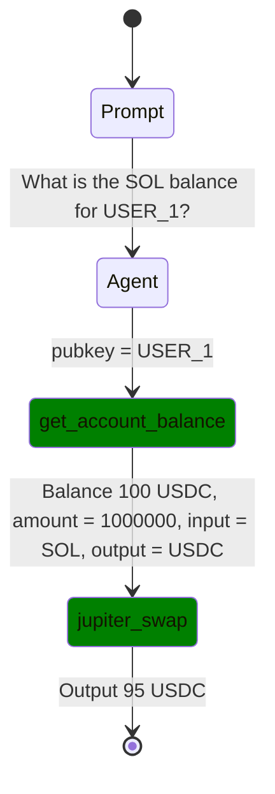

# TOFIX.md

## Flow Diagram Bug Fixes

### 🐛 Current Issues

#### 1. Duplicate Transitions in StateDiagram
**Problem**: Generated diagram has duplicate transitions:
```mermaid
Tool1 --> Tool2 : Balance: "100 USDC"
Tool1 --> Tool2 : amount = 1000000, input = SOL, output = USDC, user_pubkey = USER_1
```

**Expected**: Single transition with combined parameters:
```mermaid
Tool1 --> Tool2 : pubkey = USER_1, Balance "100 USDC"
```

#### 2. Incorrect Quote Formatting
**Problem**: Results show with escaped quotes:
```
Balance: "100 USDC"
Output: "95 USDC"
```

**Expected**: Clean formatting without extra quotes:
```
Balance "100 USDC"
Output "95 USDC"
```

#### 3. Missing Tool ID Extraction
**Problem**: Using generic names instead of actual tool IDs:
```
Tool1, Tool2
```

**Expected**: Actual tool names from logs:
```
get_account_balance, jupiter_swap
```

#### 4. OTEL Log Integration Missing
**Problem**: Not parsing real tool calls from `tool_calls.log`
**Available Data**: Tool names, parameters, and results in OTEL format

### 🔧 Fix Plan

#### Phase 1: Fix StateDiagram Generation Logic
**File**: `crates/reev-api/src/handlers/flow_diagram/state_diagram_generator.rs`

**Tasks**:
- Fix duplicate transition logic
- Remove extra quotes from result formatting
- Use actual tool_id instead of generic Tool1/Tool2
- Combine parameters and results into single transition

#### Phase 2: Extract Real Tool IDs
**File**: `crates/reev-api/src/handlers/flow_diagram/session_parser.rs`

**Tasks**:
- Extract tool_id from enhanced session logs
- Map tool_id to readable names for diagram states
- Handle tool_id sanitization for Mermaid compatibility

#### Phase 3: OTEL Log Parser Integration
**File**: `crates/reev-api/src/handlers/flow_diagram/otel_parser.rs`

**Tasks**:
- Create OTEL log parser for `tool_calls.log`
- Extract tool calls with timing information
- Merge OTEL data with session data
- Fallback to OTEL when session tools array missing

#### Phase 4: Enhanced Parameter/Result Formatting
**Files**: `crates/reev-api/src/handlers/flow_diagram/state_diagram_generator.rs`

**Tasks**:
- Improve parameter summarization logic
- Better result formatting without quotes
- Combine multiple parameters/results into readable format
- Handle edge cases (empty results, errors, etc.)

### 📋 Implementation Details

#### 1. Fix Duplicate Transitions
```rust
// Current logic creates multiple transitions
// Fix: Combine into single transition with all info
let transition_text = format!("{} {}", params_summary, result_summary);
```

#### 2. Tool ID Extraction
```rust
// Extract from session tools array
let tool_name = tool_call.tool_id.clone();
let state_name = sanitize_for_mermaid(&tool_name);
```

#### 3. Quote Removal
```rust
// Remove extra quotes from results
fn clean_result_text(text: &str) -> String {
    text.replace('"', "").replace("\\\"", "")
}
```

#### 4. OTEL Parser Pattern
```rust
// Parse tool_calls.log format
"Calling tool {tool_name} with args: {args}"
"Tool completed successfully in {context} with result: {result}"
```

### 🎯 Expected Results

After fixes, diagram should look like:


### 🧪 Testing Strategy

1. **Unit Tests**: Test each fix individually
2. **Integration Tests**: Test with real session and OTEL logs
3. **Edge Cases**: Test with missing data, errors, empty results
4. **Backward Compatibility**: Ensure existing functionality works

### 📁 Files to Modify

- `crates/reev-api/src/handlers/flow_diagram/state_diagram_generator.rs`
- `crates/reev-api/src/handlers/flow_diagram/session_parser.rs`
- `crates/reev-api/src/handlers/flow_diagram/otel_parser.rs` (new)
- `crates/reev-api/src/handlers/flow_diagram/mod.rs`

### ⏱️ Priority

1. **High**: Fix duplicate transitions and quote formatting
2. **Medium**: Extract real tool IDs from session data
3. **Low**: OTEL log integration (future enhancement)

### 🔄 Dependencies

- Session logger enhancement (completed)
- StateDiagram generator (completed)
- Test session with tools (completed)
- Real tool calls from agent execution (needed for testing)