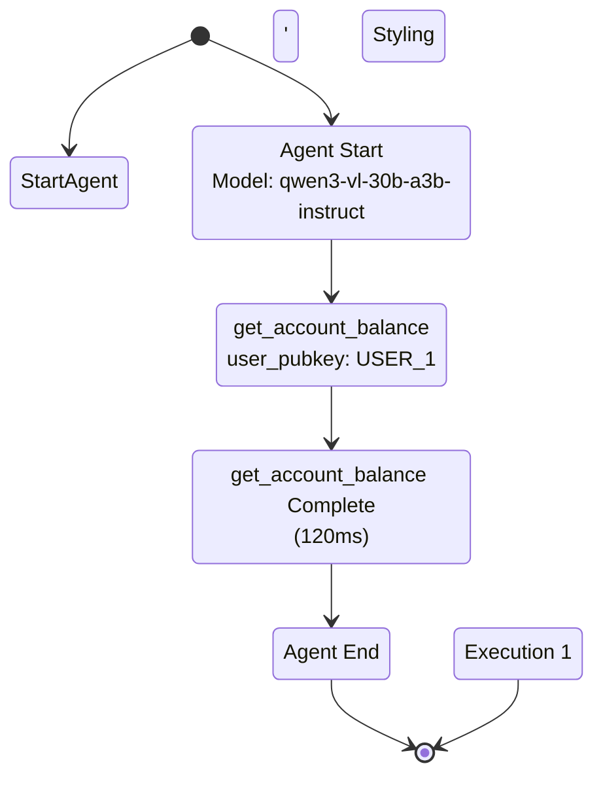

# 🎨 Flow Visualization with Mermaid State Diagrams

This document explains how to generate beautiful Mermaid state diagrams from your `reev-agent` flow execution logs.

## 📋 Overview

The flow visualization system converts structured OpenTelemetry tracing logs into interactive Mermaid state diagrams that show:

- **Agent decision flows** - Start and end points
- **Tool execution sequence** - Which tools are called and in what order
- **Timing information** - Execution duration for each tool
- **Error states** - Where and why errors occurred
- **Tool categorization** - Color-coded by function (Swap, Transfer, Discovery, Lending)

## 🚀 Quick Start

### 1. Generate Flow Logs

Run any agent operation - logs are automatically created:

```bash
# Run agent with tool tracing
cargo run --example otel_tool_logging_demo

# Or run tests
cargo test --test otel_logging_test
```

This creates `logs/tool_calls.log` with detailed execution traces.

### 2. Generate Mermaid Diagram

```bash
# Basic diagram generation
cargo run --bin flow_visualizer -- --input logs/tool_calls.log

# Save to file
cargo run --bin flow_visualizer -- --input logs/tool_calls.log --output diagram.mmd

# Generate HTML preview (opens in browser)
cargo run --bin flow_visualizer -- --input logs/tool_calls.log --html --output flow_diagram.html

# Open in browser
open flow_diagram.html
```

### 3. Visualize

Copy the generated Mermaid code into:
- [Mermaid Live Editor](https://mermaid.live/)
- [GitHub Markdown] (native support)
- [Mermaid CLI](https://github.com/mermaid-js/mermaid-cli)
- Any Mermaid-compatible viewer

## 🎯 Example Output

### Input Log (truncated)
```
2025-10-18T15:07:28.270655Z INFO [OpenAIAgent] Starting agent execution with model: qwen3-vl-30b-a3b-instruct
2025-10-18T15:07:35.764213Z INFO [AccountBalanceTool] Starting tool execution with OpenTelemetry tracing
2025-10-18T15:07:35.764213Z INFO Tool execution completed - total_time: 120ms
```

### Generated Mermaid Diagram


## 🔧 Configuration Options

### CLI Parameters

```bash
# Include timing information (default: enabled)
cargo run --bin flow_visualizer -- --input logs/tool_calls.log --timing

# Include tool parameters (default: disabled)
cargo run --bin flow_visualizer -- --input logs/tool_calls.log --include-params

# Limit diagram complexity
cargo run --bin flow_visualizer -- --input logs/tool_calls.log --max-depth 2

# Show/hide error states
cargo run --bin flow_visualizer -- --input logs/tool_calls.log --hide-errors

# Disable tool categorization
cargo run --bin flow_visualizer -- --input logs/tool_calls.log --no-grouping
```

### Programmatic Configuration

```rust
use reev_agent::flow::visualization::{DiagramConfig, MermaidStateDiagramGenerator};

let config = DiagramConfig {
    include_timing: true,
    include_parameters: true,
    max_depth: 3,
    show_errors: true,
    group_tools: true,
};

let generator = MermaidStateDiagramGenerator::with_config(config);
let diagram = generator.generate_diagram(&executions)?;
```

## 🎨 Color Coding

Tools are automatically categorized and color-coded:

| Category | Tools | Color |
|----------|--------|-------|
| **Swap** | `jupiter_swap`, `jupiter_swap_flow` | 🔴 Red (`#ff6b6b`) |
| **Transfer** | `sol_transfer`, `spl_transfer` | 🟢 Teal (`#4ecdc4`) |
| **Discovery** | `get_account_balance`, `get_position_info` | 🔵 Blue (`#45b7d1`) |
| **Lending** | `jupiter_lend_*`, `jupiter_earn` | 🟡 Yellow (`#f9ca24`) |
| **Other** | Other tools | 🟣 Purple (`#6c5ce7`) |

## 📊 Advanced Features

### HTML Preview with Interactive Viewer

```bash
# Generate interactive HTML
cargo run --bin flow_visualizer -- \
  --input logs/tool_calls.log \
  --html \
  --output flow_diagram.html

# Open in browser
open flow_diagram.html
```

The HTML preview includes:
- ✅ Embedded Mermaid.js renderer
- 🎨 Professional styling
- 📱 Responsive design
- ℹ️ Information panel

### Automatic Diagram Generation

The `OpenAIAgent` automatically generates diagrams after each execution:

```rust
// This happens automatically in enhanced/openai.rs
let diagram_path = format!("logs/{}_flow_diagram.mmd", benchmark_id);
info!("[OpenAIAgent] 🎨 Generated flow diagram: {}", diagram_path);
```

Look for files like:
- `logs/otel-test-001_flow_diagram.mmd`
- `logs/demo-balance-001_flow_diagram.mmd`

## 🔍 Log Patterns Recognized

The parser recognizes these log patterns:

### Agent Lifecycle
- `Starting agent execution with OpenTelemetry tracing`
- `Agent execution completed`

### Tool Execution
- `[ToolName] Starting tool execution with OpenTelemetry tracing`
- `[ToolName] Tool execution completed - total_time: Xms`

### Error States
- `ERROR` or `WARN` log levels
- Tool failure patterns

### Span Context
- `in agent_execution with model: ..., conversation_depth: ..., benchmark_id: ...`

## 🛠️ Troubleshooting

### Empty Diagrams

**Problem**: Generated diagram shows only styling, no states.

**Solution**: Check that your logs contain the expected patterns:

```bash
# Verify log content
grep -i "Starting agent execution\|Tool execution completed" logs/tool_calls.log

# If empty, run agent first to generate logs
cargo test --test otel_logging_test
```

### Compilation Errors

**Problem**: Build fails with missing dependencies.

**Solution**: Ensure required dependencies are in `Cargo.toml`:

```toml
[dependencies]
chrono = { workspace = true }
regex = { workspace = true }
clap = { version = "4.5", features = ["derive"] }
```

### Performance Issues

**Problem**: Large log files slow to process.

**Solution**: Use `--max-depth` to limit complexity:

```bash
# Simple diagram for large logs
cargo run --bin flow_visualizer -- \
  --input logs/large_tool_calls.log \
  --max-depth 1 \
  --no-timing
```

## 📚 Integration Examples

### 1. CI/CD Pipeline Integration

```yaml
# .github/workflows/flow-visualization.yml
- name: Generate Flow Diagram
  run: |
    cargo run --bin flow_visualizer -- \
      --input logs/tool_calls.log \
      --output docs/flow_diagram.mmd

- name: Update Documentation
  run: |
    cat docs/flow_diagram.mmd >> README.md
```

### 2. Monitoring Dashboard

```rust
// In your monitoring service
use reev_agent::flow::visualization::generate_mermaid_diagram;

async fn update_flow_dashboard() {
    let logs = fs::read_to_string("logs/tool_calls.log")?;
    let diagram = generate_mermaid_diagram(&logs)?;

    // Send to dashboard
    dashboard_client.update_diagram(&diagram).await?;
}
```

### 3. Automated Testing

```rust
#[test]
fn test_flow_visualization() {
    let sample_log = include_str!("fixtures/sample_flow.log");
    let diagram = generate_mermaid_diagram(sample_log).unwrap();

    assert!(diagram.contains("stateDiagram-v2"));
    assert!(diagram.contains("jupiter_swap"));
}
```

## 🎯 Best Practices

### 1. Log Structure
- Use consistent logging patterns
- Include timing information
- Add meaningful context to spans

### 2. Diagram Design
- Keep diagrams focused (use `--max-depth`)
- Use color coding consistently
- Include timing for performance analysis

### 3. Integration
- Generate diagrams automatically in CI
- Store diagrams with build artifacts
- Use HTML previews for sharing

### 4. Performance
- Process logs asynchronously for large systems
- Cache generated diagrams
- Use streaming for real-time visualization

## 🔮 Future Enhancements

- [ ] Real-time streaming diagrams
- [ ] Integration with observability platforms (Grafana, Datadog)
- [ ] Custom styling themes
- [ ] Export to other formats (SVG, PNG)
- [ ] Interactive drill-down capabilities
- [ ] Performance metrics overlay
- [ ] Comparison between multiple executions

## 📞 Support

For issues or questions:

1. Check log patterns match expected format
2. Verify all dependencies are installed
3. Test with sample logs first
4. Use `--html` output for debugging

Happy visualizing! 🎨✨
