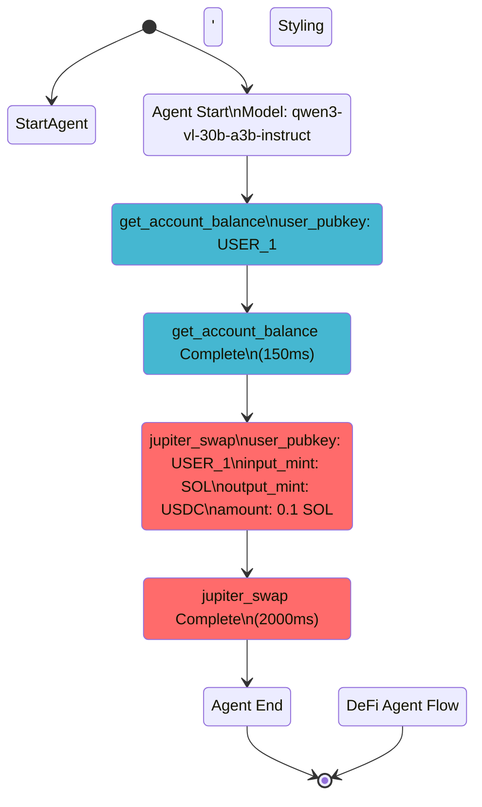

2025-10-18T16:00:00.000000Z INFO [OpenAIAgent] Starting agent execution with OpenTelemetry tracing
2025-10-18T16:00:01.000000Z INFO [AccountBalanceTool] Starting tool execution with OpenTelemetry tracing
2025-10-18T16:00:02.000000Z INFO [AccountBalanceTool] Tool execution completed - total_time: 150ms
2025-10-18T16:00:03.000000Z INFO [JupiterSwapTool] Starting tool execution with OpenTelemetry tracing
2025-10-18T16:00:05.000000Z INFO [JupiterSwapTool] Tool execution completed - total_time: 2000ms
2025-10-18T16:00:06.000000Z INFO [OpenAIAgent] Agent execution completed
```

## 🎨 Generated Mermaid Diagram



## 🚀 How to Use

### 1. Generate Flow Logs
```bash
# Run agent with tracing
cargo run --example otel_tool_logging_demo

# Or run tests
cargo test --test otel_logging_test
```

### 2. Generate Diagram
```bash
# Flow visualization is now handled via the web API
# Use reev-api endpoints for flow diagram generation
# See FLOW.md for web interface usage
```

### 3. Visualize
- Copy Mermaid code to [Mermaid Live Editor](https://mermaid.live/)
- Open HTML file in browser
- Use in GitHub Markdown

## 🎯 What the Diagram Shows

1. **Agent Start** - Model initialization
2. **Tool Calls** - Which tools are executed and in what order
3. **Timing** - How long each tool takes
4. **Parameters** - Key arguments passed to tools
5. **Flow Completion** - Successful execution end

## 🎨 Color Coding

- 🔴 **Red** - Swap operations (jupiter_swap)
- 🔵 **Blue** - Discovery operations (get_account_balance)
- 🟢 **Green** - Transfer operations
- 🟡 **Yellow** - Lending operations

## 📊 Benefits

- **Debugging** - See exactly what tools were called
- **Performance** - Identify slow operations
- **Documentation** - Visual flow representation
- **Communication** - Share with stakeholders

This makes it easy to understand your AI agent's decision-making process! 🎉