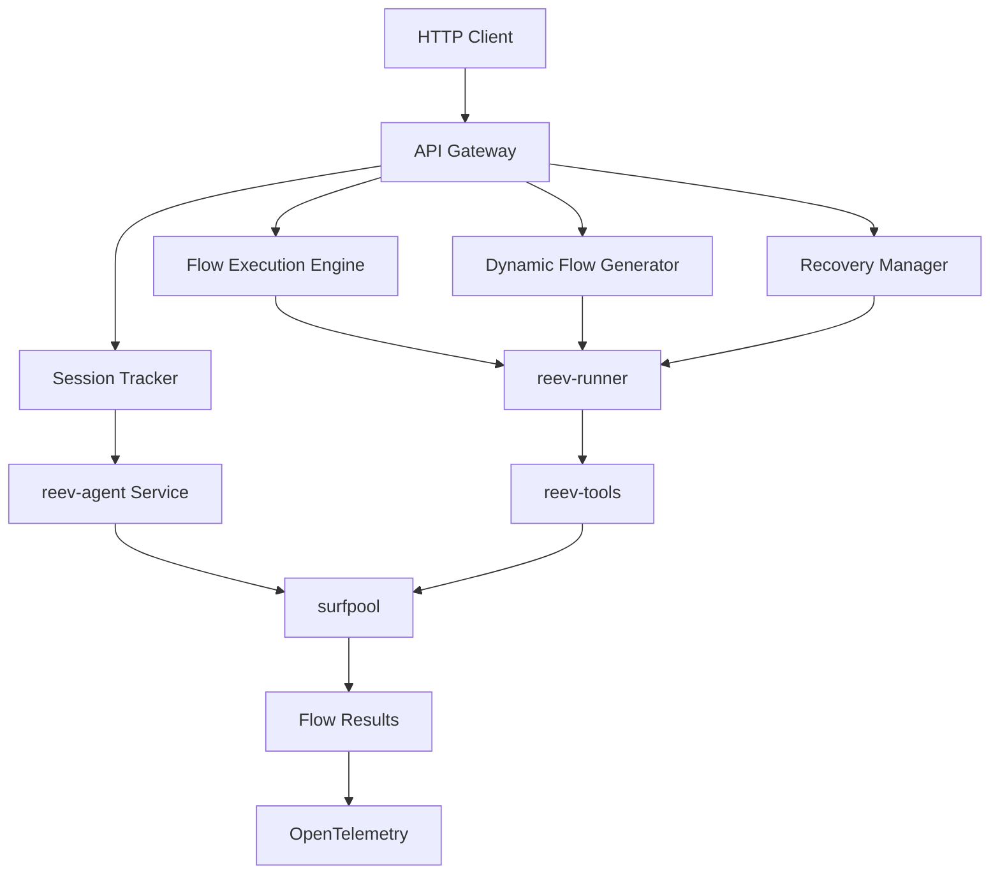

# reev-api: Dynamic Flow REST API

REST API server for reev dynamic flow system. Provides comprehensive endpoints for dynamic flow execution, recovery management, and real-time session tracking with atomic execution control.

## 🏗️ Architecture Overview



## 🚀 Quick Start

### Development Mode with Auto-reload

```bash
cargo watch -w crates -x "run -p reev-api --bin reev-api"
```

**Features:**
- Dynamic flow execution endpoints
- Real-time session tracking
- Automatic recovery management
- Comprehensive OpenTelemetry integration
- Hot reload during development

### Manual Start

```bash
cargo run -p reev-api --bin reev-api
```

### Production Build

```bash
cargo build --release -p reev-api
./target/release/reev-api
```

## 📡 Dynamic Flow Endpoints

### Flow Execution
| Endpoint | Method | Description |
|----------|--------|-------------|
| `POST /api/v1/flows/execute-dynamic` | Execute dynamic flow with bridge mode |
| `POST /api/v1/flows/execute-direct` | Execute dynamic flow with direct mode |
| `POST /api/v1/flows/execute-recovery` | Execute dynamic flow with recovery mode |

### Session Management
| Endpoint | Method | Description |
|----------|--------|-------------|
| `GET /api/v1/sessions/{flow_id}` | Get flow execution session details |
| `GET /api/v1/sessions/{flow_id}/status` | Get real-time execution status |
| `GET /api/v1/sessions` | List all active sessions |
| `DELETE /api/v1/sessions/{flow_id}` | Cancel active session |

### Recovery Management
| Endpoint | Method | Description |
|----------|--------|-------------|
| `GET /api/v1/recovery/config` | Get recovery configuration |
| `PUT /api/v1/recovery/config` | Update recovery configuration |
| `GET /api/v1/recovery/metrics` | Get recovery performance metrics |

### Flow Configuration
| Endpoint | Method | Description |
|----------|--------|-------------|
| `GET /api/v1/flows/templates` | List available flow templates |
| `GET /api/v1/flows/suggest` | Get flow suggestions from natural language |

## 📡 API Configuration

### Environment Variables

| Variable | Default | Description |
|----------|---------|-------------|
| `PORT` | `3001` | Server port |
| `DATABASE_PATH` | `db/reev_results.db` | SQLite database file path |
| `REEV_API_SESSION_TIMEOUT` | `3600000` | Session timeout in milliseconds |
| `REEV_API_MAX_CONCURRENT_FLOWS` | `100` | Maximum concurrent flow executions |
| `REEV_API_RECOVERY_ENABLED` | `true` | Enable recovery system |

### Default Access
- **API Server**: http://localhost:3001
- **Health Check**: http://localhost:3001/api/v1/health
- **API Documentation**: http://localhost:3001/docs (when compiled with docs feature)

## 🛠️ Core Endpoints

### Health & Status

#### `GET /api/v1/health`
Check if the API server is running.

**Response:**
```json
{
  "status": "healthy",
  "timestamp": "2025-10-13T08:00:00Z",
  "version": "0.1.0"
}
```

### Benchmarks

#### `GET /api/v1/benchmarks`
List all available benchmarks.

**Response:**
```json
[
  "001-sol-transfer",
  "002-spl-transfer",
  "003-spl-transfer-fail",
  "004-partial-score-spl-transfer",
  "100-jup-swap-sol-usdc",
  "110-jup-lend-deposit-sol",
  "111-jup-lend-deposit-usdc",
  "112-jup-lend-withdraw-sol",
  "113-jup-lend-withdraw-usdc",
  "114-jup-positions-and-earnings",
  "115-jup-lend-mint-usdc",
  "116-jup-lend-redeem-usdc",
  "200-jup-swap-then-lend-deposit"
]
```

#### `POST /api/v1/benchmarks/{id}/run`
Execute a benchmark with a specific agent.

**Request:**
```json
{
  "agent": "deterministic",
  "config": {
    "agent_type": "deterministic",
    "api_url": "https://api.example.com",
    "api_key": "your-api-key"
  }
}
```

**Response:**
```json
{
  "execution_id": "uuid-string",
  "status": "started"
}
```

#### `GET /api/v1/benchmarks/{id}/status/{execution_id}`
Get the current status of a running benchmark.

**Response:**
```json
{
  "id": "execution-id",
  "benchmark_id": "001-sol-transfer",
  "agent": "deterministic",
  "status": "Running",
  "progress": 75,
  "start_time": "2025-10-13T08:00:00Z",
  "end_time": null,
  "trace": "Starting benchmark...\nProgress: 50%\n",
  "logs": "",
  "error": null
}
```

#### `POST /api/v1/benchmarks/{id}/stop/{execution_id}`
Stop a running benchmark.

**Response:**
```json
{
  "status": "stopped"
}
```

### Agents

#### `GET /api/v1/agents`
List all available agent types.

**Response:**
```json
[
  "deterministic",
  "local",
  "gemini",
  "glm-4.6"
]
```

#### `POST /api/v1/agents/config`
Save agent configuration.

**Request:**
```json
{
  "agent_type": "gemini",
  "api_url": "https://generativelanguage.googleapis.com",
  "api_key": "your-gemini-api-key"
}
```

**Response:**
```json
{
  "status": "saved"
}
```

#### `GET /api/v1/agents/config/{agent_type}`
Get saved configuration for an agent.

**Response:**
```json
{
  "agent_type": "gemini",
  "api_url": "https://generativelanguage.googleapis.com",
  "api_key": "***key"
}
```

#### `POST /api/v1/agents/test`
Test agent connection and configuration.

**Request:**
```json
{
  "agent_type": "deterministic",
  "api_url": "https://api.example.com",
  "api_key": "your-api-key"
}
```

**Response:**
```json
{
  "status": "success",
  "message": "Configuration appears valid"
}
```

### Performance Data

#### `GET /api/v1/agent-performance`
Get performance summary for all agents.

**Response:**
```json
[
  {
    "agent_type": "deterministic",
    "total_executions": 10,
    "success_rate": 1.0,
    "avg_score": 1.0,
    "avg_execution_time_ms": 5000
  }
]
```

## 🔄 CORS Support

The API server supports CORS for web frontend integration:

- **Allowed Origins**: `http://localhost:3000`, `http://localhost:5173`
- **Allowed Methods**: All HTTP methods
- **Allowed Headers**: All headers
- **Credentials**: Supported

## 📊 Database

The API server uses SQLite for storing:
- Benchmark execution results
- Agent performance metrics
- Flow logs for debugging

**Database Location**: `db/reev_results.db` (configurable via `DATABASE_PATH`)

## 🐛 Troubleshooting

### Port Conflicts

If you encounter port conflicts on macOS:
- The server uses port 3001 by default (not 3000)
- Port 3000 conflicts with Apple AirPlay/AirPort services
- Override with: `PORT=3002 cargo run -p reev-api --bin reev-api`

### Database Issues

If database operations fail:
1. Check database file permissions: `ls -la db/reev_results.db`
2. Verify database directory exists: `mkdir -p db/`
3. Reset database (if needed): `rm db/reev_results.db`

### Common Errors

**404 Errors on endpoints**:
- Ensure all endpoints are registered in `main.rs`
- Check that the server started successfully

**Frontend 404s**:
- Verify CORS origins include your frontend URL
- Check that frontend is configured to use port 3001

## 🛠️ Development

### Project Structure

```
crates/reev-api/
├── src/
│   ├── main.rs          # Server entry point and endpoint registration
│   └── lib.rs           # API state and endpoint implementations
├── Cargo.toml           # Dependencies and crate configuration
└── README.md            # This file
```

### Dependencies

- `axum` - Web framework
- `tokio` - Async runtime
- `tower-http` - HTTP middleware (CORS)
- `serde` - Serialization
- `uuid` - UUID generation
- `chrono` - Date/time handling
- `project-root` - Project root detection

### Adding New Endpoints

1. Define the handler function in `src/lib.rs`
2. Add the route in `src/main.rs` router
3. Update this README with the new endpoint
4. Test with `curl` or the web frontend

## 📝 License

This project is part of the Reev benchmark system. See the main project LICENSE for details.
