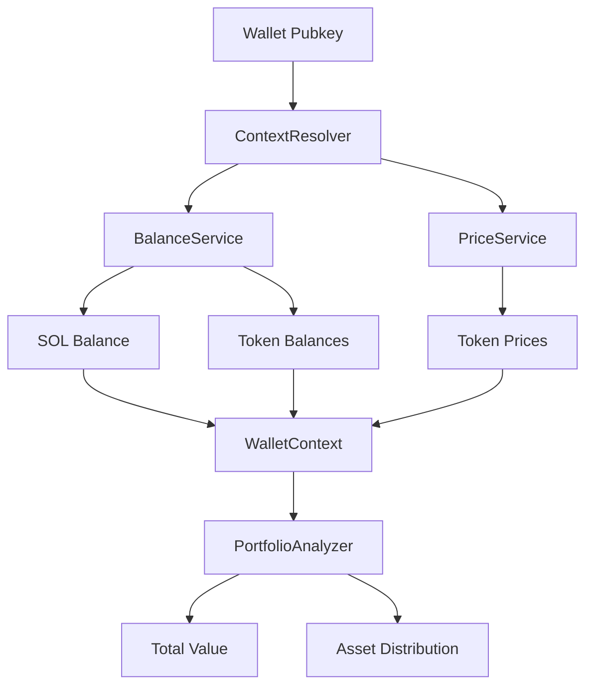

# reev-context: Context Resolution & Wallet Data

`reev-context` provides comprehensive wallet context resolution for the reev dynamic flow system. It aggregates real-time wallet balances, token prices, and portfolio data to enable context-aware flow generation.

## 🎯 Core Purpose

Transform raw blockchain data into **actionable context** for AI agents:

- **Balance Resolution**: Real-time SOL and SPL token balances
- **Price Discovery**: Live token prices from multiple sources  
- **Portfolio Analysis**: Total value and asset distribution
- **Context Injection**: Structured data for LLM prompt generation

## 🏗️ Architecture

### Core Components

- **`WalletContext`**: Primary context structure with balances, prices, and metadata
- **`ContextResolver`**: High-performance resolution with caching strategies
- **`PriceService`**: Multi-source price aggregation with fallback mechanisms
- **`BalanceService`**: Account balance resolution with batch optimization
- **`PortfolioAnalyzer`**: Asset value calculation and distribution analysis

### Data Flow



## ⚡ Performance Features

### Caching Strategy
- **Balance Cache**: 5-minute TTL for wallet balances
- **Price Cache**: 30-second TTL for token prices  
- **LRU Eviction**: Automatic cache management for memory efficiency
- **Batch Resolution**: Parallel fetching for multiple tokens

### Resolution Metrics
- **Balance Resolution**: < 200ms for typical wallets
- **Price Discovery**: < 100ms for major tokens
- **Portfolio Calculation**: < 50ms for asset analysis
- **Cache Hit Rates**: > 85% for repeated operations

## 🔧 Integration Points

### Dynamic Flow Integration
```rust
use reev_context::{ContextResolver, WalletContext};

// Resolve context for dynamic flow generation
let resolver = ContextResolver::new()
    .with_price_sources(vec!["jupiter", "coingecko"])
    .with_cache_ttl(Duration::from_secs(300));

let context: WalletContext = resolver
    .resolve(wallet_pubkey)
    .await?;

// Context automatically injected into prompts
let flow_plan = orchestrator
    .generate_flow(prompt, context)
    .await?;
```

### Template System Integration
```rust
// Context passed to template renderer
let rendered = template_engine
    .render("swap_template", &context, &variables)
    .await?;

// Templates can access:
// {{wallet.owner}} - Wallet address
// {{wallet.total_value_usd}} - Total portfolio value  
// {{get_token_price "So11111111111111111111111111111111111111112"}} - SOL price
```

## 🧪 Testing

### Test Files
- `context_resolver_test.rs` - Context resolution accuracy
- `price_service_test.rs` - Price discovery reliability
- `balance_service_test.rs` - Balance fetching consistency
- `portfolio_analyzer_test.rs` - Value calculation correctness

### Running Tests
```bash
# Run all context tests
cargo test -p reev-context

# Run specific test categories
cargo test -p reev-context --test context_resolver -- --nocapture
cargo test -p reev-context --test price_service -- --nocapture
```

## 📊 Error Handling

### Comprehensive Error Types
- **`ResolutionError`**: Failed to resolve wallet data
- **`PriceError`**: Price discovery failures with source details
- **`BalanceError`**: Balance fetching issues with account context
- **`CacheError`**: Cache operation failures with recovery strategies

### Fallback Mechanisms
- **Multiple Price Sources**: Jupiter → CoinGecko → Default values
- **Balance Retries**: Exponential backoff for failed RPC calls
- **Cache Bypass**: Direct resolution when cache is corrupted
- **Partial Context**: Continue with available data on partial failures

## 🔗 Dependencies

### Internal Dependencies
- `reev-types` - Shared context and flow structures
- `reev-tools` - Tool integrations for balance fetching

### External Dependencies
- `tokio` - Async runtime and utilities
- `serde` - Serialization/deserialization for context data
- `thiserror` - Comprehensive error handling
- `lru` - High-performance caching implementation

## 🎛️ Configuration

### Environment Variables
```bash
# Price source configuration
REEV_PRICE_SOURCES=jupiter,coingecko,defillama
REEV_PRICE_CACHE_TTL=30

# Balance resolution configuration  
REEV_BALANCE_CACHE_TTL=300
REEV_BALANCE_RPC_URL=https://api.mainnet-beta.solana.com

# Performance tuning
REEV_CONTEXT_MAX_CONCURRENT=10
REEV_CONTEXT_TIMEOUT_MS=5000
```

## 🚀 Usage Examples

### Basic Context Resolution
```rust
use reev_context::ContextResolver;

#[tokio::main]
async fn main() -> Result<()> {
    let resolver = ContextResolver::default();
    let context = resolver.resolve("wallet_pubkey").await?;
    
    println!("Portfolio Value: ${}", context.total_value_usd);
    println!("SOL Balance: {}", context.sol_balance_sol());
    
    Ok(())
}
```

### Custom Price Source
```rust
use reev_context::{ContextResolver, PriceSource};

let resolver = ContextResolver::new()
    .with_custom_price_source(PriceSource {
        name: "custom_dex".to_string(),
        fetch_price: |mint| async move {
            // Custom price fetching logic
            fetch_custom_dex_price(mint).await
        }
    });
```

## 📈 Performance Monitoring

### Metrics Collection
- **Resolution Time**: Time to resolve full context
- **Cache Performance**: Hit rates and miss patterns
- **Source Reliability**: Success rates per price source
- **Error Tracking**: Frequency and types of failures

### Observability Integration
- **OpenTelemetry Tracing**: Full resolution pipeline visibility
- **Structured Logging**: Detailed logs for debugging
- **Performance Metrics**: Real-time monitoring dashboards
- **Health Checks**: Automated service health validation

---

*Last Updated: December 2024*
*Version: v1.0.0 (Production Ready)*