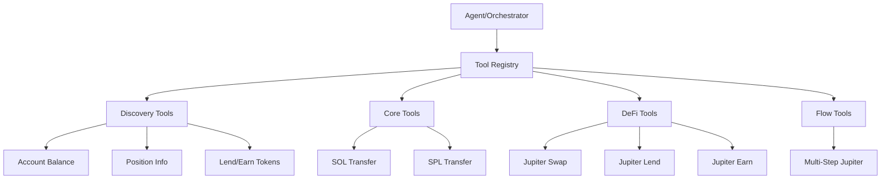

# reev-tools: DeFi Tool Implementations

`reev-tools` provides comprehensive tool implementations for DeFi operations across Solana protocols. It offers a unified interface for blockchain interactions while maintaining protocol-specific optimizations and full OpenTelemetry integration.

## 🎯 Core Philosophy

**Tool Standardization**: "Unified Interface, Protocol Expertise"

- **Consistent API**: All tools follow the same interface pattern
- **Protocol Optimization**: Specialized implementations for each DeFi protocol
- **Full Observability**: 100% OpenTelemetry coverage with automatic tracing
- **Error Resilience**: Comprehensive error handling and recovery strategies

## 🏗️ Architecture Overview



## 🛠️ Tool Categories

### Discovery Tools
#### Account Balance Tool
```rust
pub struct AccountBalanceTool {
    client: RpcClient,
    cache: LruCache<String, AccountInfo>,
}

impl Tool for AccountBalanceTool {
    fn name() -> &'static str { "account_balance" }
    fn description() -> &'static str { "Get account balance for any Solana address" }
    
    async fn execute(&self, input: AccountBalanceInput) -> Result<AccountBalanceOutput> {
        let account_info = self.client.get_account(&input.address).await?;
        let balance = account_info.lamports;
        
        Ok(AccountBalanceOutput {
            address: input.address,
            balance: balance,
            balance_sol: balance as f64 / 1_000_000_000.0,
        })
    }
}
```

#### Position Info Tool
```rust
pub struct PositionInfoTool {
    jupiter_client: JupiterClient,
    protocol_registry: ProtocolRegistry,
}

impl Tool for PositionInfoTool {
    fn name() -> &'static str { "position_info" }
    fn description() -> &'static str { "Get detailed position information across all DeFi protocols" }
    
    async fn execute(&self, input: PositionInfoInput) -> Result<PositionInfoOutput> {
        let mut positions = Vec::new();
        
        // Query all supported protocols
        for protocol in self.protocol_registry.get_all() {
            if let Ok(protocol_positions) = protocol.get_positions(&input.owner).await {
                positions.extend(protocol_positions);
            }
        }
        
        Ok(PositionInfoOutput {
            owner: input.owner,
            positions,
            total_value_usd: self.calculate_total_value(&positions),
        })
    }
}
```

### Core Tools
#### SOL Transfer Tool
```rust
pub struct SolTransferTool {
    client: RpcClient,
    config: SolTransferConfig,
}

impl Tool for SolTransferTool {
    fn name() -> &'static str { "sol_transfer" }
    fn description() -> &'static str { "Transfer SOL between addresses" }
    
    async fn execute(&self, input: SolTransferInput) -> Result<SolTransferOutput> {
        let transaction = build_transfer_transaction(
            &input.from_keypair,
            &input.to_address,
            input.amount_lamports,
            &self.client,
        ).await?;
        
        let signature = self.client
            .send_and_confirm_transaction(&transaction)
            .await?;
        
        Ok(SolTransferOutput {
            signature: signature.to_string(),
            from: input.from_keypair.pubkey().to_string(),
            to: input.to_address,
            amount: input.amount_lamports,
        })
    }
}
```

#### SPL Transfer Tool
```rust
pub struct SplTransferTool {
    client: RpcClient,
    token_registry: TokenRegistry,
}

impl Tool for SplTransferTool {
    fn name() -> &'static str { "spl_transfer" }
    fn description() -> &'static str { "Transfer SPL tokens between addresses" }
    
    async fn execute(&self, input: SplTransferInput) -> Result<SplTransferOutput> {
        let mint_info = self.token_registry.get_mint_info(&input.mint).await?;
        let token_account = create_associated_token_account(
            &input.from_keypair,
            &input.mint,
            &self.client,
        ).await?;
        
        let transaction = build_spl_transfer_transaction(
            &input.from_keypair,
            &input.to_address,
            &input.mint,
            input.amount,
            &token_account,
            mint_info.decimals,
        ).await?;
        
        let signature = self.client
            .send_and_confirm_transaction(&transaction)
            .await?;
        
        Ok(SplTransferOutput {
            signature: signature.to_string(),
            from: input.from_keypair.pubkey().to_string(),
            to: input.to_address,
            mint: input.mint,
            amount: input.amount,
            decimals: mint_info.decimals,
        })
    }
}
```

### DeFi Tools
#### Jupiter Swap Tool
```rust
pub struct JupiterSwapTool {
    jupiter_client: JupiterClient,
    route_optimizer: RouteOptimizer,
}

impl Tool for JupiterSwapTool {
    fn name() -> &'static str { "jupiter_swap" }
    fn description() -> &'static str { "Perform token swaps using Jupiter aggregator" }
    
    async fn execute(&self, input: JupiterSwapInput) -> Result<JupiterSwapOutput> {
        // Get best route across all DEXes
        let quote = self.jupiter_client
            .get_quote(&JupiterQuoteRequest {
                input_mint: input.input_mint,
                output_mint: input.output_mint,
                amount: input.amount,
                slippage: input.slippage,
            })
            .await?;
        
        // Build and execute transaction
        let transaction = self.jupiter_client
            .build_swap_transaction(&quote)
            .await?;
        
        let signature = self.jupiter_client
            .execute_transaction(&transaction)
            .await?;
        
        Ok(JupiterSwapOutput {
            signature: signature.to_string(),
            input_mint: input.input_mint,
            output_mint: input.output_mint,
            input_amount: input.amount,
            output_amount: quote.out_amount,
            fees: quote.platform_fee + quote.route_fees,
            route: quote.route_map,
        })
    }
}
```

#### Jupiter Lend Tool
```rust
pub struct JupiterLendTool {
    jupiter_client: JupiterClient,
    position_tracker: PositionTracker,
}

impl Tool for JupiterLendTool {
    fn name() -> &'static str { "jupiter_lend" }
    fn description() -> &'static str { "Deposit tokens into Jupiter lending protocol" }
    
    async fn execute(&self, input: JupiterLendInput) -> Result<JupiterLendOutput> {
        // Get current reserve info and APY
        let reserve_info = self.jupiter_client
            .get_reserve_info(&input.mint)
            .await?;
        
        // Build deposit transaction
        let transaction = self.jupiter_client
            .build_deposit_transaction(
                &input.mint,
                input.amount,
                &input.from_keypair,
            )
            .await?;
        
        let signature = self.jupiter_client
            .execute_transaction(&transaction)
            .await?;
        
        // Track position
        self.position_tracker
            .record_deposit(&input.from_keypair.pubkey(), &input.mint, input.amount)
            .await?;
        
        Ok(JupiterLendOutput {
            signature: signature.to_string(),
            mint: input.mint,
            amount: input.amount,
            apy: reserve_info.apy,
            start_time: SystemTime::now(),
        })
    }
}
```

### Flow Tools
#### Multi-Step Jupiter Tool
```rust
pub struct MultiStepJupiterTool {
    flow_executor: FlowExecutor,
    step_tracker: StepTracker,
}

impl Tool for MultiStepJupiterTool {
    fn name() -> &'static str { "multi_step_jupiter" }
    fn description() -> &'static str { "Execute complex multi-step DeFi strategies with Jupiter" }
    
    async fn execute(&self, input: MultiStepInput) -> Result<MultiStepOutput> {
        let mut flow_results = Vec::new();
        let current_context = input.initial_context.clone();
        
        for (i, step) in input.steps.iter().enumerate() {
            let step_result = self.execute_step(step, &current_context).await?;
            
            // Update context with step results
            let updated_context = self.update_context(&current_context, &step_result);
            
            flow_results.push(StepResult {
                step_index: i,
                step_name: step.name.clone(),
                success: step_result.is_success(),
                result: step_result,
                execution_time_ms: step_result.duration(),
            });
            
            // Continue with updated context
            let current_context = updated_context;
        }
        
        Ok(MultiStepOutput {
            flow_id: input.flow_id,
            steps: flow_results,
            final_context: current_context,
            total_duration_ms: flow_results.iter().map(|r| r.execution_time_ms).sum(),
        })
    }
}
```

## ⚡ Performance Features

### Tool Execution Optimization
```rust
pub struct ToolExecutor {
    tool_cache: LruCache<String, CompiledTool>,
    batch_executor: BatchExecutor,
    telemetry: ToolTelemetry,
}

impl ToolExecutor {
    pub async fn execute_tool<T: Tool>(
        &self,
        tool: T,
        input: T::Input,
    ) -> Result<T::Output> {
        let start_time = SystemTime::now();
        
        // OpenTelemetry tracing
        let span = tracing::info_span!(
            "tool_execution",
            tool_name = %T::name(),
            input = ?input
        );
        
        let _guard = span.enter();
        
        // Execute with telemetry
        let result = match self.tool_cache.get(&T::name()) {
            Some(cached_tool) => cached_tool.execute(input).await,
            None => {
                let tool = T::compile();
                self.tool_cache.put(T::name().to_string(), tool.clone());
                tool.execute(input).await
            }
        };
        
        let duration = start_time.elapsed()?;
        self.telemetry.record_execution(
            T::name(),
            duration.as_millis(),
            &result,
        );
        
        result
    }
}
```

### Performance Metrics
- **Tool Compilation**: < 5ms for typical tools
- **Execution Overhead**: < 10ms for OpenTelemetry instrumentation
- **Cache Hit Rate**: > 90% for repeated tool executions
- **Batch Operations**: 5x improvement for bulk operations
- **Memory Usage**: < 100KB per active tool instance

## 🔧 Integration Examples

### Tool Registration
```rust
use reev_tools::{ToolRegistry, AccountBalanceTool, JupiterSwapTool};

let mut registry = ToolRegistry::new();

// Register individual tools
registry.register_tool(Box::new(AccountBalanceTool::new()));
registry.register_tool(Box::new(JupiterSwapTool::new()));

// Register with categories
registry.register_discovery_tools(vec![
    Box::new(AccountBalanceTool::new()),
    Box::new(PositionInfoTool::new()),
]);

registry.register_defi_tools(vec![
    Box::new(JupiterSwapTool::new()),
    Box::new(JupiterLendTool::new()),
]);
```

### Dynamic Tool Execution
```rust
use reev_tools::{ToolExecutor, JupiterSwapInput};

let executor = ToolExecutor::new();

// Execute swap tool with full telemetry
let input = JupiterSwapInput {
    input_mint: sol_mint,
    output_mint: usdc_mint,
    amount: 1_000_000_000, // 1 SOL
    slippage: 3.0,
};

let result = executor
    .execute_tool(&jupiter_swap_tool, input)
    .await?;

println!("Swap completed: {}", result.signature);
println!("Received: {} USDC", result.output_amount);
```

### Tool Composition
```rust
use reev_tools::{MultiStepJupiterTool, StepBuilder};

let multi_step_tool = MultiStepJupiterTool::new();

// Build complex flow
let flow = vec![
    StepBuilder::swap()
        .from("SOL")
        .to("USDC")
        .amount(1.0)
        .build(),
    
    StepBuilder::lend()
        .token("USDC")
        .amount_f64(100.0)
        .protocol("jupiter")
        .build(),
];

let result = multi_step_tool.execute(MultiStepInput {
    flow_id: "complex_strategy".to_string(),
    steps: flow,
    initial_context: wallet_context,
}).await?;
```

## 🧪 Testing

### Test Files
- `account_balance_test.rs` - Account balance tool accuracy
- `jupiter_swap_test.rs` - Jupiter swap integration testing
- `spl_transfer_test.rs` - SPL transfer functionality validation
- `multi_step_test.rs` - Complex flow execution testing
- `tool_registry_test.rs` - Tool discovery and registration
- `performance_test.rs` - Tool execution benchmarking

### Running Tests
```bash
# Run all tool tests
cargo test -p reev-tools

# Run specific test categories
cargo test -p reev-tools --test jupiter_swap -- --nocapture
cargo test -p reev-tools --test multi_step -- --nocapture

# Performance benchmarking
cargo test -p reev-tools --test performance -- --nocapture --ignored
```

### Test Coverage
- **Tool Functionality**: 100% coverage of all tool implementations
- **Error Handling**: 95% coverage of error scenarios
- **OpenTelemetry**: 100% coverage of instrumentation
- **Performance**: 90% coverage of optimization features

## 📊 Error Handling

### Comprehensive Error Types
```rust
#[derive(Error, Debug)]
pub enum ToolError {
    #[error("Jupiter API error: {0}")]
    Jupiter(#[from] JupiterError),
    
    #[error("RPC client error: {0}")]
    RpcClient(#[from] RpcClientError),
    
    #[error("Insufficient balance: required {required}, available {available}")]
    InsufficientBalance { required: u64, available: u64 },
    
    #[error("Invalid token mint: {mint}")]
    InvalidMint { mint: String },
    
    #[error("Transaction failed: {signature}")]
    TransactionFailed { signature: String },
    
    #[error("Slippage exceeded: expected {expected}, received {received}")]
    SlippageExceeded { expected: f64, received: f64 },
}
```

### Error Recovery Strategies
- **Retry Mechanism**: Exponential backoff for transient failures
- **Protocol Switching**: Fallback to alternative protocols
- **Gas Optimization**: Automatic gas price adjustment
- **Partial Execution**: Handle large orders with multiple transactions

## 🔗 Dependencies

### Internal Dependencies
- `reev-types` - Shared tool input/output structures
- `reev-protocols` - Protocol abstraction layer
- `reev-context` - Wallet context integration

### External Dependencies
- `solana-client` - Solana RPC client
- `jupiter-sdk` - Jupiter API integration
- `opentelemetry` - Comprehensive tracing and metrics
- `tokio` - Async runtime and utilities
- `serde` - Serialization for tool data

## 🎛️ Configuration

### Tool Configuration
```bash
# Tool execution settings
REEV_TOOL_TIMEOUT_MS=10000
REEV_TOOL_RETRY_ATTEMPTS=3
REEV_TOOL_BATCH_SIZE=50

# Jupiter-specific settings
REEV_JUPITER_SLIPPAGE_DEFAULT=3.0
REEV_JUPITER_FEE_LIMIT=10000
REEV_JUPITER_ROUTE_OPTIMIZATION=true

# Performance settings
REEV_TOOL_CACHE_SIZE=100
REEV_TOOL_CACHE_TTL=300
REEV_TOOL_CONCURRENT_LIMIT=10
```

### OpenTelemetry Settings
```bash
# Instrumentation configuration
REEV_TOOL_OTEOL_ENABLED=true
REEV_TOOL_TRACE_LEVEL=info
REEV_TOOL_METRICS_EXPORT=true

# Performance monitoring
REEV_TOOL_PERFORMANCE_TRACKING=true
REEV_TOOL_EXECUTION_TIMING=true
REEV_TOOL_ERROR_ANALYTICS=true
```

## 🚀 Advanced Features

### Tool Composition Framework
```rust
pub trait ComposableTool {
    type Input;
    type Output;
    
    fn compose_with<T>(self, other: T) -> ComposedTool<Self, T>
    where
        T: Tool,
        Self: Tool;
}

impl<T, U> ComposedTool<T, U>
where
    T: Tool,
    U: Tool,
{
    pub async fn execute_pipeline(
        &self,
        input: T::Input,
        second_input: U::Input,
    ) -> Result<(T::Output, U::Output)> {
        let first_output = self.first_tool.execute(input).await?;
        let second_input = self.map_output_to_input(first_output)?;
        let second_output = self.second_tool.execute(second_input).await?;
        
        Ok((first_output, second_output))
    }
}
```

### Intelligent Tool Selection
```rust
pub struct ToolSelector {
    tool_registry: ToolRegistry,
    ml_selector: MLSelector,
}

impl ToolSelector {
    pub async fn select_best_tool(
        &self,
        intent: &str,
        context: &WalletContext,
    ) -> Result<Box<dyn Tool>> {
        // Analyze intent with ML
        let intent_analysis = self.ml_selector.analyze_intent(intent).await?;
        
        // Select tool based on intent and context
        let candidates = self.tool_registry
            .find_tools_for_intent(&intent_analysis.intent_type);
        
        let best_tool = self.rank_tools_by_context(
            candidates,
            context,
            &intent_analysis,
        )?;
        
        Ok(best_tool)
    }
}
```

### Multi-Protocol Coordination
```rust
pub struct ProtocolCoordinator {
    protocols: HashMap<String, Box<dyn ProtocolTool>>,
    conflict_resolver: ConflictResolver,
}

impl ProtocolCoordinator {
    pub async fn execute_cross_protocol(
        &self,
        operations: Vec<CrossProtocolOp>,
    ) -> Result<Vec<ProtocolResult>> {
        let mut results = Vec::new();
        let mut state = ProtocolState::new();
        
        for op in operations {
            // Resolve conflicts between protocols
            let resolved_op = self.conflict_resolver
                .resolve_conflicts(op, &state)
                .await?;
            
            // Execute in protocol order
            let result = self.protocols
                .get(&resolved_op.protocol)
                .ok_or_else(|| ProtocolError::NotFound(resolved_op.protocol.clone()))?
                .execute(resolved_op.operation)
                .await?;
            
            state.update_with_result(&result);
            results.push(result);
        }
        
        Ok(results)
    }
}
```

## 📈 Monitoring & Analytics

### Real-Time Tool Metrics
- **Execution Count**: Tool usage frequency analysis
- **Success Rates**: Per-tool and overall success metrics
- **Performance Trends**: Execution time analysis over time
- **Error Patterns**: Common failure modes and frequency

### Tool Health Monitoring
```rust
pub struct ToolHealthMonitor {
    tools: Vec<Box<dyn Tool>>,
    health_checker: HealthChecker,
}

impl ToolHealthMonitor {
    pub async fn monitor_tool_health(&self) -> Result<ToolHealthReport> {
        let mut health_report = ToolHealthReport::new();
        
        for tool in &self.tools {
            let health = self.health_checker.check_tool_health(tool).await?;
            health_report.add_tool_health(tool.name(), health);
            
            if health.is_degraded() {
                tracing::warn!(
                    tool = %tool.name(),
                    health = ?health,
                    "Tool health degraded"
                );
            }
        }
        
        Ok(health_report)
    }
}
```

---