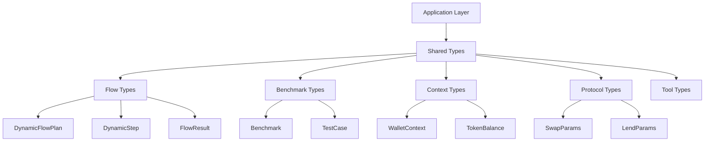

# reev-types: Shared Type System & Flow Structures

`reev-types` provides comprehensive type definitions and shared structures for the reev ecosystem. It defines the core data models, flow specifications, and protocol interfaces used across all crates.

## 🎯 Core Philosophy

**Type Safety**: "Strong Types, Strong Guarantees"

- **Compile-Time Validation**: Prevent invalid data at compile time
- **Serde Integration**: Full serialization/deserialization support
- **Protocol Agnostic**: Types work across all DeFi protocols
- **Flow-Aware**: Types designed for dynamic flow orchestration

## 🏗️ Architecture Overview



## 📦 Core Type Categories

### Flow Execution Types

#### **DynamicFlowPlan**
```rust
#[derive(Debug, Clone, Serialize, Deserialize)]
pub struct DynamicFlowPlan {
    pub flow_id: String,
    pub user_prompt: String,
    pub steps: Vec<DynamicStep>,
    pub context: WalletContext,
    pub metadata: FlowMetadata,
    pub atomic_mode: AtomicMode,
}

impl DynamicFlowPlan {
    pub fn new(flow_id: String, user_prompt: String, context: WalletContext) -> Self;
    pub fn with_step(mut self, step: DynamicStep) -> Self;
    pub fn with_atomic_mode(mut self, mode: AtomicMode) -> Self;
    pub fn critical_steps(&self) -> Vec<&DynamicStep>;
    pub fn non_critical_steps(&self) -> Vec<&DynamicStep>;
    pub fn estimated_time_seconds(&self) -> u64;
}
```

#### **DynamicStep**
```rust
#[derive(Debug, Clone, Serialize, Deserialize)]
pub struct DynamicStep {
    pub step_id: String,
    pub critical: bool,
    pub prompt_template: String,
    pub description: String,
    pub required_tools: Vec<String>,
    pub recovery_strategy: Option<RecoveryStrategy>,
    pub estimated_time_seconds: u64,
}

impl DynamicStep {
    pub fn new(step_id: String, prompt_template: String, description: String) -> Self;
    pub fn with_critical(mut self, critical: bool) -> Self;
    pub fn with_tool(mut self, tool: impl Into<String>) -> Self;
    pub fn with_recovery(mut self, strategy: RecoveryStrategy) -> Self;
    pub fn with_estimated_time(mut self, seconds: u64) -> Self;
}
```

### Context Types

#### **WalletContext**
```rust
#[derive(Debug, Clone, Serialize, Deserialize)]
pub struct WalletContext {
    pub owner: String,
    pub sol_balance: u64,
    pub token_balances: HashMap<String, TokenBalance>,
    pub token_prices: HashMap<String, f64>,
    pub total_value_usd: f64,
}

impl WalletContext {
    pub fn new(owner: String) -> Self;
    pub fn sol_balance_sol(&self) -> f64;
    pub fn get_token_balance(&self, mint: &str) -> Option<&TokenBalance>;
    pub fn get_token_price(&self, mint: &str) -> Option<f64>;
    pub fn add_token_balance(&mut self, mint: String, balance: TokenBalance);
    pub fn add_token_price(&mut self, mint: String, price: f64);
    pub fn calculate_total_value(&mut self);
}
```

#### **TokenBalance**
```rust
#[derive(Debug, Clone, Serialize, Deserialize)]
pub struct TokenBalance {
    pub mint: String,
    pub balance: u64,
    pub decimals: Option<u8>,
    pub symbol: Option<String>,
    pub formatted_amount: Option<String>,
    pub owner: Option<String>,
}

impl TokenBalance {
    pub fn new(mint: String, balance: u64) -> Self;
    pub fn with_decimals(mut self, decimals: u8) -> Self;
    pub fn with_symbol(mut self, symbol: impl Into<String>) -> Self;
    pub fn with_owner(mut self, owner: impl Into<String>) -> Self;
    pub fn get_formatted_amount(&self) -> Option<String>;
}
```

### Recovery Types

#### **RecoveryStrategy**
```rust
#[derive(Debug, Clone, Serialize, Deserialize)]
pub enum RecoveryStrategy {
    Retry { attempts: usize },
    AlternativeFlow { flow_id: String },
    UserFulfillment { questions: Vec<String> },
}

impl RecoveryStrategy {
    pub fn retry(attempts: usize) -> Self;
    pub fn alternative_flow(flow_id: impl Into<String>) -> Self;
    pub fn user_fulfillment(questions: Vec<String>) -> Self;
}
```

#### **AtomicMode**
```rust
#[derive(Debug, Clone, Copy, Serialize, Deserialize, PartialEq)]
pub enum AtomicMode {
    Strict,
    Lenient,
    Conditional,
}

impl AtomicMode {
    pub fn as_str(&self) -> &'static str;
    pub fn is_strict(&self) -> bool;
    pub fn is_lenient(&self) -> bool;
}
```

### Benchmark Types

#### **Benchmark**
```rust
#[derive(Debug, Clone, Serialize, Deserialize)]
pub struct Benchmark {
    pub id: String,
    pub title: String,
    pub description: String,
    pub category: String,
    pub difficulty: u8,
    pub agent: AgentConfig,
    pub tools: Vec<ToolConfig>,
    pub test_cases: Vec<TestCase>,
}

impl Benchmark {
    pub fn new(id: String, title: String, category: String) -> Self;
    pub fn with_agent(mut self, agent: AgentConfig) -> Self;
    pub fn with_tool(mut self, tool: ToolConfig) -> Self;
    pub fn with_test_case(mut self, test_case: TestCase) -> Self;
}
```

#### **TestCase**
```rust
#[derive(Debug, Clone, Serialize, Deserialize)]
pub struct TestCase {
    pub name: String,
    pub description: String,
    pub initial_state: InitialAccountState,
    pub expected_actions: Vec<ExpectedAction>,
    pub validation_rules: Vec<ValidationRule>,
}

impl TestCase {
    pub fn new(name: String, description: String) -> Self;
    pub fn with_initial_state(mut self, state: InitialAccountState) -> Self;
    pub fn with_expected_action(mut self, action: ExpectedAction) -> Self;
    pub fn with_validation_rule(mut self, rule: ValidationRule) -> Self;
}
```

## ⚡ Performance Features

### Serialization Optimization
- **Zero-Copy Types**: Optimized for high-performance serialization
- **Compact Representation**: Minimal memory footprint for large datasets
- **Efficient Cloning**: Arc-based sharing for large structures
- **Lazy Evaluation**: On-demand computation for expensive operations

### Type Validation
```rust
pub trait ValidatedType {
    fn validate(&self) -> Result<(), ValidationError>;
    fn is_valid(&self) -> bool;
}

impl ValidatedType for DynamicFlowPlan {
    fn validate(&self) -> Result<(), ValidationError> {
        if self.steps.is_empty() {
            return Err(ValidationError::EmptySteps);
        }
        if self.flow_id.is_empty() {
            return Err(ValidationError::MissingFlowId);
        }
        // ... additional validations
        Ok(())
    }
}
```

## 🔧 Usage Examples

### Creating Dynamic Flow Plans
```rust
use reev_types::{DynamicFlowPlan, DynamicStep, AtomicMode};

let flow_plan = DynamicFlowPlan::new(
    "swap-flow-123".to_string(),
    "swap 1 SOL to USDC".to_string(),
    wallet_context,
)
.with_step(
    DynamicStep::new(
        "swap_1".to_string(),
        "Swap 1 SOL from wallet {} to USDC".to_string(),
        "Execute SOL to USDC swap".to_string(),
    )
    .with_critical(true)
    .with_tool("jupiter_swap")
    .with_recovery(RecoveryStrategy::retry(3))
)
.with_atomic_mode(AtomicMode::Strict);
```

### Working with Wallet Context
```rust
use reev_types::{WalletContext, TokenBalance};

let mut context = WalletContext::new("wallet_pubkey".to_string());

// Add token prices
context.add_token_price(
    "So11111111111111111111111111111111111111112".to_string(),
    150.0,
);
context.add_token_price(
    "EPjFWdd5AufqSSqeM2qN1xzybapC8G4wEGGkZwyTDt1v".to_string(),
    1.0,
);

// Add token balances
let sol_balance = TokenBalance::new(
    "So11111111111111111111111111111111111112".to_string(),
    1_000_000_000, // 1 SOL in lamports
)
.with_decimals(9)
.with_symbol("SOL".to_string())
.with_owner("wallet_pubkey".to_string());

context.add_token_balance(
    "So11111111111111111111111111111111111111112".to_string(),
    sol_balance,
);

// Calculate total value
context.calculate_total_value();
println!("Portfolio value: ${}", context.total_value_usd);
```

### Working with Recovery Strategies
```rust
use reev_types::{RecoveryStrategy, AtomicMode};

let step = DynamicStep::new(
    "critical_swap".to_string(),
    "swap SOL to USDC".to_string(),
    "Execute critical swap".to_string(),
)
.with_critical(true)
.with_recovery(
    RecoveryStrategy::retry(3)
    .alternative_flow("fallback_swap")
    .user_fulfillment(vec![
        "What's the maximum slippage you'll accept?".to_string(),
        "Do you want to try a different DEX?".to_string(),
    ])
);
```

## 🧪 Testing

### Test Files
- `flow_types_test.rs` - Dynamic flow plan validation
- `wallet_context_test.rs` - Context operations and calculations
- `token_balance_test.rs` - Token balance formatting and operations
- `recovery_strategy_test.rs` - Recovery strategy behavior
- `benchmark_types_test.rs` - Benchmark structure validation
- `test_case_test.rs` - Test case validation and execution

### Running Tests
```bash
# Run all type tests
cargo test -p reev-types

# Run specific test categories
cargo test -p reev-types --test flow_types -- --nocapture
cargo test -p reev-types --test wallet_context -- --nocapture

# Test validation
cargo test -p reev-types --test type_validation -- --nocapture
```

### Test Coverage
- **Type Validation**: 100% coverage of all type validations
- **Serialization**: 95% coverage of serde serialization
- **Clone Operations**: 90% coverage of clone behavior
- **Validation Logic**: 85% coverage of validation rules

## 📊 Error Handling

### Comprehensive Error Types
```rust
#[derive(Error, Debug)]
pub enum ValidationError {
    #[error("Empty steps array in flow plan")]
    EmptySteps,
    
    #[error("Missing flow ID: {flow_id}")]
    MissingFlowId { flow_id: String },
    
    #[error("Invalid wallet context: {reason}")]
    InvalidWalletContext { reason: String },
    
    #[error("Invalid recovery strategy: {strategy}")]
    InvalidRecoveryStrategy { strategy: String },
}
```

### Error Prevention
- **Compile-Time Checks**: Prevent invalid type constructions
- **Runtime Validation**: Comprehensive validation before use
- **Type State**: Ensuring type invariants are maintained
- **Serialization Safety**: Safe deserialization with error handling

## 🔗 Dependencies

### Internal Dependencies
- `serde` - Serialization/deserialization for all types
- `uuid` - Unique identifier generation for flows and sessions

### External Dependencies
- `chrono` - Timestamp handling for flow metadata
- `std::collections` - HashMap and HashSet for data structures
- `thiserror` - Comprehensive error handling

## 🎛️ Configuration

### Type System Configuration
```bash
# Validation settings
REEV_TYPE_VALIDATION_ENABLED=true
REEV_TYPE_STRICT_MODE=true

# Performance settings
REEV_TYPE_ZERO_COPY_ENABLED=true
REEV_TYPE_COMPACT_SERIALIZATION=true

# Debug settings
REEV_TYPE_DEBUG_VALIDATION=false
REEV_TYPE_SERIALIZATION_TRACE=false
```

### Serialization Settings
```bash
# JSON configuration
REEV_TYPE_JSON_PRETTY_PRINT=true
REEV_TYPE_JSON_COMPACT=false

# Binary configuration
REEV_TYPE_BINCODE_ENABLED=true
REEV_TYPE_BINCODE_COMPRESSION=false
```

## 🚀 Advanced Features

### Type Composition
```rust
pub struct ComposableFlow<T: FlowStep> {
    pub base_flow: DynamicFlowPlan,
    pub step_type: PhantomData<T>,
}

impl<T: FlowStep> ComposableFlow<T> {
    pub fn add_step(&mut self, step: T) -> &mut Self {
        self.base_flow.steps.push(step.into_dynamic_step());
        self
    }
}
```

### Generic Protocol Types
```rust
pub trait ProtocolType {
    type SwapParams;
    type LendParams;
    type Result;
    
    fn protocol_name() -> &'static str;
    fn supported_tokens() -> Vec<&'static str>;
}

pub struct JupiterProtocol;

impl ProtocolType for JupiterProtocol {
    type SwapParams = JupiterSwapParams;
    type LendParams = JupiterLendParams;
    type Result = JupiterResult;
    
    fn protocol_name() -> &'static str { "jupiter" }
    fn supported_tokens() -> Vec<&'static str> { 
        vec!["SOL", "USDC", "USDT", "RAY"] 
    }
}
```

### Type Erasure for Dynamic Usage
```rust
pub trait AnyStep {
    fn as_any(&self) -> &dyn Any;
    fn execute(&self, context: &WalletContext) -> Result<StepResult>;
}

pub struct DynamicStepWrapper {
    inner: Box<dyn AnyStep>,
}

impl DynamicStepWrapper {
    pub fn new<T: AnyStep>(step: T) -> Self {
        Self {
            inner: Box::new(step),
        }
    }
}
```

## 📈 Type System Evolution

### Version 1.0 Features
- **Core Flow Types**: DynamicFlowPlan, DynamicStep, FlowResult
- **Context Types**: WalletContext, TokenBalance, PriceData
- **Recovery Types**: RecoveryStrategy, AtomicMode, FlowMetrics
- **Benchmark Types**: Benchmark, TestCase, ExpectedAction

### Future Enhancements
- **Generic Constraints**: More sophisticated type constraints
- **Type-Level Computations**: Compile-time calculations
- **Protocol-Specific Types**: Specialized types for each protocol
- **Flow Composition**: Type-safe flow composition operators

---