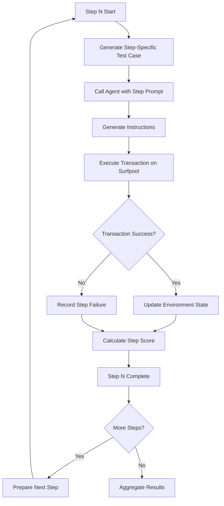

# 🌊 Flow Benchmarks: Multi-Step DeFi Workflows

## 📋 Overview

Flow benchmarks in the Reev framework enable testing of complex multi-step DeFi workflows that require sequential operations. Unlike regular benchmarks that execute a single transaction, flow benchmarks execute multiple steps, each as an independent transaction, with proper state management and error isolation.

## 🏗️ Architecture

### Step-by-Step Execution Model

```
Flow Benchmark Definition
├── Step 1: Initial Operation
│   ├── Generate step-specific instructions
│   ├── Execute transaction on surfpool
│   ├── Validate step success/failure
│   └── Update environment state
├── Step 2: Follow-up Operation
│   ├── Use updated state from Step 1
│   ├── Generate step-specific instructions
│   ├── Execute transaction on surfpool
│   └── Update environment state
└── ... Additional Steps
    └── Continue until flow completion
```

### Key Benefits

- **🔄 Transaction Isolation**: Each step executes independently, preventing cascading failures
- **📊 Partial Credit**: Successful steps contribute to final score even if later steps fail
- **🔍 Debuggability**: Failed steps can be identified and fixed individually
- **⚡ State Management**: Account states flow automatically between steps
- **🤖 Agent Consistency**: Both deterministic and AI agents handle flows identically

## 📝 Flow Benchmark Structure

### YAML Definition

```yaml
id: 200-jup-swap-then-lend-deposit
description: Multi-step flow - User swaps SOL to USDC then deposits USDC into Jupiter lending
tags: ["jupiter", "swap", "lend", "multi-step", "flow", "yield"]

initial_state:
  - pubkey: "USER_WALLET_PUBKEY"
    owner: "11111111111111111111111111111111"
    lamports: 5000000000
  - pubkey: "USER_USDC_ATA_PLACEHOLDER"
    owner: "TokenkegQfeZyiNwAJbNbGKPFXCWuBvf9Ss623VQ5DA"
    lamports: 0
    data:
      mint: "EPjFWdd5AufqSSqeM2qN1xzybapC4G4wEGGkZwyTDt1v"
      owner: "USER_WALLET_PUBKEY"
      amount: "0"

prompt: "Perform a two-step DeFi operation: 1) Swap 0.5 SOL to USDC using Jupiter with the best rate, 2) Deposit all received USDC into Jupiter lending to start earning yield."

flow:
  - step: 1
    description: "Swap 0.5 SOL to USDC using Jupiter"
    prompt: "Swap 0.5 SOL from my wallet to USDC using Jupiter. Find the best rate and execute the swap."
    critical: true
    timeout: 30

  - step: 2
    description: "Deposit received USDC into Jupiter lending"
    prompt: "Deposit all the USDC I just received from the swap into Jupiter lending to start earning yield. Use the maximum deposit amount available."
    depends_on: ["step_1_result"]
    critical: true
    timeout: 30

ground_truth:
  min_score: 0.6
  final_state_assertions:
    - type: SolBalance
      pubkey: "USER_WALLET_PUBKEY"
      expected: 1500000000
      weight: 0.3
    - type: TokenAccountBalance
      pubkey: "USER_USDC_ATA_PLACEHOLDER"
      mint: "EPjFWdd5AufqSSqeM2qN1xzybapC4G4wEGGkZwyTDt1v"
      expected: 50000000
      weight: 0.4

  success_criteria:
    - type: "steps_completed"
      description: "All critical steps must be completed successfully"
      required: 2
      weight: 0.5
    - type: "final_balance_positive"
      description: "User should end with more tokens than started"
      required: true
      weight: 0.3
    - type: "no_critical_errors"
      description: "No errors in critical steps"
      required: true
      weight: 0.2
```

### Flow Step Properties

| Property | Type | Required | Description |
|----------|------|----------|-------------|
| `step` | number | ✅ | Sequential step number (1-based) |
| `description` | string | ✅ | Human-readable description of the step |
| `prompt` | string | ✅ | Step-specific prompt for the agent |
| `critical` | boolean | ❌ | Whether step is critical for flow success (default: false) |
| `timeout` | number | ❌ | Timeout in seconds for step execution (default: 30) |
| `depends_on` | array | ❌ | List of step dependencies (default: none) |

## 🚀 Execution Flow

### Framework Processing

1. **Flow Detection**: Framework identifies benchmarks with `flow` sections
2. **Step Preparation**: Each step prepared as individual test case
3. **Sequential Execution**: Steps executed in order with dependency resolution
4. **State Propagation**: Environment state updated after each step
5. **Result Aggregation**: Step scores combined for final assessment

### Step Execution Process

For each step in the flow:



### Agent Interface

Both deterministic and AI agents receive step-specific requests:

```json
{
  "context_prompt": "---\n\nCURRENT ON-CHAIN CONTEXT:\naccount_states:\n  ...\nfee_payer_placeholder: USER_WALLET_PUBKEY\nkey_map:\n  ...\n\n---",
  "id": "200-jup-swap-then-lend-deposit-step-1",
  "model_name": "deterministic",
  "prompt": "Swap 0.5 SOL from my wallet to USDC using Jupiter. Find the best rate and execute the swap."
}
```

## 🎯 Agent Implementation

### Deterministic Agent Flow Handlers

Each flow step requires a specific handler in the deterministic agent:

```rust
// Step 1: Jupiter SOL → USDC swap
flow_id if flow_id.contains("200-jup-swap-then-lend-deposit-step-1") => {
    info!("[reev-agent] Handling flow step 1: Jupiter SOL to USDC swap");
    
    let user_pubkey = Pubkey::from_str(key_map.get("USER_WALLET_PUBKEY")?)?;
    let input_mint = native_mint::ID;
    let output_mint = Pubkey::from_str("EPjFWdd5AufqSSqeM2qN1xzybapC4G4wEGGkZwyTDt1v")?;
    let amount = 250_000_000; // 0.5 SOL
    let slippage_bps = 800; // 8%
    
    let instructions = handle_jupiter_swap(
        user_pubkey, input_mint, output_mint, amount, slippage_bps, key_map
    ).await?;
    
    serde_json::to_string(&instructions)?
}

// Step 2: Jupiter USDC lending deposit
flow_id if flow_id.contains("200-jup-swap-then-lend-deposit-step-2") => {
    info!("[reev-agent] Handling flow step 2: Jupiter USDC lending deposit");
    
    let user_pubkey = Pubkey::from_str(key_map.get("USER_WALLET_PUBKEY")?)?;
    let usdc_mint = Pubkey::from_str("EPjFWdd5AufqSSqeM2qN1xzybapC4G4wEGGkZwyTDt1v")?;
    let deposit_amount = 9_000_000; // ~9 USDC from swap
    
    let instructions = handle_jupiter_lend_deposit(
        user_pubkey, usdc_mint, deposit_amount, key_map
    ).await?;
    
    serde_json::to_string(&instructions)?
}
```

### AI Agent Flow Handling

AI agents automatically handle flow steps through the standard interface, receiving step-specific prompts and context.

## 📊 Scoring System

### Step-Level Scoring

Each flow step is scored using the standard two-tiered system:

```
Step Score = (Instruction Score × 75%) + (On-Chain Score × 25%)
```

### Flow-Level Aggregation

```
Flow Score = Weighted Average of Step Scores × Success Factor
```

**Success Factors:**
- **Complete Success**: 1.0 (all critical steps succeed)
- **Partial Success**: 0.8 (non-critical steps may fail)
- **Critical Failure**: 0.5 (critical steps fail)
- **Complete Failure**: 0.0 (no steps succeed)

### Example Scoring

For a 2-step flow:
- Step 1: 100% (Jupiter swap successful)
- Step 2: 80% (Jupiter lending partial success)
- Flow Score: (100% + 80%) / 2 × 0.8 = 72%

## 🧪 Testing Flow Benchmarks

### Running Flow Benchmarks

```bash
# Run specific flow benchmark
cargo run -p reev-runner -- benchmarks/200-jup-swap-then-lend-deposit.yml --agent deterministic

# Run with detailed logging
RUST_LOG=info cargo run -p reev-runner -- benchmarks/200-jup-swap-then-lend-deposit.yml --agent deterministic

# Test with different agents
cargo run -p reev-runner -- benchmarks/200-jup-swap-then-lend-deposit.yml --agent local-model
```

### Expected Output

```
INFO reev_runner: Detected flow benchmark, executing step-by-step benchmark_id=200-jup-swap-then-lend-deposit steps_count=2
INFO reev_runner: Executing flow step step=1 description=Swap 0.5 SOL to USDC using Jupiter
INFO reev_runner: Flow step completed step=1 actions_count=6
INFO reev_runner: Executing flow step step=2 description=Deposit received USDC into Jupiter lending
INFO reev_runner: Flow step completed step=2 actions_count=16
INFO reev_runner: Flow benchmark completed benchmark_id=200-jup-swap-then-lend-deposit score=100.0 total_actions=22

✅ 200-jup-swap-then-lend-deposit (Score: 100.0%): Succeeded
 ├─ Step 1
 │  ├─ ACTION: [6 Jupiter swap instructions]
 │  └─ OBSERVATION: Success
 └─ Step 2
    ├─ ACTION: [16 Jupiter lending instructions]
    └─ OBSERVATION: Success
```

### Validation Checklist

For each flow benchmark:

- [ ] **Flow Detection**: Framework correctly identifies flow benchmarks
- [ ] **Step Execution**: All steps execute in correct order
- [ ] **Transaction Isolation**: Each step executes as separate transaction
- [ ] **State Propagation**: Account states flow between steps correctly
- [ ] **Agent Consistency**: Both deterministic and AI agents handle flows identically
- [ ] **Error Handling**: Step failures don't cascade to other steps
- [ ] **Score Aggregation**: Final score calculated correctly from step results
- [ ] **Timeout Handling**: Steps respect individual timeout constraints

## 🔧 Development Guidelines

### Creating New Flow Benchmarks

1. **Define Flow Steps**: Clearly sequence operations with dependencies
2. **Set Critical Flags**: Mark steps essential for flow success
3. **Configure Timeouts**: Set appropriate timeouts for each step
4. **Write Ground Truth**: Define success criteria and final state assertions
5. **Test Step Handlers**: Implement deterministic agent handlers for each step
6. **Validate Execution**: Test with both deterministic and AI agents

### Best Practices

#### Step Design
- **Single Responsibility**: Each step should perform one logical operation
- **Atomic Operations**: Steps should be self-contained and not depend on external state
- **Clear Dependencies**: Explicitly define step dependencies using `depends_on`
- **Appropriate Timeouts**: Set realistic timeouts based on operation complexity

#### Error Handling
- **Graceful Degradation**: Design flows to handle partial failures gracefully
- **Critical Path Identification**: Mark essential steps as `critical: true`
- **Fallback Strategies**: Provide alternative approaches for non-critical steps

#### State Management
- **Minimal State Changes**: Only modify accounts necessary for the step
- **Clear State Transitions**: Ensure state changes are predictable and verifiable
- **Account Reuse**: Use consistent account placeholders across steps

## 🚨 Common Issues & Solutions

### Step Execution Failures

**Issue**: Steps failing with "invalid program argument" or similar errors
**Solution**: 
- Verify step handlers are implemented in deterministic agent
- Check instruction data encoding (must be valid base58)
- Ensure account placeholders are properly resolved

### State Propagation Issues

**Issue**: Later steps not seeing state changes from earlier steps
**Solution**:
- Verify account state updates in step completion logs
- Check that account placeholders are correctly mapped
- Ensure environment state is properly updated between steps

### Agent Inconsistency

**Issue**: Deterministic and AI agents produce different results
**Solution**:
- Verify both agents receive the same step-specific prompts
- Check that step handlers are implemented for deterministic agent
- Ensure prompt context is consistent across agent types

### Transaction Isolation Failures

**Issue**: Step failures affecting other steps
**Solution**:
- Verify each step executes as separate transaction
- Check that error handling doesn't stop flow execution prematurely
- Ensure step dependencies are properly resolved

## 📈 Performance Considerations

### Execution Time

- **Step Overhead**: Each step adds ~2-3 seconds of setup/telemetry overhead
- **State Updates**: Account state propagation adds ~1 second per step
- **Transaction Simulation**: Each step includes full transaction simulation

### Resource Usage

- **Memory**: Flow state maintained throughout execution (~10MB per flow)
- **Network**: Each step makes independent RPC calls to surfpool
- **CPU**: Step aggregation and scoring adds computational overhead

### Optimization Strategies

- **Parallel Steps**: Independent steps can be executed in parallel (future feature)
- **State Caching**: Cache account state lookups between steps
- **Batch Operations**: Combine related operations into single steps where possible

## 🔮 Future Enhancements

### Planned Features

1. **Conditional Flows**: Support for if/else logic in flow definitions
2. **Parallel Execution**: Independent steps executed simultaneously
3. **Retry Logic**: Automatic retry mechanisms for failed steps
4. **Flow Composition**: Nested flows and sub-workflows
5. **Dynamic Steps**: Steps generated based on runtime conditions

### Advanced Flow Patterns

#### Conditional Execution
```yaml
flow:
  - step: 1
    description: "Check account balance"
    condition: "balance > 1000000000"
    on_success: "step_2a"
    on_failure: "step_2b"
```

#### Parallel Execution
```yaml
flow:
  - step: 1
    description: "Execute multiple independent operations"
    parallel:
      - operation: "swap_sol_to_usdc"
      - operation: "check_price_feed"
```

#### Retry Logic
```yaml
flow:
  - step: 1
    description: "Jupiter swap with retry"
    retry:
      max_attempts: 3
      backoff: "exponential"
```

## 🎯 Conclusion

Flow benchmarks provide a powerful framework for testing complex multi-step DeFi workflows in the Reev ecosystem. By executing each step as an independent transaction with proper state management and error isolation, flow benchmarks enable realistic testing of sophisticated DeFi strategies while maintaining the framework's core principles of reproducibility and accurate scoring.

The step-by-step execution model ensures that both deterministic and AI agents can be evaluated consistently across complex workflows, providing valuable insights into agent capabilities for handling real-world DeFi operations.